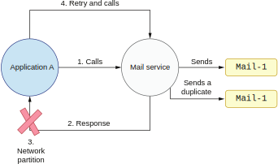

## 10.1 保证至少一次的数据源

我们总是很容易把自己的应用程序简单地理解成一个部署在单节点并使用非分布式的标准SQL数据库。然而，即使我们的服务的的确确具有一个十分简单的部署模型，没有考虑任何的可扩展性，我们也需要意识到它有可能（且大概率会）被应用到一个分布式环境上。理由是：如果我们的系统提供了一些业务功能，它会有大概率需要去调用另一个服务。每次我们调用一个外部服务时，都会访问网络。这意味着我们的服务需要通过网络发出一个请求并等待响应。

### 10.1.1 单节点服务之间的网络访问

假设我们部署在单节点上的应用程序A需要访问一个邮件服务。当邮件服务收到请求时，它会发送一封邮件给终端用户。这时，我们就是在一个分布式环境下进行操作。

重要的是记住每个网络请求都有可能失败（见图10.1）。这个失败可能来自我们所访问的服务的一个错误。

**图10.1 邮件服务错误导致的网络请求失败**

第一眼看上去，这是一个简单的场景。然而从访问者（应用程序A）的角度看，这并不容易理解。事实上应用程序A可能是一个电子商务服务，一个市场自动化服务，一个付费确认服务，或者任何其他服务。邮件服务的错误可能发生在它发送邮件之前或者之后。如果是发送邮件之前出现了错误，且邮件服务能够返回一个合理的响应（比如返回了一个表示系统维护中的状态码），那么应用程序A可以知道邮件没有被发送。但是如果应用程序A得到的是一个没有原因的通用错误，我们就不能安全假设邮件并没有被发送。

在考虑网络失败的情况下，这个情况可能会变得更复杂。有可能我们调用了邮件服务并成功发送了邮件，且邮件服务返回了一个表示一切正常的状态码。然而我们要记住请求和响应都经由网络发送，而每一次访问网络都有很多种失败的可能。比如说，网络路径上的某个路由器，交换机或集线器可能奔溃。也有可能网络发生了分区阻止了（响应）包的传输，如图10.2所示。

**图10.2 向应用程序A返回响应时发生了网络错误**

当网络失败时，应用程序A中的调用者无法得知操作的结果。应用程序A会观察到一个超时，表示对方的响应没能在给定的时间范围内抵达。此时，调用者就进入了一个不一致的状态：它对系统状态的视图是不完整的。邮件可能被发送了，也可能没有。

### 10.1.2 应用程序重试请求

如果应用程序A没能收到一个表示成功的响应，解决方案之一是，它可以重试之前的请求。如果之前是由于临时的网络分区，重试大概率会成功。这时，应用程序对系统状态再次建立了（基本上）完整的视图。

然而，重试在我们的系统架构中会导致问题。我们有可能需要重试不止一次。这时，邮件服务有可能发送好几封重复的邮件，如图10.3所示。比如说第一次请求失败了，然后重试也失败了，然后第二次重试。此时，那封邮件就有可能被发送了三次！这是因为我们不知道之前的请求是在邮件发送之前还是之后失败的。

**图10.3 应用程序A重试请求导致重复的邮件**

让我们用图10.3解释整个步骤。在处理过程的第一阶段，应用程序A通过某种协议向邮件服务发送了一个请求。接下来，邮件服务成功发送了邮件并向调用者（应用程序A）返回一个响应。不幸的是，在返回响应时遇到了网络分区。从应用程序A的角度，它观察到了一个失败：调用者没有得到任何响应，最后由于超时而失败。此时调用者决定重试，并再次向邮件服务发送请求。从邮件服务的角度，这个重试只是另一个需要处理的请求。所以它再次发送了同样的邮件。此时，响应成功抵达了应用程序A，所以不会再有重试了。不幸的是邮件被发送了两次。

在真实世界的系统架构中，我们可能需要集成多个外部服务。重试发送邮件可能算不上什么问题，虽然它有可能导致发送的邮件被放入客户的垃圾文件夹。我们可能会有更严重的问题，比如我们的系统需要处理一笔支付。处理支付同样也是一个外部调用，而重试支付的问题是我们有可能往用户账户里扣了两次（甚至多次）钱。

在我们重试邮件服务的操作时，它其实是提供了一个保证至少一次的传输语义。如果应用程序A不断重试直到操作成功，邮件会被发送一次或多次。有可能存在重复的传输，但绝对不会一次成功的传输都没有（除非整个邮件服务发生了致命故障）。我们会在下一章讨论每一种传输语义的细节。在本章，我们只需要知道，我们架构的传输模式是至少一次，而这会导致邮件服务在应用程序A重试请求时发送重复的邮件。

### 10.1.3 生产数据和幂等性

重试带有副作用的操作通常是不安全的。我们当前的架构就是这样。但是我们如何判断一个重试操作是否安全呢？这个问题的答案就是系统的幂等性特征。如果一个操作无论进行多少次都会导致同样的结果，那我们就称这个操作是幂等的。

比如说，从数据库获取信息是幂等的（假设底层数据没有在多次尝试之间发生改变）。所有的get操作，比如从HTTP端点获取数据，应该都是幂等的。如果我们的服务需要从另一个服务那里获取数据， 它有可能多次重试get操作。假设所有的get操作的执行都不会修改任何状态。那么无论重试多少次get操作都是安全的。

另一个例子是删除一个给定ID的记录也是幂等的。无论它被执行多少次，它的结果都是一样的。如果我们删除一个具有特定ID的记录并重试，这个操作是幂等的。假设记录在第一次操作就被删除。后续的重试试图删除一个已删除的元素，则它什么也不会做。不管调用多少次，结果都是一样的。

另一方面，生成数据通常是非幂等操作。发送邮件不是幂等的。当我们进行发送操作时，邮件就被发送了。在上一节的架构中介绍过，这是一个无法回滚的副作用。重试这样的操作会导致另一次发送，也就是说副作用会再次出现。

值得注意的是，一些生产动作可以是幂等的。如果我们适当地设计我们的业务实体，下面这个操作可能是幂等的。例如，假设我们有一个购物车服务，它会将用户在某个电子商务网站上的产品状态作为事件发送。那些对购物车状态感兴趣的服务会消费这些事件。

在本节中，我们将以两种方式设计这些事件：一种是幂等的，另一种是非幂等的。最直接的方法是在用户每次将产品添加到购物车中都会发送事件表示新增一个项目。例如，如果用户将新书A添加到购物车，发送一个数量为1的新事件。接下来，用户再次将同一本书添加到购物车中，我们会再次发送数量为1的事件，如图10.4所示。

**图10.4 购物车为书籍服务生成的数据是非幂等的**

书籍事件的消费者服务基于收到的事件构建自己的购物车状态视图。这种基于事件的架构通常用于构建遵循命令查询职责分离 (CQRS) 模式的系统。它让我们可以独立扩展系统的写入部分（购物车服务）和读取部份。在我们的场景中，来自购物车服务的事件被发送到某个队列，然后多个消费者服务可以独立消费这些事件。每个服务都可以构建它自己的数据库模型并根据它的读取流量进行优化。此外，添加更多的读取服务不影响购物车服务的写入性能。（我们将在下一节中深入看看这个模式。）

上面提到的商业模型的问题在于它不是幂等的。如果购物车服务需要重试发送任何购物车事件，都会有一个重复的状态传输到图书事件消费者服务那里。因为消费者服务需要根据事件重新创建购物车视图，当重复事件发生时，它将增加购物车内商品的数量，结果数量将等于3。此时视图是不一致且损坏的。很明显，这样的商业模式是非幂等的。我们该如何将其改造成幂等？

当每次购物车发生变化时，购物车服务发送的事件可以包含整个购物车内容的完整视图，而不仅是增量。有了这种改进的架构，每次用户的购物车添加新商品后，新的聚合事件将发送到外部服务。当用户第一次将书籍A添加到购物车时，发送数量为1的事件。然而，当用户第二次添加书籍A，发送的新事件将包含数量2。于是，所有购物车事件的消费者服务都将获得购物车的完整视图。由于不需要重新创建本地视图，这些服务避免了在发生重试时视图可能会变得不一致的问题。购物车服务现在可以重试发送此类事件，而不会有引入不一致状态的风险。

我们还需要小心，在重试的情况下，购物车服务仍然可以发出重复的事件。因为我们传播的是完整的购物车状态，所以发送给消费者的最新事件会覆盖用户购物车的旧状态。然而，在重试的情况下，事件的顺序可能会混淆，如图10.5所示。

**图10.5 乱序的重试**

假设在时间T1，第一个操作失败，并将重试操作安排在一段时间后执行。同时，第二个操作在时间T2成功完成。然后，在时间T3执行预定的重试操作，它将覆盖book event_2传播的状态。事件的消费者最终会出现不一致的状态。所以，我们在重试时要小心。这个问题可以通过在消费者服务内对事件进行排序来解决或在购物车服务发送事件时进行排序来解决。我们应该在重试时也保证顺序。

通常，我们不需要对事件进行全局排序：购物车由特定用户创建并拥有。每个用户都有一个唯一的ID。因此，我们可以传播购物车所属用户的`user_id`。有了这些信息，我们只需要对这个特定ID的事件进行排序。如果购物车事件在`user_id`下排序，事件的消费者就可以根据`user_id`重新创建购物车，而无需担心覆盖行为。我们可以说购物车数据根据`user_id`分区，且分区内保证了顺序。广泛使用的队列框架（如Apache Kafka和Pulsar）提供了一种在分区内保证顺序的方法。

传播视图的完整状态的也有一些缺点。如果状态变大，每次发送事件时，我们都需要通过网络传输更多数据。这也意味着序列化和反序列化逻辑将执行更多工作。然而，在实际系统中，这种业务模型的幂等性通常证明了这些权衡是合理的。

从这个例子中我们可以看出，使非get操作具有幂等性是复杂、脆弱，有时甚至是不可能的。当我们在CQRS这样具有许多组件的分布式架构中运行时，问题会成倍增加。

### 10.1.4 理解命令查询职责分离（CQRS）

为了更深入地了解 CQRS，假设我们需要构建两个服务来消费用户的购物车数据。现有的购物车服务负责将用户的事件写入一个持久队列。这是我们架构的命令写入模型（C）。另一方面，我们可以有N个服务（在将来某个时候）异步消费用户的事件。假设我们有两个服务：一个用户画像服务和一个关系分析服务，如图10.6所示。

第一个用户画像服务需要优化其读取模型，通过`user_id`更快地获得数据。我们可以选择一些分布式数据库并使用`user_id`作为分区键。然后，用户画像的客户就可以使用这个针对读取优化的数据模型，通过`user_id`来进行查询。另一个关系分析服务针对完全不同的业务场景优化。它也会读取用户的数据，但它的读取模型针对离线分析做了另一种优化，允许各种查询模式以批处理的方式进行。它可以将这些事件保存到分布式文件系统，比如HDFS。用户画像和关系分析服务是我们 CQRS 架构的查询 (Q) 部分。

**图10.6 两个不同的读取模型使用CQRS**

这种架构给我们带来了一些重要的好处。首先，数据的生产者和消费者互相解耦。其次，产生事件的服务不需要猜测这些数据所有可能的用途。它只需要将事件保存在针对写优化的数据存储里。消费者的责任是获取这些数据并将其转换为针对特定业务场景优化的数据库模型。消费者服务的开发团队可以独立工作，基于可读取的数据创造商业价值。使用 CQRS 时，数据是一等公民。消费者服务可以从各种不同的数据源消费并使用数据。

不过，这种模式也有很多缺点。首先，数据将被复制到N个地方。我们需要的读取模型服务越多，重复的数据就越多。此外，这种架构需要大量的数据移动。写入模型服务（为了保存原始数据）和读取模型服务都会发送很多请求。这些请求中的任何一个都可能失败，因此前面讨论的所有问题（例如重试、传输至少一次、网络分区和幂等性操作）都将影响我们系统的状态。事实上，它们会更显而易见：我们拥有的服务越多，出错的可能性就越多。如果我们不防范这种情况，那些读取模型服务就可能会出现不一致的状态。向两个服务之一发送一个非幂等重复数据就可能使整个系统的状态分叉。

我们如何设计一个可容错系统（意味着它会重试失败的操作）在分布式环境中工作（实际上，几乎每个生产环境系统都是分布式的）并确保我们对系统的视图保持一致性？一个经过充分验证的模式是在消费者上实现去重逻辑。当一个服务在非幂等操作（不可重试）上实现了去重逻辑，它就将这个操作改成了对所有调用者都是幂等的。在下一节，我们会实现一个去重逻辑库。