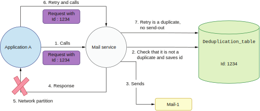

## 10.2 去重库的简单实现

我们会试着让邮件服务的发送行为幂等化。我们可以通过在邮件服务中实现去重逻辑来做到这一点。当一个新的请求到来时，邮件服务会检查这个请求之前是否收到过。如果从来没有收到过，意味着这不是一个重试请求，邮件服务就可以安全地处理这个请求。

需要注意的是，去重工作需要每个事件都具有一个唯一的标识符。调用者（应用程序A）将为每一个请求生成UUID作为唯一标识。当再次发送请求时，会使用同一个UUID。接收事件的邮件服务可以用这个UUID来验证这个请求之前是否达到过。在我们的架构中，如果一个请求（或事件）可以在多个服务之间进行传递，所有这些服务都可以使用相同的UUID。通常，这个唯一的ID是在生产者端（执行请求或事件的第一个服务）生成的，沿途所有服务都可以用它来进行去重。

这个ID是否被处理过的信息必须被持久化。所以这个ID需要被保存在持久性数据库中。数据库是我们系统需要使用的一个新组件。你的服务很有可能已经使用了某种数据库，所以添加一个用于去重的表可能很简单。图 10.7 显示了邮件服务的去重逻辑。



**图10.7 邮件服务的去重逻辑**

让我们考虑之前那个导致邮件重复的情况。图10.7中发送的第一个请求的ID为1234（在现实生活中，它将是一个 UUID）。当请求到达时，邮件服务首先查询数据库，检查之前是否已经处理过这个ID的请求。如果没有处理过，它会将该记录添加到数据库中。然后，它继续处理并向最终用户发送邮件。接下来，邮件服务（在步骤4）返回响应通知应用程序A，数据已被正确处理，不幸的是，（在步骤5）发生了网络分区。

应用程序A不知道邮件是否已发送，因此它会用相同ID重试发送请求。当重试请求到达邮件服务时，它会检查该请求是否重复。如果之前已经处理过这个请求，则不会再次处理。

该解决方案看起来很健壮，但它有一个问题。如果邮件服务在保存了ID信息之后，发送邮件之前发生了某种失败怎么办？现在让我们考虑一下这种情况，如图10.8所示。


**图10.8 发送邮件时发生部分失败**

如果我们的去重服务在发送之前检查并保存事件的ID，我们就在冒部分失败的风险。因为有可能在请求被标记为已处理之后，邮件发送失败。失败的响应将被返回给应用程序。如我们所预料的那样，应用程序会用同一个请求ID重试。但是，此时邮件服务已将该ID标记为已处理。所以不会处理这个重试的请求，邮件也不会被发送。解决这个问题最直接的方法是将去重服务拆分为两个阶段，并将发送邮件的操作插入这两个阶段之间。图10.9显示了这个过程。


**图10.9 去重的三个阶段**

首先，新方法将尝试从数据库中获取给定ID的记录。如果ID不存在，它就应该执行调用者提供的任何操作。在我们的场景里，这个操作就是发送邮件。如果发送操作成功完成（没有返回异常），我们才插入一条带有该请求ID的新记录。代码10.1显示了这段逻辑。

**代码10.1 实现一个简单的去重服务**
```
public class NaiveDeduplicationService {

    private final DbClient dbClient = new DbClient();

    public void executeIfNotDuplicate(String id, Runnable action) {
        boolean present = dbClient.find(id);
        if (!present) {
            action.run();
            dbClient.save(id);
        }
    }
}
```

`DbClient` 负责与后端数据库交互。输入参数`Runnable` 是我们的邮件发送程序。`dbClient.find(id)`是去重的第一阶段。它将尝试查找记录是否存在于数据库。如果不存在，则执行实际的处理过程。最后阶段将一个新的ID保存到数据库。如果数据库中存在该ID的记录，请求就会被忽略。

这个解决方案似乎在我们讨论的两种故障情况下表现得都很好。如果邮件发送成功后出现网络分区，（在调用了`dbClient.save()`方法后）请求id就被保存在数据库里。在这种情况下，重试的请求将被视为一个重复。

我们考虑的第二种情况（当邮件在发送时出现故障）将使`Runnable`运行失败。这将导致请求ID没有被保存到数据库中。重试请求时，就会被正确地重新处理，因为
请求ID未保存。

但是需要记住，我们的邮件服务在分布式环境下运行。由于这个环境天生就是并发的，我们所讨论的解决方案不会为所有场景都提供幂等性。让我们考虑一下为什么该解决方案不是原子的，以及我们该如何以原子的方式解决这个问题。