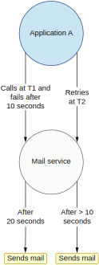
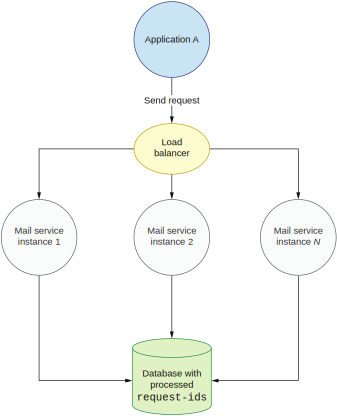
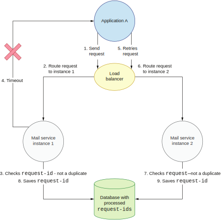

## 10.3 在分布式系统里实现去重会遇到的常见错误

让我们在两种环境下考量上一节的简单实现。第一种环境假设邮件服务和向它发送数据的应用程序A都仅部署在一个节点上。第二种环境增加了一些复杂性：邮件服务将被部署到多个节点。第二种环境更符合现实情况，因为这是微服务架构中服务的部署方式，是可容错和可扩展的。拥有多个节点给了我们容错能力，因为一旦某个节点发生故障，另一个（或多个）节点将开始处理其流量。我们将分析第二种环境会如何影响我们去重逻辑的一致性。


### 10.3.1 单节点场景

让我们看看去重逻辑如何在单节点应用程序A和单节点邮件服务的环境下运行。两个服务都仅部署了一个节点。如图10.10所示。


**图10.10 应用程序A和邮件服务都是单节点部署**

让我们分析在给定ID下的重试。应用程序A在T1时间执行了第一个调用。我们假设它失败了，然后在T2时间执行的重试也失败了。另外我们还假设用的是之前提到的三段式逻辑：

* 阶段1——在数据库查询请求的ID
* 阶段2——如果请求ID不存在，执行邮件服务逻辑
* 阶段3——将请求ID保存在数据库

为了简单起见，我们只考虑在阶段2发生的故障，但是在真实世界的应用里，任何阶段都可能发生故障。这使得它更加棘手和难以分析。我们的分析侧重于该组件的主要功能：防止重复发送电子邮件。

如果T1的请求在阶段2失败，则将响应返回给调用服务的应用程序。因为请求在阶段2失败，所以阶段3的操作没有执行。T2的重试会被执行，邮件发送成功。即使我们的`executeIfNotDuplicate()`方法不具有原子性，在这种情况下也不会有重复的发送，如下列代码所示。

**代码10.2 阻塞式邮件发送**
```
public void executeIfNotDuplicate(String id, Runnable action) {
    boolean present = dbClient.find(id);
    if (!present) {
        action.run();		1
        dbClient.save(id);
    }
}
1 发送操作会阻塞N秒
```

让我们考虑一下如果邮件发送操作执行了很长时间会发生什么。在代码里，邮件发送操作是阻塞式的，它涉及另一个远程调用（发送一封实际的电子邮件）。这个调用会阻塞我们代码的运行。它也可能在等待响应时由于网络分区而失败；跟10.1.2节介绍的情况一模一样，只是用在了邮件的外部网络调用上。

从第9章我们知道，每个网络请求都应该配置一个合理的超时来防止线程和资源的阻塞。让我们假设应用程序A将超时设置为10秒，但邮件服务的发送操作阻塞的时间是它的两倍（20秒）。在这种情况下，T1的请求会在10秒后失败。但是，这并不意味着邮件发送失败。它可能会在另一个10秒后成功。图10.11显示了上述情况。



**图10.11 单节点环境下的重复发送**

两个请求会产生交错。从应用程序A的角度来看，T1的请求（因为超时）失败了。但那只是因为发送邮件的动作阻塞了20秒，且之后它还成功了。之后，去重逻辑会将请求ID保存进数据库。不幸的是，与此同时，由于观察到了失败，应用程序A在T2重试请求。重试请求将在邮件服务将T1的请求ID保存为已处理的请求之前到达。因此，T2会被当成一个新的、非重复的请求处理。这会导致电子邮件被发送。与此同时，T1的请求完成并且也导致邮件被发送。由于邮件被重复发送，我们非原子的去重服务在系统中导致了不一致。

这还只是单节点环境下可能导致重复发送邮件的故障场景之一。然而，在设计一个健壮组件时，即使只有一个场景会导致需求被打破，都应该足以让我们去考虑改变设计。在改设计之前，让我们先在多节点环境下分析同样的场景。


### 10.3.2 多节点环境

让我们看看，当邮件服务被部署到多个节点的环境下，去重逻辑的一致性和正确性。将服务部署到更多的物理机器（节点）以提高其整体性能和容错能力是很常见的操作。

当我们在多个节点上部署邮件服务时，它的API通过负载均衡器暴露出来。通过负载均衡器的IP地址可以访问邮件服务的每一个实例。我们假设这能提供动态可扩展性，这意味着可以基于流量动态添加或删除新的邮件服务实例。因此，邮件服务各个实例的IP地址对应用程序A是隐藏的。 应用程序A的请求被发送到负载均衡服务。负载均衡服务捕获请求并将其重定向到后端的某个邮件服务的实例。

负载均衡的实际实现是从应用程序A中抽象出来的。当新的邮件服务被部署时，它会将自己注册到负载均衡器上。从那时起，负载均衡服务就会将流量转发到新添加的节点上。图10.12说明了负载均衡器在多节点环境中的作用。



**图10.12 多节点环境下的单个服务**

在这个场景下，邮件服务必须是无状态的；到达的任何请求，它都应该能够处理。所有需要的状态，包括保存已处理请求的表，都保存在单独的数据库中。为了简化分析，我们假设数据库不是分布式的，并将其所有状态保存在一个节点上（如果你希望，它可以是主备架构）。然而在真实世界的应用中，可（通过添加或删除节点来实现）扩展的应用程序一般应该使用分布式数据库，所以请求的ID数据会被分区到N个节点上。这也使得数据层可以通过添加或删除节点来水平扩展。这两种（分布式和非分布式）数据库类型，我们后面都会讨论。

假设我们的负载均衡器组件在转发请求时只是通过简单的循环来选取后端的邮件服务实例。第一个请求被转发到邮件服务的实例1，第二个请求被转发到实例2，依此类推。注意负载均衡算法广泛使用了循环策略，因为它很容易实现也很容易理解。它在很多业务场景下，往往也表现良好。其他的负载平衡算法也有，例如那些考虑节点延迟的算法。使用最广泛的一种是随机二选一算法（http://mng.bz/DxPR）。不过，负载均衡服务使用的具体算法不影响我们的分析。

不幸的是，我们当前的去重逻辑在这种环境下无法正常工作。让我们考虑应用程序A在多节点环境下进行重试的场景，如图 10.13 所示。



**图10.13 多节点环境下重试请求**

在步骤1，应用程序A发送请求，要求发送邮件。请求经过负载均衡器，并在步骤2转发到后端第一个邮件服务实例。在步骤3，邮件服务检查请求ID是否在数据库中。不在，所以它继续处理。不幸的是，这会导致步骤4返回应用程序A的响应超时。应用程序A在步骤5发起重试，这个重试请求在步骤6被转发到第二个邮件服务实例。邮件服务在步骤7检查请求ID是否已被处理。结果发现它没有被处理，于是继续发送。同时，第一个邮件服务实例完成邮件发送，并在步骤8将请求ID保存到数据库。然后，第二个邮件服务实例在步骤9完成操作并将请求ID保存到数据库，覆盖了先前第一个邮件服务实例的保存操作。这也意味着当我们的去重逻辑开始工作后，两个邮件服务实例都没有观察到重复，但结果却导致了邮件被重复发送。

在现实生活中，情况可能会变得更糟。应用程序A基于某种逻辑触发邮件发送。而这个逻辑可能又是由另一个服务的外部调用触发的。这在微服务架构中（尤其是基于事件的）并不少见。业务流可能会跨越多个服务。另外，假设我们的应用程序是无状态的，应用程序A也可能收到重复的请求。因此，我们的非原子去重逻辑可能会导致更多的重复邮件。可能存在的大量重复会严重影响我们系统的一致性视图。分析到这里，已经可以清楚地看到我们的去重逻辑需要改进。接下来让我们看看如何使其在单节点和多节点环境下具有原子性。