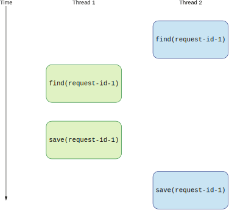
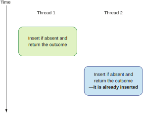

## 10.4 用原子化的逻辑避免竞争条件

回顾一下我们现在的去重逻辑。它分三个阶段：

* 阶段1——在数据库查询请求的ID
* 阶段2——如果请求ID不存在，执行邮件服务逻辑
* 阶段3——将请求ID保存在数据库

值得注意的是，无论我们的逻辑是否有第二阶段，前面讨论的所有故障场景都会破坏我们系统的一致性。让我们简化我们的示例并假设我们的去重逻辑只有阶段1和阶段3。我们的去重逻辑现在看起来像这样：

* 阶段1——在数据库查询请求的ID
* 阶段2——将请求ID保存在数据库

发送重复邮件的可能性依然存在，因为向数据库查询和保存数据的操作也可能由于在分布式环境下执行远程调用而失败。就算是成功了，响应也可能被网络分区阻断。

之前讨论的所有应用程序A遇到的故障场景也都可能在数据库调用上发生。例如，阶段3在保存请求ID时，可能会抛出一个表示超时的异常。众所周知，超时不会给调用者很多信息。可能发生的一种情况是客户端超时了，但服务端的操作仍在执行。从应用程序A的角度来看，这意味着操作失败，向应用程序返回错误。重试可能发生在请求ID被服务实例1插入表之前。因此，请求将被转发到服务实例2。这个情况与上一节讨论的情况几乎相同。图10.14显示这会如何导致一个竞争条件。



**图10.14 两个线程同时查询和保存会导致竞争条件**

查询和保存动作会发生交错，导致系统不一致。例如，一个线程（或节点）可能在另一个节点执行了查询操作后执行同样的操作。查询操作可能需要任意时间。所以我们不能对此做任何强假设。两次查询调用都会返回false，于是逻辑继续，最后，保存也会被调用两次。这就是为什么我们的去重逻辑没能正确工作。

为了实现我们去重逻辑的原子性，我们需要将阶段的数量减少到1。我们还需要在一个操作里检查给定的请求是否重复并保存请求的ID。这应该是一个没有任何中间步骤的外部调用。每次当我们需要查询一个值，执行一些动作，并保存另一个值时，都有可能出现竞争条件。

这在多线程环境中执行时是不可避免的。我们可以把所有对去重组件的调用做成同步的，但这意味着该组件的并发度等于1。换句话说，服务一次只能处理一个请求。真实世界的应用程序每秒需要处理N个请求，这样的解决方案是不可用的。系统需要处理的请求越多，线程的数量和争抢就越激烈。这增加了中间故障的可能性，迟早会让我们的去重逻辑发生不一致。

幸运的是，大多数横向扩展架构使用的分布式数据库都暴露了一种方法让我们的任务可以在一个原子化的操作中执行。（标准的SQL数据库也允许我们执行原子操作。）

我们需要执行一个保存操作，仅当新纪录不存在时才插入它。此外，它需要返回一个布尔值，表示插入是否成功。这样的操作为我们提供了实现一个健壮的去重逻辑所需要的所有信息。这个操作被称为`upsert`；保存操作仅当该值不存在时才会插入，并返回结果。图10.15说明了这个概念。你需要查看自己选择的数据库是否提供了这种方法。`upsert`应该是原子的，这意味着数据库应该将其作为单个操作执行。



**图10.15 原子操作upsert仅当值不存在时才插入并返回结果**

因为`upsert`是原子的，所以两个交错的操作之间不会发生竞争条件。所有逻辑都在数据库端执行，只有结果被返回给调用者。

现在让我们看看使用`upsert`的去重服务该如何实现。最重要的是，`DbClient`将提供一个方法允许我们进行`upsert`。如下列代码所示。

**代码10.3 去重用到的upsert**
```
public boolean findAndInsertIfNeeded(String id);
```

我们需要确保自己使用的方法是原子的。它应该尝试去插入一个给定ID。如果该ID已存在于数据库中则返回false。如果（upsert 操作）执行了插入，则返回true。下列代码显示了新的`isDuplicated()`方法会根据给定ID是否重复返回true或false。

**代码10.4 实现原子去重逻辑**
```
@Override
public boolean isDuplicate(String id) {
    boolean wasInserted = dbClient.findAndInsertIfNeeded(id);
    if (wasInserted) {
        return false;
    } else {
        return true;
    }
}
```

如果`findAndInsertIfNeeded()`返回true，表示给定ID已插入数据库。这意味着在此之前数据库里没有这个ID。重要的是这个方法会将给定的ID插入数据库。我们不需要像之前那样执行阶段2。如果`findAndInsertIfNeeded()`方法返回false，说明ID是重复的。这也意味着upsert没有插入一个新的ID，因为该值已经存在。

我们的逻辑现在是原子的，因此不容易出现竞争条件。我们需要注意，使用原子的upsert操作不允许我们在阶段之间执行自定义行为。然而，我们已经看到这种方法是错误的了。现在，去重逻辑只负责查找重复项。它不会尝试以端到端的方式确保请求成功。新的去重逻辑仅有一个功能，且它以原子和正确的方式执行之。

如果在邮件服务中使用这个新的去重组件，而没有其他机制检查发送邮件的正确性，我们就有可能无法发送邮件。让我们考虑下面这个情况，当请求到达邮件系统时，去重逻辑将请求标记为已处理。如果之后的邮件发送过程出现故障，则应用程序重试的请求将不会生效，因为该请求已被标记为已处理。

另一方面，如果在成功处理后才进行标记，那这个机制并不能防止重复发送。由于这个事实，我们应该在系统入口处使用原子去重逻辑。并且，我们应该将它与其他验证系统正确性的机制一起使用，例如事务日志或在发生故障时回滚（删除）已处理的 ID。所有这些技术都有其复杂性和权衡，应单独分析。

本章的示例演示了在分布式系统中执行动作并推理其过程是具有挑战性和复杂性的。如果你可以将处理过程设计为幂等的，你的系统将更具有更高的容错性和健壮性。然而，并不是每个处理服务都可以是幂等的，我们需要设计一种机制来保护我们的系统不会去重试那些不该重试的操作。如果你不想设计复杂的去重逻辑，那么从你的应用程序的角度来看，每次请求失败都是致命的，因为无法重试。只有系统管理员的手动操作才能协调数据。如果你想要让自己的系统具有容错性和可靠性，这一点并不理想。

基于这个原因，我们可能决定实现一些机制，例如重试和去重，来解决这些问题。但是，我们需要小心，因为在分布式系统中实现这样的机制可能会产生与我们预期不同的行为。实现一个具备伪一致性的系统是危险的。在执行重复交易时，我们可能会面临引入难以调试的bug和亏损金钱的风险。出于这些原因，我们应该在正确的传输语义下分析所有输入和输出的流量。我们将在下一章深入研究应用程序之间的传输语义和数据流。


## 总结

* 如果你的应用程序执行任何网络调用，那么你就是在分布式系统的环境下运行。请记住，每个网络调用都可能失败。
* 每个外部调用都可能由于各种原因而失败，例如网络故障或目标应用程序故障，但我们可以对这些故障进行分析和推理。
* 重试机制允许我们设计可容错的应用程序。
* 幂等操作让我们可以重试操作而不用担心重复数据。
* 我们可以将业务领域设计成对幂等操作更加友好。能够幂等的操作越多，我们的系统的自动化和容错性越高。
* 除了幂等性，我们还需要注意请求的顺序。我们可以分析幂等性对我们应用程序的重试策略的影响。
* 实现在分布式环境下运行的逻辑（例如去重库）时，我们需要仔细分析边缘情况和故障场景。
* 如果一个本该是原子的操作被拆分为N个阶段，那要让我们的系统具备原子性就变得很复杂，甚至不可能。我们可以用正确的数据库操作将非原子解决方案改造成原子解决方案。
* 如果将一个本该一致的操作拆分为N个远程调用，我们的系统就有可能失去一致性。
* 所有系统都会有一些保证原子性和一致性的操作给我们的代码使用。如果和这些系统交互需要进行外部调用，那么这些调用中的每一个都可能失败。
* 如果我们使用的系统被设计成可以在分布式环境下工作，我们想要解决的问题很可能已经解决了。例如，很多乍一看可能难以实现的原子操作，可以使用upsert方法来实现。这提高了我们系统的一致性。