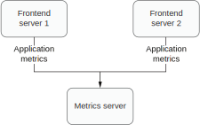
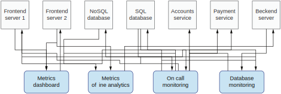
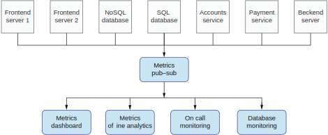
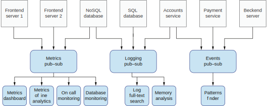

## 11.1 事件驱动应用程序的架构

我们为什么要实现一个事件驱动的系统架构？让我们从一个简单设计开始，看它在紧耦合以及容错的情况下会如何演化。然后我们会看到将它重构成事件驱动后可以如何改进这个系统。

假设我们有两个前端应用程序。可以认为它们是运行在不同节点上的独立微服务。它们都会产生指标并发送给一个指标服务用来持久化指标数据。图11.1展示了这个场景

**图11.1 两个前端应用发送数据给一个后端服务**

这也意味着前端服务1和前端服务2会跟指标服务建立连接。这是一个标准的请求-响应过程。前端服务发送请求（可能通过HTTP或者别的协议），等待响应并结束。在现实生活中，发送指标可能是一个较为繁重的任务，所以每个前端服务都会需要一个线程池来发送这些请求。

从指标服务的角度来看，它需要保持的连接数是前端服务的两倍。当指标服务故障时，两个前端服务都无法发送任何数据。这意味着指标服务的故障会影响到它所有的客户端。这样的容错能力可不理想，因为指标服务变成了一个单点故障。

在现实生活中，情况会变得更加复杂。我们可能会有N个不同的指标服务，用于不同的场景。比如，我们可能有一个指标服务用来提供UI仪表盘，另一个服务在后台对指标进行分析。某些最关键的指标可能会被发送给第三个指标服务用来呼叫人工干预。

另外，我们的架构需要监控的服务数量可能会增长。除了前端服务以外，我们的数据库可能也需要监控。如果我们的业务给用户提供了价值，我们可能需要处理用户的付款和账户信息。所有这些服务都需要发送指标数据，如图11.2所示。

**图11.2 服务越多，指标越多**

在现有架构下，这样的情况会导致服务间连接数的爆炸。每一个产生指标的服务都需要发送数据给N个指标服务。任何一个指标服务故障都会导致所有产生指标的服务一起故障。每一个连接都是直接连接，我们的系统是紧耦合的。如果我们的服务需要通过一个不可靠的媒介（网络）发送数据，我们就会很难保证SLA。幸运的是，事件驱动架构可以解决这些问题，解开服务之间的耦合并提供容错能力。

在本节，我们将在数据的生产者和消费者之间引入一个新的组件提供一个间接层来改进架构。我们可以称它为发布-订阅（pub-sub）系统或事件队列。事件队列是生产者和消费者之间唯一的集成点。

举例来说，如果一个服务需要发送一个指标，它不再需要将指标直接发送给目标服务。假设它需要发送的目标服务包括仪表盘，后台分析以及人工监控服务，如图11.3所示。

**图11.3 事件驱动架构在生产者和消费者之间加入了一个间接层**

在之前的架构里，这个前端服务需要连接三个不同的指标服务（仪表盘，后台分析和人工监控）。其中任何一个服务发生的故障都会传播给这个前端服务。现在，这个前端服务只需要连接一个组件：发布-订阅系统。所有对这个前端服务产生的指标感兴趣的消费者都可以订阅发往这个队列的事件。一旦某个事件被发送，所有的消费者都会得到这个事件。

值得注意的是我们的架构从同步迁移到了异步；生产者和消费者之间没有直接连接，任何指标服务发生故障，前端（生产者）应用程序都不会受到影响。事件仍然会被发送给队列（也就是我们的指标发布-订阅系统）。队列会将事件保持一段有限（或无限）的时间，并在指标服务重新上线后继续发送给它。

使用这样的机制，我们就给系统加入了容错能力。但是要实现这样的机制，我们需要能够正确理解传输语义，并在生产者和消费者端都实现这样的逻辑。我们会在本章后面学到如何实现。现在，某些读者可能已经注意到当前的架构有一个新的问题。队列组件成为了我们系统的单点故障。一旦它故障了，我们的系统就无法工作了。

这话没错；幸运的是，像Apache Kafka或Pulsar这样的队列系统都是经过生产环境验证的，都提供了极高的SLA和可用性。事实上，我们可以基于业务场景调整这些系统的可用性和一致性。可用性可以通过增加服务（Kafka broker）数量以及主题的复制因子来提升。Broker越多，我们能够容忍的错误就越多。如果你的数据被复制到了N（>1）个broker上，一个Kafka服务发生故障，系统依然可用。这是因为其他broker会在第一个broker故障时开始处理流量。

另一个可以提升我们系统的容错性，可用性和松耦合的方案是部署并维护N个独立的事件队列。在这样的设置下，我们可以有一个独立的队列负责指标，一个队列负责日志，另一个负责收集应用程序的事件等，如图11.4所示。

**图11.4 多个独立的发布-订阅系统可避免单点故障**

在这样的设置下，我们就不会再有单点故障了。某个队列系统的故障不会影响其他系统的客户端。比如说，当事件的发布-订阅系统发生故障，应用程序依然可以发送指标和日志，因为每个发布-订阅系统都是独立部署的。如果指标的收集对我们的架构很关键，我们可以调整系统设置单独提高它的可用性。我们可以在基础架构上投入更多的钱，部署更多的服务并将数据复制到更多的地方。另一方面，我们可能觉得事件的收集并不是那么关键，可以降低它的成本并允许数据的丢失。（我们在事件的发布-订阅系统上的开销小了，但是需要忍受一些数据丢失。）通过将队列功能拆成N个独立系统，我们就可以获得双赢——低耦合的异步容错系统且没有单点故障。

当事件的发布-订阅系统发生故障时，生产者可能决定将一些发送的事件缓存一段时间（也可能不缓存）。这种行为被称为断路。此时我们的架构依然是可用的。在我们开始理解事件驱动架构的传输语义之前，让我们先理解Apache Kafka的一些基本概念。