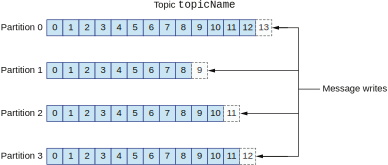
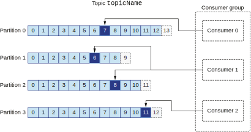
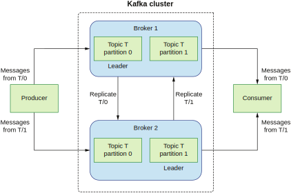

## 11.2 基于Apache Kafka的生产者和消费者应用程序

在我们开始分析消费者和生产者的传输保证之前，让我们先来理解Apache Kafka架构的基本概念。生产者和消费者使用的主要结构被称为`主题`。主题是一个分布式，只追加的数据结构。主题通过分区获得分布能力。一个主题可以被分割成N个分区；分区越多，它的分布式处理进程就越多。假设我们有一个名字叫`topicName`的主题有4个分区（图11.5）。分区编号从0开始递增。

**图11.5 主题是一个分布式，只追加的日志结构**

每个分区都有它自己的偏移量用于在只追加结构中精确指定一条记录。当生产者向主题发送一条新的记录时，它首先需要计算这条记录应该被发送给哪个分区。每一条记录都包含一个键值对。

键决定了该记录的分区。比如说，它可以只包含`user_id`。那么Kafka会根据`user_id`分区，确保同一个用户的所有事件都被发送到同一个分区里。只有这样，该用户事件的顺序才会得到保留。实际的发布-订阅系统中会存在很多主题。一个主题处理账户数据，另一个处理付款信息等等。

生产者发出的消息会被追加到某个分区的末尾。比如说，要是分区算法决定某个事件应该被发送到分区0，它就会被追加到该分区日志的末尾。这条新纪录的偏移量是13。注意这里我们可能会遇到分区倾斜的状况，也就是有一个分区处理了太多的数据。这意味着我们使用的分区键太狭窄了。我们可以往Kafka键添加额外的数据来提升分区的分布性。

### 11.2.1 Kafka消费者

Kfaka解耦合了生产者和消费者，它以异步方式进行数据的消费。消费者是一个从Kfaka主题读取数据的进程。你可能还记得，主题是有分区的。因此，消费者需要知道该主题所有的分区。我们可以只用一个消费者从所有的分区读取数据。不过在现实生活中，我们的应用程序会具有更高的并发性。

现在假设我们有一个4个分区的主题。我们让一个应用程序从这4个分区中获取数据。在这样的条件下，我们可以根据性能需要最多部署4个消费者。每个消费者都从一个分区中读取事件。如果我们的消费者数量超过了分区数，多余的消费者就会被闲置。这是因为所有的主题分区都已经被分配了一个消费者。

让我们假设一个更加复杂的情况。我们的主题还是有4个分区，但我们不需要4个消费者（见图11.6）。在经过了性能测试后，我们发现3个消费者就足以处理带宽了。

**图11.6 分配具有多个消费者的消费者组**

这样的情况是完全可行的。在这样的设定下，有一个消费者进程（consumer 1）会得到两个分区。Consumer 1会处理分区1和分区2。请注意现实场景下的分区分配可能跟这里不太一样。但是在我们的场景下，每个消费者都会分配到至少一个分区。

注意这个额外分区的处理是无法被分布到N个节点上的，因为这会打破分区内的顺序保证。如果让多个消费者得到同一个分区键的事件，我们就无法保证处理的顺序。因此Apache Kafka会确保这样的情况不可能发生。

上述情况（4个分区，3个消费者）的问题在于有一个消费者处理的事件量是其他消费者的两倍。因此，在现实设定中，我们应该考虑选取偶数个消费者。如果我们有4个分区，创建两个消费者来让它们处理同样的数据流量。如果需要更高的带宽，我们应该使用4个消费者。

**注意** 在创建主题之前就选定分区的数量是很重要的。所以你需要根据性能测试和经验数据仔细选择这个数字。

假设我们发现选择的分区数对于我们需要处理的流量来说太低了。那么我们可以创建一个具有更多分区的新主题，并将旧主题迁移到新主题上。不过这个操作是资源密集型的，而且很耗时间。

使用Apache Kafka的一个最重要的好处是它让我们有能力部署N个独立的消费者应用程序。在Kafka中，每一个应用程序都被称为消费者组。每一个消费者组都可以有N个消费者。这就解决了我们在发布-订阅章节描述的问题。

我们可以让多个应用程序消费同一个主题。每个应用程序都可以按照自己的节奏从同一个主题独立消费数据。比如说，假如指标仪表盘应用程序（一个独立的消费者组）不需要高带宽，那么它可以是运行在单个物理节点上的单个Kafka消费者进程。另一方面，人工呼叫的监控服务可能是一个更加关键且对性能敏感的应用程序。这个消费者组就可以有N个消费者来快速处理数据。

### 11.2.2 理解Kafka brokers设置

最后让我们来分析一下如何将Apache Kafka完整地部署到N个broker上。我们来看一个最简单的场景，Kafka被部署到两台物理机器上。每一台机器上都有一个Kafka broker。我们有一个名为`T`的主题有2个分区。这意味着生产者和消费者最大的并发性等于2（分区数）。除此之外T主题的复制因子被设置为2，所以每一个事件（最终）都被保存在两个broker上。

我们假定上述设定只有一个生产者和一个消费者。我们最多可以有两个生产者，且每个消费者组最多可以有两个消费者。然而，将设定简化为只有一个生产者和一个消费者让我们可以轻松探究Kafka broker设置背后的理由。图11.7显示了符合我们场景的设定。

**图11.7 多个Kafka broker**

`T`主题有2个分区。由于主题复制因子被设定为2，每个分区都会被复制到两个broker上。如果它被设定为1，每个分区就只被保留在一个broker上。分区以主从模式工作。任何一个分区都只有一个主broker。在我们的设定下，broker 1是`T`主题分区0的主，broker 2是`T`主题分区1的主。

我们需要记住复制因子越高，集群需要的资源就越多。如果复制因子为2，相比复制因子1，我们就需要两倍的磁盘空间。这是因为数据需要被保存在两个物理地址上。如果复制因子等于3，我们就需要3倍的磁盘空间。另外，将数据保存到更多的broker也需要更多的网络流量并消耗更多的CPU。因为在复制数据时需要通过网络进行传输。

生产者发送数据到主题分区时，它会发送给该分区的主broker。接下来，数据被复制到从broker作为崩溃时的备份。如果broker 1崩溃了，broker 2会作为该分区的主broker开始服务。消费者进程需要保存一个列表，里面包含了所有主题所有分区的主broker。这样它才能从正确的分区消费数据。当一个broker发生故障时，重平衡过程会更新该消费者上所有分区的主broker。现在我们已经了解了Kafka是如何工作的，接下来让我们来分析一下生产者的传输语义。