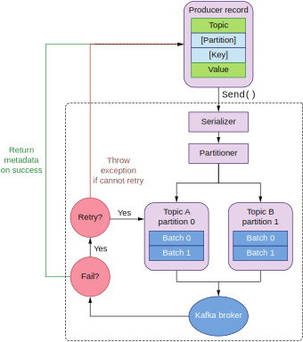
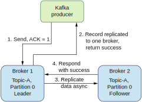

## 11.3 生产者的逻辑

让我们首先来看看Kafka生产者的逻辑。Apache Kafka的生产者（http://mng.bz/lad2）是我们发送数据给Kafka主题的主要入口点。Kafka生产者可以有很多设置参数（http://mng.bz/BxP1）。其中有3个是我们需要指定的。

第一个参数是一个Kafka broker的列表，叫做`bootstrap-servers`。这个列表里应该包含了同一个集群中所有的Kafka broker。生产者用它们来决定事件应该被发往哪里。另外，每一条Kafka记录都包含一个键值对。我们需要为它们指定序列化器。序列化器提供的转换逻辑可以将一个Java对象序列化为字节数组，用于发往Kafka主题。下列代码显示了一个使用Spring Kafka库的Kafka生产者配置的例子（http://mng.bz/dojo）。

**代码11.1 创建一个Kafka生产者的配置**
```
@Configuration
public class SenderConfig {

    @Value("${kafka.bootstrap-servers}")
    private String bootstrapServers;

    @Bean
    public Map<String, Object> producerConfigs() {
        Map<String, Object> props = new HashMap<>();
        props.put(ProducerConfig.BOOTSTRAP_SERVERS_CONFIG, bootstrapServers);
        props.put(ProducerConfig.KEY_SERIALIZER_CLASS_CONFIG,
          IntegerSerializer.class);
        props.put(ProducerConfig.VALUE_SERIALIZER_CLASS_CONFIG,
          StringSerializer.class);					1
        return props;
    }

    @Bean
    public ProducerFactory<Integer, String> producerFactory() {
        return new DefaultKafkaProducerFactory<>(producerConfigs());
    }

    @Bean
    public Producer<Integer, String> producer() {
        return producerFactory().createProducer();			2
    }

    @Bean
    public KafkaTemplate<Integer, String> kafkaTemplate() {
        return new KafkaTemplate<>(producerFactory());
    }

    @Bean
    public Sender sender() {
        return new Sender();					3
    }
}

1 Kafka生产者的设置是一个map
2 生产者处理整数类型的键和字符串类型的值
3 Sender是一个建立在Kafka生产者上的Spring抽象
```

生产者逻辑使用了之前创建的`Producer`向Kafka主题发送数据。这个逻辑是异步的，`Producer`的行为不会阻塞，而是返回一个`Future`。这里需要指出，在多个线程之间共享一个`Producer`实例向多个主题发送数据是线程安全的。`Producer`接受主题，分区键和实际的值作为参数。它会将请求基于分区键路由到正确的主题分区，如下列代码所示。


**代码11.2 创建一个Kafka生产者**
```
@Autowired private Producer<Integer, String> producer;

public Future<RecordMetadata> sendAsync			1
➥ (String topic, String data, Integer partitionKey) {		2
    LOGGER.info("sending data=‘{}’ to topic=‘{}’", data, topic);
    try {
        return producer.send(
            new ProducerRecord<>(topic, partitionKey, data),		3
            (recordMetadata, e) -> {				4
                if (e != null) {
                    LOGGER.error("error while sending data:" + data, e);
                }
            });
    } finally {
        producer.flush();
    }
}

1 返回一个Future
2 生产者接受一个主题，分区键，和实际要发送的数据。
3 将ProducerRecord直接传递给Kafka生产者
4 成功发送数据后执行异步的回调函数
```

发送操作是异步的，我们可以注册一个回调函数在发送结束后执行。我们的回调函数会检查异常是否为空。如果不为空，说明发送操作失败了。

这个简单的`sendAsync()`代码隐藏了很多复杂性。让我们通过分析图11.8来回顾一下生产者流程。



**图11.8 Kafka生产者发送操作的流程**

首先，我们创建了一个`ProducerRecord`。它包含了一个主题，键和值。我们可以指定这条记录要发往的分区，如果不指定，它会根据键计算出这个分区。如果我们没有提供键（键是空值），它会根据round-robin算法给这条消息分配一个分区。接下来，数据会被序列化成一个字节数组。然后，分区器决定这条记录应该被发送到哪个分区。

注意，生产者会按照主题分区对记录进行批处理。这意味着一个批次可以包含N条同一个分区的记录。发送成功后，它会返回每一条记录的元数据。包括该条记录在送达的分区内的偏移量。如果发送失败，发送会被重试。这个retry参数（http://mng.bz/VlXy）可用于配置重试的次数。如果还有剩余的重试次数，整个批次的记录都会被重发。如果重试次数用完，会向调用者传播一个异常。

这里需要注意的是，在某个分区内重发一批记录会打破该分区内的顺序保证。如果第一个请求失败了并调度了一个重试，第二个请求有可能在重试发生之前成功。此时，批次会发生交错（跟我们在前一章讨论的情况类似）。这会导致分区内的乱序事件。

如果启用了重试行为（默认是启用的），就会有发生重复的可能。工作在这种模式下的生产者提供了至少一次的传输保证——同一个条记录可以被发送一次或更多次。如果我们想要让生产者的逻辑容错且健壮，重试是必然要启用的。


### 11.3.1 为生产者选择一致性还是可用性

我们在生产者端需要做出的另一个重要的权衡是选择数据的一致性还是生产者的可用性。假设我们的集群有两个broker，主题A被同时复制到这两个broker上。为了简化起见，我们假设主题A只有一个分区（行为和N个分区是一样的）。当生产者往该主题发送数据时，我们在确认响应时有三个选项（http://mng.bz/xvQd）。每一个选项都提供了不同的一致性和可用性。让我们首先来研究将`acks`参数设置为`all`会发生什么，如图11.9所示。


**图11.9 acks=all，我们选择了一致性放弃了可用性（生产者需要等待服务器返回的确认）**

如果主题在创建时选择的复制因子是2，发送的记录需要被所有的broker（在我们的例子中是2个）成功保存并返回确认。A主题分区0的主broker是broker 1。生产者会向这个broker发送数据。因为`acks`参数被设置成`all`，主broker将记录传播给broker 2（从）。当数据在从broker上成功保存后，主broker会收到来自从broker的成功响应，然后才能向生产者返回一个成功响应。

任何一个broker发生了故障，数据都是一致的。这保证了该主题在两个broker上的数据相同。然而，在这种情况下（一个broker故障），复制因子2无法被满足。此时，我们的系统不可用。我们为了数据的一致性牺牲了整个系统的可用性。

在真实生活的设置下，我们会有更多的broker。如果我们有三个broker且复制因子为2，一个broker故障不会导致整个系统不可用。只要还有两个broker在线，我们就能成功发送数据。

你要根据自己的业务场景选择broker的数量和主题的复制因子。为了决定这些数据，你首先需要找到集群需要处理的每秒最大请求数（或者MB/s）。一旦你有了这个数据，你就可以针对单个broker进行性能测试，找到它的最大处理带宽。你也可以在网上找到相关资源（比如，http://mng.bz/Axwo），但是注意，你的最大带宽会根据你使用的机器类型发生变化。磁盘速度，CPU数量和内存大小都会影响带宽。

找到单个broker最大处理带宽后，你就可以根据你的流量算出所需要的broker数量。但是为了让你的Kafka系统具有高可用和一致性，你还需要增加你主题的复制因子。复制因子取决于你的个人需求，需要被仔细选取。主题复制的地方越多，你的集群需要处理的带宽就越高。比如说，假设你将复制因子设置为2，那么你的网络流量就会翻倍。由于数据需要被保存在两个Kafka broker上，你的磁盘空间也要翻倍。

**注意** 创建一个生产环境的Kafka集群是一个复杂的项目，所以我建议你多读多实验来找到最适合你的设置。

现在让我们来考虑这个acks参数设置为1的情况。此时，生产者只需要等待1个broker（主）确认数据成功保存即可。图11.10描述了这样的配置。



**图11.10 acks=1，我们选择了可用性放弃了一致性**

在这个场景下，数据需要被复制到多少个broker上依然是由主题A的复制因子决定的。不过复制操作会异步进行。只要主broker成功保存了生产者的数据，它就会立刻向调用者返回成功。

数据在后台会被同步到从broker上。不过在从broker保存数据的时候有可能发生故障。此时，数据就没有被复制到第二个broker上。因为生产者只需要等待主broker的确认，所以它无法得知后台发生的故障。如果broker 1在复制数据的时候失败，broker 2上主题A的数据就不是最新的，我们就在冒丢失数据的风险。另一方面，就算集群里只有一个broker在工作，生产者依然可以将数据发送到主题A，我们获得了主题A的可用性，代价则是数据的一致性。

我们还可以将acks参数设置为第三个选项：0。此时，生产者不会等待任何Kafka broker返回确认。这是一个触发即遗忘的场景，生产环境下一般很少用到。丢失数据的可能性很高，而你甚至都不会注意到。

现在我们已经了解了生产者端的逻辑，接下来让我们进入Kafka消费者端。我们会在消费者的代码里实现不同的传输语义。