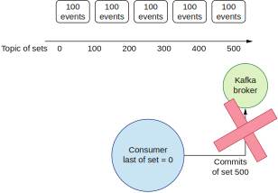
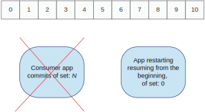
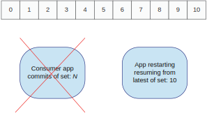
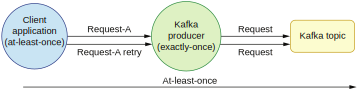

## 11.4 在消费者端实现不同的传输语义

数据被成功保存到主题的只追加日志后，Kafka消费者就可以获取它。我们可以配置主题的留存时间，超过这个时间的事件会被删除。留存时间也可以被配置成无限，这意味着事件不会被删除。让我们从一个消费者代码样例开始看起。

在配置消费者时，我们也需要提供一个Kafka broker列表。你可能还记得生产者端需要使用一个序列化器来将对象转换成一个字节数组。消费者端需要一个相反的转换：从字节数组转换成对象。因此我们需要提供一个反序列器的类。每一个消费者都工作在一个消费者组里，所以我们也需要提供这个消费者所在的消费者组的ID。

这里有个重要的知识，Kafka主题的偏移量是在消费者组内追溯的。这意味着当消费者从主题内批量获取事件时，它会通过提交偏移量来表示这些事件已经被正确处理了。当发生故障的时候，同一消费者组内的另一个消费者就会从上一次提交的偏移量后继续处理。

我们提交偏移量和继续处理的方式影响了我们消费者应用程序的传输语义。让我们从一个最简单的例子开始：让Kafka消费者自动提交偏移量。我们可以通过设置enable.auto.commit（http://mng.bz/ZzgR）为true来进行自动提交，如下列代码所示。

**代码11.3 配置一个Kafka消费者**
```
@Bean
public Map<String, Object> consumerConfigs() {
    Map<String, Object> props = new HashMap<>();

    props.put(ConsumerConfig.BOOTSTRAP_SERVERS_CONFIG, bootstrapServers);
    props.put(ConsumerConfig.KEY_DESERIALIZER_CLASS_CONFIG,
        IntegerDeserializer.class);
    props.put(ConsumerConfig.VALUE_DESERIALIZER_CLASS_CONFIG,
        StringDeserializer.class);
    props.put(ConsumerConfig.GROUP_ID_CONFIG, "receiver");
    props.put(ConsumerConfig.ENABLE_AUTO_COMMIT_CONFIG, "true");
    return props;
}
```

我们可以用这个配置来构造一个Kafka消费者。消费者可以工作在N个主题上，也可被多个线程共享。我们只需要用它去订阅我们想要消费的主题，如下列代码所示。

**代码11.4 创建一个自动提交偏移量的Kafka消费者**
```
public KafkaConsumerAutoCommit(Map<String, Object> properties, String topic) {
    consumer = new KafkaConsumer<>(properties);
    consumer.subscribe(Collections.singletonList(topic));			1
}

public void startConsuming() {
    try {
        while (true) {							2
            ConsumerRecords<Integer, String> records =
                consumer.poll(Duration.ofMillis(100));				3

            for (ConsumerRecord<Integer, String> record : records) {		4
                LOGGER.debug(
                    "topic = {}, partition = {}, offset = {}, key = {}, value = {}",
                    record.topic(),
                    record.partition(),
                    record.offset(),
                    record.key(),
                    record.value());
                logicProcessing(record);
            }
        }
    } finally {
        consumer.close();
    }
}

1 消费者从订阅的主题接收事件
2 在while循环中迭代处理
3 轮询所有可用的记录，最多等待100毫秒
4 返回一批记录，它们来自订阅的所有主题
```

`startConsuming()`方法在循环中调用消费者的`poll()`方法获取结果，最多等待100毫秒。这个方法返回一批记录给消费者处理。每一条记录都包含键和值以及一些元信息，比如主题和分区。`offset()`方法返回该条记录在该主题分区内的偏移量。最后，我们在这批记录上进行迭代，循环处理每一条记录。

当消费者工作在自动提交模式，它会在后台每隔N毫秒自动提交偏移量，N由auto.commit.interval.ms设置指定（http://mng.bz/REnZ），默认为5秒。

想象一下我们的应用程序每秒处理100个事件，如图11.11所示。假设一共有5批这样的事件。这样的场景下，偏移量每隔500个事件才会提交一次。如果应用程序在5秒内发生了故障，偏移量就不会被提交。最近一次已知的偏移量就还是0。



**图11.11 每秒处理100个事件的消费者自动提交**

当发生故障时，另一个消费者继续处理，它会观察到上次提交的偏移量为0。它会轮询到之前发生故障的那个消费者可能已经处理过的500个事件，这意味着有可能发生500次重复事件。这就是至少一次传输语义有可能发生的场景。我们的消费者在成功提交时可以只收到一次事件。但是如果提交失败了，另一个消费者会重新处理数据。


### 11.4.1 消费者手动提交

我们可以用手动提交来改进上述情况。首先，我们需要将自动提交设置为false来禁用这一行为，如下列代码所示。

**代码11.5 禁用自动提交**
```
props.put(ConsumerConfig.ENABLE_AUTO_COMMIT_CONFIG, "false");
```

现在开始，消费者不会再自动提交偏移量了。提交这件事变成了我们的责任。现在我们需要做的最重要的决定是，我们要在事件进入系统的时候提交还是在处理完后提交。如果我们想要保证至少一次传输语义，我们就应该在处理完成后提交偏移量。这样就可以确保消息只有在成功处理后才被标记成已提交。下列代码展示了这个过程。

**代码11.6 同步提交**
```
public void startConsuming() {
    try {
        while (true) {
            ConsumerRecords<Integer, String> records =
                consumer.poll(Duration.ofMillis(100));
            for (ConsumerRecord<Integer, String> record : records) {
                logicProcessing(record);
                try {
                    consumer.commitSync();		1
                } catch (CommitFailedException e) {
                    LOGGER.error("commit failed", e);
                }
            }
        }
    } finally {
        consumer.close();
    }
}

1 这段消费者代码里唯一的区别就是手动提交。
```

在代码11.6，我们用`commit()`方法来完成手动提交。它会提交该消费者处理的所有分区的偏移量。注意这个`commit()`方法是阻塞的。这意味着偏移量在提交完成之前不会继续处理下一批记录。虽然这样比较安全，但是新方案的整体性能会受到影响，所以这个`commit()`操作可能有一定代价。

如果要避免这个代价，我们可以使用不阻塞线程的`commitAsync()`方法。但是，如果我们用异步方式提交，我们就需要仔细处理错误，因为异常不再被传播给主调用线程。下列代码展示了如何使用`commitAsync()`。

**代码11.7 异步提交**
```
consumer.commitAsync(
                (offsets, exception) -> {
                    if (exception != null) LOGGER.error(
➥ "Commit failed for offsets {}", offsets, exception);
                });
```

有时我们可能观察到一个异步提交失败了，但下一批事件的提交却成功了。此时，我们的系统不会受到影响，因为后面那次成功的提交操作会记录正确的偏移量。

现在让我们来看看在处理事件之前就提交偏移量会发生什么。此时，处理事件的逻辑发生的故障不会被Kafka broker注意到。因为偏移量已经被提交了，所以当消费者继续处理时，之前的批次不会被重新处理。

如果`logicProcessing()`方法没有成功完成，一些事件可能并没有被处理。此时我们就有可能丢失事件。这样的系统具有至多一次的传输保证：一个事件会被处理一次（但也有可能它一次也没有被处理）。


### 11.4.2 从最早或最晚的偏移量开始重启

影响我们消费者应用程序传输语义的还有第二个方面。假设我们的主题有10条记录（因此会有10个偏移量）。我们的消费者应用程序一次会获取多条记录。这批记录内包含1个到10个事件，并提交一个等于获取事件数量的偏移量。不幸的是我们的应用程序在提交阶段奔溃了。此时，我们不知道消费者应用程序处理了多少事件。这可以被很多因素影响，比如消费者的超时设置，批处理的大小等等。应用程序重启后，我们可以有两种方式继续进行处理。

这两种方式由auto.offset.reset策略（http://mng.bz/2jqg）控制。如果设置成earliest，消费者会从该主题分区最后一次提交的偏移量开始继续处理。如果这个偏移量不存在，那就从头开始处理。图11.12描绘了这个策略。

此时，消费者会重复处理数据。这是因为消费者的奔溃可能发生在处理记录的任何时候，事实上，我们一次重启最多可能会有20条重复记录（2 * 10个事件）。这个偏移量重置策略提供了至少一次的传输语义。



**图11.12 从最早的偏移量开始重启**

我们可以通过集成测试观察到这个策略。在下列代码所展现的测试中，我们将`OffsetResetStrategy.EARLIEST`传递给Kafka消费者。

**代码11.8 测试最早偏移量重置策略**
```
// given
ExecutorService executorService = Executors.newSingleThreadExecutor();
String message = "Send unique message " + UUID.randomUUID().toString();

KafkaConsumerWrapper kafkaConsumer =
    new KafkaConsumerWrapperCommitOffsetsOnRebalancing(
        KafkaTestUtils.consumerProps(
            "group_id" + UUID.randomUUID().toString(),
            "false",
            AllSpringKafkaTests.embeddedKafka),
        CONSUMER_TEST_TOPIC,
        OffsetResetStrategy.EARLIEST);			1

// when
sendTenMessages(message);
executorService.submit(kafkaConsumer::startConsuming);	2
sendTenMessages(message);

// then
executorService.awaitTermination(4, TimeUnit.SECONDS);
executorService.shutdown();
assertThat(kafkaConsumer.getConsumedEvents()
        ➥ .size()).isGreaterThanOrEqualTo(20);		3

1 使用最早偏移量重置策略
2 在发送了10条记录后调用startConsuming()让消费者开始消费
3 断言总共消费了至少20条记录
```

发送10个事件，开始消费，然后再发送10个事件，最后验证收到的事件数量。消费者收到了生产者发布的所有20个事件，包括consumer创建之前发送的10个。

我们可以选择的另一个策略是最晚偏移量。如果不存在一个提交过的偏移量，这个策略会在故障后从该主题最后一个偏移量开始读取。在我们的测试场景中，它会从偏移量10开始。如图11.13所示。



**图11.13 从最晚的偏移量开始重启**

在这个场景里，应用程序奔溃前传达的一些事件有可能丢失。它们被传达了但没有被处理。此时我们不会有重复的事件，但会丢失事件。使用最晚偏移量策略可以提供最多一次的传输语义。

测试代码跟之前的例子类似。首先，我们会用`OffsetResetStrategy.LATEST`创建Kafka消费者，如代码11.9所示。它是Kafka的默认值所以一般不需要传递；我们在这里显式传递这个参数只是为了说明得更清楚。消费者使用了一个随机的消费者组ID（为了保证一开始不存在偏移量），且不会自动提交偏移量。接下来我们会向Kafka主题发送10条消息。发送完毕后，我们才启动Kafka消费者。消费者启动后，我们继续发送后10条消息。

**代码11.9 测试最晚偏移量重置策略**
```
// given
ExecutorService executorService = Executors.newSingleThreadExecutor();
String message = "Send unique message " + UUID.randomUUID().toString();

KafkaConsumerWrapper kafkaConsumer =
    new KafkaConsumerWrapperCommitOffsetsOnRebalancing(
        KafkaTestUtils.consumerProps(
            "group_id" + UUID.randomUUID().toString(),		1
            "false",
            AllSpringKafkaTests.embeddedKafka),
        CONSUMER_TEST_TOPIC,
        OffsetResetStrategy.LATEST);				2

// when
sendTenMessages(message);

executorService.submit(kafkaConsumer::startConsuming);		3

sendTenMessages(message);

// then
executorService.awaitTermination(4, TimeUnit.SECONDS);
executorService.shutdown();
assertThat(kafkaConsumer.getConsumedEvents().size()).isLessThanOrEqualTo(10);

1 动态产生消费者组，避免跟其它消费者测试产生冲突
2 传递最晚偏移量策略
3 最初的10条记录发送后开始消费者逻辑
```

你可以观察到Kafka消费者只获取了10条记录。消费者启动前发布的事件没有被处理。

这个集成测试跟之前的类似。两种情况都有各自的优缺点和各自的适用场景。如果我们对时延很敏感，需要对最近的事件做出响应，我们可能会从最晚的偏移量开始继续处理。比如，一个告警系统可能对几分钟前传达的事件更感兴趣。过时的数据对我们来说没什么价值。另一方面，如果我们的系统需要提供正确性，我们就应该处理所有的事件，并去除重复。比如说，如果一个付费系统崩溃了，我们需要从奔溃前的点开始继续处理所有等待中的付费交易。


### 11.4.3 （最终）恰好一次语义

构建一个提供恰好一次传输语义的系统很难。到目前为止，我们已经看到了两种可能的传输语义：至少一次和至多一次。如果我们的系统逻辑是非幂等性的，且我们不能丢失任何事件，那我们就需要做到恰好一次的语义。

实际上，提供最终恰好一次的系统通常是在至少一次传输语义之上构建的。正如我们在上一章学到的，实现去重逻辑可以提供我们最终恰好一次的语义。我们强调“最终”是因为，在中间某些层，事件可以被重复。例如，它们可以在生产者端的重试逻辑中重复。在这种情况下，这些重复事件对于整个系统来说是看不见的，系统最终是恰好一次的传输语义。

Apache Kafka通过实现一种分布式事务的形式来构建最终恰好一次的语义。在Kafka架构里，生产者和消费者都可能发生重复。生产者默认会重试那些失败的请求。消费者则如本节讨论的那样，可能由于提交偏移量的行为在重启后获得重复的事件。

为了减轻这个问题，Apache Kafka实现了事务。生产者会在将一个新的事件发送给Kafka主题之前开始一个事务。它使用`transactional_id`（http://mng.bz/1jPX）在事务内提供最终恰好一次的语义。每一条记录都会得到一个事务ID。当发送出现故障时，操作会回滚，于是Kafka确保该条记录不会出现在Kafka主题内。之后我们可以用一个不同的事务ID重试该条记录。不过，事务仅在当前Kafka生产者内有效。如果生产服务的逻辑是基于外部事件（比如来自另一个Kafka集群或通过HTTP），我们依然有可能得到一个重复。

触发生产者发送的事件可能遵循了至少一次的传输语义（如图11.14）。如果使用了Kafka事务的系统没有手段检测到此类重复，那么这些事件就有可能被生产者认为是两个独立的事件。



**图11.14 上游至少一次的传输语义会导致恰好一次的系统发生重复**

假设客户应用程序没有实现事务并提供了至少一次的传输语义。它就可能在发生故障时重试。即使基于该客户逻辑的Kafka生产者使用了事务来提供最终恰好一次的语义，我们也要注意到此时整个系统是有可能产生重复的。

从Kafka生产者的角度来看，这是两个不同的请求。如果没有实现一个去重机制，我们就不可能判断出这些请求是否重复。接下来，这两个请求都会通过事务传输，并都具有恰好一次的保证。而从整个系统的逻辑来看，它向Kafka发送了两次同一个事件（这两个事件其实是重复的）。因此，逻辑上这只是一个至少一次的传输保证。

我们可以很清楚地看到，只有当你业务流程内所有组件都提供最终恰好一次的语义时，你的整个系统才是最终恰好一次的。实际上，我们可能会有N个处理、通信、交换数据的阶段通过发布订阅系统，HTTP协议或别的什么东西互联。这意味着整个管道需要被封装到单个事务里。这样一个解决方案可能非常脆弱，很难容错。在任何阶段发生故障，我们的业务流都有可能无法继续，必须等待操作人员的人工干预来修复事务。

如果你想要在自己的应用程序里使用最终恰好一次的语义，你要当心你系统的性能和可用性。在决定是否使用这个机制前，应该做大量的性能和混沌测试。我们会在下一节看到如何使用Kafka传输语义来提升我们系统的容错。