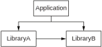
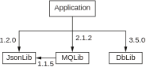
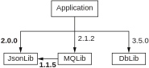

## 12.2 库的版本管理

对于很多开发者来说，库的版本管理是最重要的。如果你只是使用库，情况会比较简单——或者至少可能比较简单。使用多个库的多个版本是很复杂的，会令你极度沮丧。就算所有你用的库的开发者都遵循了跟你平台一致的版本命名规则（比如版本语义规范），也不能保证你不会遇到兼容性问题。最多只是让你的决定变少而已。

本节大部分内容都跟库的发布有关。发布一个库需要做出很多决定，其中许多决定只是基于有根据的猜测做出的权衡。库的发布这个概念本身就有很多细微的差别。Maven Central或NuGet这样的包管理器在发布库时需要要考虑的事情和一个公司内部库的发布或库源码的更新需要考虑的事情截然不同。

这事没有简单的解决方案，但是本节提供的指引能够帮你问出正确的问题并至少得到一个不算最糟的答案。很多库的版本管理解决的都是兼容性问题，让我们首先来思考兼容性到底意味着什么。


# 12.2.1 源码，二进制和语义兼容性

本节我们会解决一个主要问题：我们希望发布一个库的新版本，且我们需要知道它是否后向兼容同一个库的老版本。假定我们对使用我们库的代码一无所知，并将每一个例子都当成一个挑战：我们是否能写出一段假想的客户代码会因为我们的改动而出问题？这样我们就能去考虑这个问题背后的原因。

**注意** 本节任何地方，当我们提到客户代码时，意味着这段代码属于某个依赖我们库的应用程序（或另一个库）。也就是说通常它会调用我们的库提供的函数。但这不是一定如此的。有时候客户代码也可能只是实现了一个我们的库提供的接口。

剧透警告：对于几乎所有你能够想到的改动来说，写一段假想的会出问题的客户代码都是可能的。作为一个极端点的例子，客户代码可以校验你的库的哈希并在不符合预期时抛出异常。这种情况下，对你的库的任何改动都会让那个客户出问题。

幸运的是，大多数客户代码都是符合情理的，不过你可能依然会发现客户代码出现一些合理但令人费解的问题。你是应该承认这种情况属于破坏性改动并接受相关的代价，还是认为这种费解的情况不属于需要修复的范畴？在你发现某个改动可能导致客户代码被破坏后，你就需要做出这些决定。

对于编译语言来说，你需要考虑三种类型的兼容性问题：源码兼容性，二进制兼容性，以及语义兼容性。那些不需要提前编译的语言无所谓二进制兼容性的概念，因为它们的库实际以源码的形式发布。比如React和jQuery这样的JavaScript库。下面所有的例子都是Java写的，但是兼容性规则跟语言息息相关；我们的目的是展示思考的过程，而不是关注例子里特定的改动。

大多数例子展示的都是库代码，包括改动前和改动后的代码，以及使用哭的客户代码。让我们先来看看源码兼容性。

**源码兼容性**

如果一个旧版本的库的客户代码也可以工作在新版本的库上，我们就称这个库的新版本是源码兼容旧版本的。Java需要对新库重新编译客户代码。让我们看一些明显的不兼容改动的例子：重命名一个方法（即使只是改了一个字母的大小写），见下列代码。

**代码12.1 改变方法名字**
```
库代码改动前
public static User getByID(int userId) {
    …
}
库代码改动后
public static User getById(int userId) {
    …
}
客户代码
int userId = request.getUserId();
User user = User.getByID(userId);
```

库改动后，客户代码编译失败，报错说找不到User.getByID的符号。重命名任何公开信息（比如包，属性，接口，类，或方法）都是破坏性改动。但并不是所有的破坏性改动都是那么明显。考虑将一个参数的类型改成其超类的情况——比如String改成Object，如下列代码所示。

**代码12.2 改变参数类型（源码兼容性）**
```
库代码改动前
public void displayData(String data) {
    …
}
库代码改动后
public void displayData(Object data) {
    …
}

任何调用这个方法的代码都依然能够工作。即使客户代码做了方法引用的转换也能工作。但客户代码能做的可不仅是调用方法。

客户代码
public class ConsumerClass extends LibraryClass {
    @Override
    public void displayData(String data) {
        …
    }
}
```

原来的代码没问题，但是改动后的库代码就会导致客户代码编译失败。Java会阻止子类重载超类里标记了final的方法，所以在这种情况下（超类里标记了final），这个改动也许是源码兼容的。总之你需要当心任何公开API的改动，因为你不确信这个改动是不是兼容的。

**注意** 虽然我们看的例子是Java写的，兼容性问题在其他语言里也会存在。重要的是不要假定在一种语言里源码兼容或二进制兼容的改动到了另一种语言也同样兼容。比如，在Java里重命名方法参数是后向兼容的，但在C#里就不是，因为C#有一个叫做命名参数的功能。更复杂的问题是，后向兼容的规则还会随着时间而改变。（比如，C#并不是一直都有命名参数的功能，而Java也可能在未来提供这个功能。）

在大多数情况下，添加新东西被认为是兼容的改动，即使它可能在理论上因引入名字冲突而破坏客户代码。一个重要的反例是在接口上添加新的方法；除非你为该方法提供了一个默认实现，否则那就是一个破坏性改动，因为任何申明自己实现了该接口的客户代码现在都不是完全实现该接口了。在已有的抽象类上添加新的抽象方法也一样。

目前为止，我们已经考虑了改动库代码并重新编译客户代码的情况。如果我们不能重新编译客户代码又会发生什么？这种情况下的兼容性被称为二进制兼容性。

**二进制兼容性**

在深入二进制兼容性细节前，我们需要提醒读者为什么它很重要。毕竟，在需要的时候重新编译我们的应用程序没什么大不了的，对不对？虽然在应用程序层面确实如此，但是对于其他依赖类型来说就不太可行了。我们会在12.2.2节看到依赖图里包含的复杂度，现在就先想象如下的场景：

* 你的应用程序依赖A库和B库
* A库也依赖B库

这个场景如图12.4所示，每个箭头表示依赖关系。如果B库的改动只能在编译后向后兼容，那你也需要重新编译A库，而这可能会很麻烦。



**图12.4 一个简单的应用程序，依赖了两次B库**

二进制兼容性可能比源码兼容性更难推导，因为它包含了一个开发者通常会忽视的抽象层。比如说，大多数Java开发者不需要理解任何一段代码生成的字节码。幸运的是，Java的语言规范里有一整个章节讲述哪些改动是二进制兼容的，而哪些不是。不过不要指望所有的语言都有精细到这种程度的文档！

有些二进制不兼容的改动很明显：删除或重命名方法或类型很明显会导致问题。另外一些改动就不是那么明显了。让我们回顾一下之前那个将方法参数的类型从String改成Object的例子。忽略我们之前注意到的重载问题，源码是兼容的，因为有一个隐式的从String到Object的类型转换。但那是一个只有编译器才知道的转换。在执行的时候，JVM还是会期待方法的签名跟之前那个保持一致。让我们来看一个实际例子。

**代码12.3 改变参数类型（二进制兼容性）**
```
库代码改动前
public void displayData(String data) {
    …
}

库代码改动后
public void displayData(Object data) {
    …
}

客户代码
public class Program {
    public static void main(String[] args) {
        new LibraryClass().displayData("Hello");
    }
}
```

如果我们试图运行的客户代码是基于改动前的库代码编译的，且在库代码改动后只重新编译了库，那么在执行时会抛出一个错误：
```
java.lang.NoSuchMethodError: 'void LibraryClass.displayData(java.lang.String)'
```
二进制兼容性特别令人讨厌的地方在于下面两个方面：
* 你只有在执行的时候才会发现问题。编译语言的开发者已经习惯于让编译器在编译的时候抓出此类问题（调用的方法不存在）。
* 你只有在JVM运行到那段调用缺失方法的代码的时候才会发现问题。这点特别让人担心，因为最不容易被测试覆盖到的代码路径往往是那些处理错误的代码，这会导致错上加错。

我们可以看到，有些API的改动可能是源码兼容但二进制不兼容的。添加新类这样的改动可能是二进制兼容但源码不兼容的（因为名字冲突）。另外的改动要么是两者都兼容，要么两者都不兼容。

所有目前提到的这些都还只是关于公开的API；我们还没有涉及实现的细节。但是`代码可以编译且所有方法都能被找到`和`所有的代码都跟以前一样可以工作`是两回事。我们要考虑的最后一个兼容性话题是语义兼容性。

**语义兼容性**

二进制兼容性是不容辩驳的。但源码兼容性就有一些摸棱两可；比如说，潜在的名字冲突算不算破坏性改动这点是你可以说了算的。这些通常都可以很明确地定义。语义兼容性讨论的是代码的行为，而你不可能知道你的客户们都会依赖什么样的行为。这叫做海拉姆定律（Hyrum's Law，以谷歌软件工程师Hyrum Wright命名，见https://www.hyrumslaw.com/）：

_如果一个 API 有足够数量的用户，那么你在接口规范里定义的行为就不重要了：你系统的所有可观察的行为都会被某些人依赖。_

在一个极端的情况下，我们可以让每一次库的更新都去升级语义版本规范的主版本。在另一个极端情况下，我们可以对用户说“如果你不喜欢新的行为就别用这个库”并宣称任何不影响公开API的改动都是非破坏性改动。当然，这两种极端情况都不太合理。

当然，大多数代码实现的改动都不会对行为做出巨大改变。值得注意的是下面这三类改动：
* 参数校验
* 继承
* 性能改动

参数校验改动通常分两种。要么是某个非法的输入被错误的放行了，而你打算收紧这个口子把它拒绝掉（作为bug修复），或者你打算放行某个之前被拒绝的输入（作为一个新功能）。这里给出一个关于后者的例子，一个简单的Person类提供一个人的正式名字和别名（可能是昵称，缩写或别的什么）。一开始，两种名字都是必须的，如下列代码所示。

**代码12.4 Person类一开始有两个不可为空的参数**
```
public class Person {
    private final String legalName;
    private final String casualName;
    public Person(String legalName, String casualName) {
        this.legalName = Objects.requireNonNull(legalName);
        this.casualName = Objects.requireNonNull(casualName);	1
    }
}
1 如果casualName为空则抛出异常
```

现在我们假设，在实际使用中，我们发现大多数用户并不想要指定一个额外的别名。他们会为正式名字和别名提供一个同样的名字，有时候这会让代码变得晦涩难懂。我们想要改变这个库，让别名可以为空，默认让别名等于正式名字。

**代码12.5 Person类构造函数改为允许空的别名**
```
public class Person {
    private final String legalName;
    private final String casualName;
    public Person(String legalName, String casualName) {
        this.legalName = Objects.requireNonNull(legalName);
        this.casualName = casualName == null ? casualName : legalName;	1
    }
}
1 如果casualName为空则使用正式名字
```

从某种意义上来说，这是一个兼容的改动。但是如果任何用户依赖了对`casualName`参数的校验，他们现在就被破坏了。更令人警惕的是，这个破坏可能是沉默性的。考虑下面这段客户方法，它会在屏幕上打印一些字符，或者也可以用来在网页上创建HTML：

```
public static void createUser(String legalName, String casualName) {
    Person person = new Person(legalName, casualName);
    System.out.println("Welcome, " + casualName);		1
    ...						2
}
1 期望这里的casualName已经被校验过是非空的了
2 使用Person类进行后续操作
```

如果`createUser`方法的`casualName`参数为空，这段代码会打印`Welcome, null`而不是像以前那样抛出一个异常。这个方法可能在别的地方会使用这个参数，而传进来一个空值在以前可是非预期的行为。这段代码可能属于一个库，而这个库的文档宣称会对casualName进行校验，其实则是利用了Person类的构造函数来做这个校验。

在这种情况下，一个向后兼容的替代方案是新增一个构造函数，只接受一个名字作为参数（这个名字会被用于正式名字和别名）。如果你发现自己在考虑放松（或收紧）校验，新增一个替代路径（通过函数的重载或新增一个方法）可以帮助你避免沉默破坏性改动

继承会导致语义改动，这是因为实现的细节可能通过函数重载的方式暴露给外界。代码12.6显示了某个游戏代码的`Player`和`Position`类。

**代码12.6 一开始的Player类和Position类**
```
public final class Position {
    private final int x;
    private final int y;
    public Position(int x, int y) {
        this.x = x;
        this.y = y;
    }
    …
}
public class Player {
    private Position position;
    public void moveTo(int x, int y) {
        moveTo(new Position(x, y));		1
    }
    public void moveTo(Position position) {
        this.position = position;			2
    }
    …
}
1 代理给接受Position参数的方法
2 在接受Position参数的方法里真正改变Player的位置
```

现在假设`Player`的一个子类想要将玩家的移动限制在一个特定的区域里。它可以重载moveTo(Position)方法，判断区域的限制，并调用super.moveTo(actualPosition)来完成操作。但是，`Player`类的作者可能决定避免总是创建`Position`对象，而是直接使用x和y的值。他们做了一个向后兼容的改动，对换了moveTo的代理方法，如代码12.7所示。

**代码12.7 改动Player类，对换了重载函数的代理方法**
```
public class Player {
    private int x;				1
    private int y;				1
    public void moveTo(int x, int y) {
        this.x = x;				2
        this.y = y;				2
    }
    public void moveTo(Position position) {
        moveTo(position.getX(), position.getY());	3
    }
}
1 坐标直接保存为两个整形
2 坐标方法成为主实现
3 代理给坐标方法
```

此时，`Player`的子类只有调用`moveTo(Position)`方法的行为才是正确的。它会对输入的区域做限制并调用`Player`的实现，然后`Player`再代理给moveTo(int, int)方法。但如果用户直接调用子类的`moveTo(int, int)`方法，限制区域的代码就被跳过了。

如果`Player`类或`moveTo`方法使用了final关键字，这就没问题了。但是只要我们还想要让自己的类或者方法可以被继承，那么它们的实现细节就会被函数重载暴露出去。

这个例子引出了语义改动最后一个值得考虑的地方：性能。（性能到底算不算语义范畴还值得推敲。但这是一个可观测的行为改变，虽然这个行为改变并不是简单的输入输出的改变。）继续使用上面的`Player`类，我们注意到原始的改动是为了避免大量的`Position`对象。但是考虑到这个类的使用方式，这个优化有可能导致相反的结果。假设我们的`Player`类有一个访问器用来访问位置以及位置的坐标。它的实现有两种方式，如下列代码所示。

**代码12.8 Player类内部的Position访问器**
```
改动前的访问器
public int getPositionX() {
    return position.getX();
}
public int getPositionY() {
    return position.getY();
}
public Position getPosition() {
    return position;
}

改动后的访问器
public int getPositionX() {
    return x;
}
public int getPositionY() {
    return y;
}
public Position getPosition() {
    return new Position(x, y);
}
```

改动后`Player`类是否具有更好的性能？这完全取决于它是如何被使用的。调用`moveTo(int, int)`，`getPositionX()`，以及`getPosotionY()`的代码绝对会看到内存分配的次数减少了，但是调用`getPosition()`的代码会看到更多的内存分配。实际上，是该库的最佳使用方式发生了变化，原来可以高效分配内存的使用模式现在变得低效了，反之亦然。如果这个库对性能要求很敏感，你就要考虑将这个改动认为是破坏性改动，因为调用方代码需要进行改动。

现在你已经可以评估任何一个改动是否向后兼容了，这是不是意味着我们已经掌握了全部的信息了？你可能得出这样的结论，我们只需要检查所有的改动并遵循语义版本规范就可以了。你可能会对自己说，“如果我们做了一个破坏性改动，那也没什么，只需要升级主版本，我们的客户就都能明白这意味着什么。”如果每一个应用程序都只有一层依赖，那么确实就是这么简单。制造一个破坏性改动会给我们的客户带来一些麻烦（他们需要检查这个破坏性改动是否会影响他们的代码并进行相应的改动），但这并没有什么大不了的。

不幸的是，生活并不总是那么简单。让我们用依赖扩张图看看当有多个库互相依赖的时候会发生什么。


### 12.2.2 依赖图和菱形依赖

我要警告你本节内容十分令人警醒。有时候，在看过了某个特别大的依赖图后，我自己都会被震惊，我们竟然如此严重地依赖那么多软件，而且这些软件还在持续进化。本节展示的问题是非常现实的，每一位曾经跟依赖冲突作战过的勇士都会展示他们的伤疤来证明这一点。好在，看起来大多数的时候我们都打赢了。强力胶布真的可以把所有的东西粘到一起。

**注意** 本节包含了很多库的版本数字作为样例。我们会假定所有这些库都遵循版本语言规范。如果依赖图里有任何库不遵循版本语言规范，那也不会影响我们讨论的内容，只是会让推导的过程变得非常非常困难。

目前为止，我们已经看过了一个应用程序依赖一个库的例子，且那个库还没有任何的依赖。现在，我们要看的例子是一个应用程序依赖多个库，且每个库都有可能还依赖了多个二级、甚至是三级库。我们会用有向图来展示这些场景，图中每个节点都表示一个库（包括其所有版本），每个箭头都表示一个依赖关系，还有标签标注了依赖的版本。

**注意** 有些工具（包括Maven）用树而不是图来表示依赖关系。树的每个节点包含了一个库及其版本，而不是用图的边表示依赖的版本。两种形式都提供了同样的信息，我只是觉得用图能够更好地发现菱形依赖。

如果这些内容听上去太复杂太数学化了，别担心：用图就可以帮助你轻松理解。（大型依赖图的问题并不能轻松解决，但是理解图本身并不难。）

让我们来看一个假想的例子。我们有一个应用程序需要读取一些JSON文件，它还需要用到一个消息队列和一个数据库。正巧，消息队列库也需要JSON的功能。依赖关系如下所示：

* 应用程序依赖JsonLib版本1.2.0
* 应用程序依赖MQLib版本2.1.2
* 应用程序依赖DbLib版本3.5.0
* MQLib依赖JsonLib版本1.1.5

从应用程序的角度来看，最后那条是一个传递依赖，是间接依赖，只是因为应用程序依赖MQLib而存在。传递依赖可以包含那些主应用程序不直接依赖的库。

图12.5展示了这一组依赖关系。



**图12.5 一个简单应用程序的依赖图**

实际的应用程序的一个完整的依赖集可能包含上千甚至上万的库。虽然这个假想例子比实际的应用程序要简单很多，但是它还是展示出了一个潜在的问题，JsonLib：JsonLib的一个客户（应用程序本身）期望使用版本1.2.0，而另一个客户（MQLib）则期望使用版本1.1.5。这就是菱形依赖问题的一个例子。当一个库被两个客户依赖，且这些客户自己也是被别人依赖的库时，我们就称其为菱形依赖。如果应用程序完全不依赖JsonLib，但DbLib依赖它，我们就会看到图12.6所示的情况，可以看到很明显的菱形。


**图12.6 经典的菱形依赖图**

上述两种情况都是菱形依赖。取决于你的语言和包管理器，应用程序直接依赖的库可能会有不同的规则，但是本节讨论的主要问题在这两种情况下都会存在。

关键的问题是：到底用了JsonLib的哪个版本？我们是否需要选择单一版本？

```
传递依赖的复杂性
为了简化起见，我们忽略了依赖图的另一个方面：通常来说，库的不同版本会有不同的传递依赖。所以JsonLib 1.1.5可能依赖了CommonLib 1.2.0，而JsonLib 1.2.0可能依赖了CommonLib 1.3.0。
```

**共享依赖 vs 隔离依赖**

不同的平台，语言，以及库、包管理器对依赖的处理方式都不一样。这些不同的处理方式有不同的优缺点，也各有独特的细节。最重要的一个区分是这些依赖是被整个应用程序共享的还是被隔离的。

如果依赖是共享的，整个应用程序会使用同一个版本的库。如果依赖是隔离的，每个依赖会复制一份自己需要的库版本，包括库内的各种状态。

共享依赖通常比隔离依赖更有效，也更方便：

* 代码的多个副本会占用更多内存（且部署时也会占用更多磁盘空间），优化的代价也更高（比如JIT必须为每一个副本编译字节码）。
* 那些需要支付昂贵代价才能初始化的资源或缓存可以借助单例模式被整个应用程序更有效地利用。
* 应用程序的不同组件之间可以透明地传递对象。

但是共享依赖也有两个比较大的缺点：

* 如果共享的状态没有设计好，组件之间可能会互相干扰。（比如两个组件都期望自己是库内某个缓存的唯一用户，这样的预期会互相被对方破坏。）
* 如果不同的组件期望同一个库的不同版本，那么单一的共享库没法同时满足两者。

能够在不同的组件之间传递对象的能力特别重要。在图12.6所示的经典菱形依赖中，假设三个库具有如下的类和方法：

```
public class JsonObject { … }			1
public class MQTopic {			2
    public JsonObject readJsonMessage() { … }
}
public class DbTable {			3
    public void writeJsonValue(string columnName, JsonObject value) { … }
}
1 JsonLib里的类
2 MQLib里的类
3 DbLib里的类
```

应用程序用起来就十分方便：它可以从一个消息队列里读取一个`JsonObject`，不需要做任何转换就可以将它写入数据库。这只有当`JsonObject`类型在两个方法的签名中（`readJsonMessage`的返回值和`writeJsonValue`的参数）都是同一个类型或者至少是互相兼容的类型才可能做到。

**注意** 在Java和C#这样的静态类型语言中，来自不同库但名字相同的类型之间通常是不兼容的。在动态类型语言中，语义会稍微松一点。动态类型语言的隔离依赖不会像静态类型语言的隔离依赖那样禁止此类对象的传递。但是这并没有解决不兼容的库版本之间的问题。有时候它甚至会让事情变得更复杂，比如说，如果创建对象的组件使用的库比消费对象的组件使用的库只是在次版本上老一些，对象的传递也许还能工作，但是反过来可能就不行。

如果一个组件的依赖完全被用于内部的实现细节（依赖的对象不会成为组件公开API的参数和返回值），那么隔离该依赖是十分健壮的方式，除了之前提到的潜在的效率问题。

应用程序在选择共享还是隔离依赖时不需要对所有的依赖使用相同的方式。比如，Maven包管理系统提供了创建`fat jar`的选项，允许用户将一个库的所有依赖都打进包里形成隔离依赖。而这个库可以和其他使用共享依赖的库一起工作。

**主版本之殇**

有了共享和隔离依赖的背景知识，我们就可以开始考虑不兼容的库版本可能带来的影响。让我们将之前的依赖图更新一下，让各个组件依赖JsonLib不同的主版本（见图12.7）。



**图12.7 不兼容的依赖**

现在应用程序依赖JsonLib版本2.0.0，而MQLib还是依赖JsonLib版本1.1.5。这会是一个问题吗？也许……

如果应用程序使用了隔离依赖，那也许就没问题。如果应用程序是用动态类型语言写的且会将JsonLib对象传递给MQLib，那可能会造成一些新的不兼容问题，但反过来应该可以工作。

如果应用程序使用了共享依赖，首先要问的问题是我们要共享哪个版本。可能的选项有三种：

* 应用程序和MQLib双方都使用2.0.0。
* 应用程序和MQLib双方都使用1.1.5。
* 依赖管理器拒绝这个非法的依赖图，因为找不到一个兼容的版本。

最可能的选项是第一个。它能工作吗？这取决于在JsonLib版本1.1.5和2.0之间发生了什么破坏性改动。很可能MQLib并没有使用任何被破坏的东西，那么一切都能正常工作。这也是说服依赖管理器不要拒绝此类依赖图的一个合理论据。问题是你很难知道一个破坏性改动是否会影响自己，特别是当潜在的破坏可能发生在另一个库里。就算有工具可以帮你检查源码和二进制兼容性，它也没法帮你检查语义兼容性。（这不是说那些能够检查库版本的工具价值不高。只要有这样的工具，我们就推荐用它。只是不要期望它能检测出所有的破坏性改动。）

**注意** 不同的语言和包管理器会做出不同的决策。作为库的作者和使用者，你值得花些时间学习自己开发环境里的规则和惯例。

应用程序的依赖越纠缠，发生这种主版本不一致的情况的概率就越高。同样，一个库包含的依赖越多，这种不一致会导致破坏的可能性也越高。那些普遍被使用的库特别如此，比如Java中的Apache通用库或者.Net中的Newtonsoft.Json库。（不过在本书写作时，Newtonsoft.Json的版本是13.0.1，还保持着一个不错的向后兼容的记录。）

就算所有的东西都正常工作，一个库要发布一个主版本也有巨大的代价。所有依赖这个库并打算升级到这个最新的主版本的其他库都要仔细检查它们自己是否需要更新主版本，因为使用它们老版本的用户可能会被破坏。（依赖的版本是如何影响客户代码自身版本的，这个话题自己就可以写一本书。）任何依赖该库的应用程序都可能需要改代码来适配这个新版本，并有可能需要解决菱形依赖和不兼容依赖的问题。

**注意** 作为一个库的作者，再决定引入破坏性改动之前，你需要意识到整个生态圈将要为此付出的代价。

我不想建议你永远不引入任何破坏性改动。设计库的API是一个先有鸡还是先有蛋的问题：你通常没办法确信自己做出的决定是否正确，也没办法在错误中学习，直到你的库有了一批忠实的用户。这时，修复那些错误就有可能需要破坏这批用户。然而，只要在一开始就考虑到这些问题，你就会让自己更有可能成功。


### 12.2.3 处理破坏性改动的技术手段

本节有点像是收集了很多妙计的锦囊，你可以用任意的次序选用。这里一个通用的建议是当你在决定自己库的版本号时需要仔细权衡。

**了解你的环境：语言，平台，以及社区**

本章通篇都在告诉你语言相关的细节很重要。作为例子，你可能还记得之前提到过在Java里面重命名一个参数不算是破坏性改动，但在C#里就并非如此。这些环境方面的细节远远超出了破坏性改动的范畴。它们还包括包管理器如何解读依赖图，社区的预期，甚至涵盖了哪些技术手段可以用来规避破坏性改动。

比如，Java的默认方法和C#的默认接口实现都允许你往接口中添加新的方法而不造成破坏性改动——只要你提供了一个合理的默认实现。（如果没有一个合理的默认实现，提供一个no-op的默认实现可以给你带来一种非破坏性改动的错觉，但实际上会破坏所有调用该默认方法的代码。）你是否在库中提供接口或抽象类也会影响你的设计。版本显然并不是影响库设计的唯一因素，重要的是记住为库将来的版本考虑各种可能性。

另一个重要的例子是构造函数和方法参数：如果你发现每次添加新功能时，参数列表都在不停增长，你可以考虑将这些参数封装到它们自己的类型来提供更高的灵活性。

我们强调一遍，你可以使用的设计模式将严重依赖于你的编码语言并会在将来进一步受到你目标平台的限制。（比如说，老版本的.NET平台就不支持C#的默认接口实现。）

**约束你的公开API层**

如果你意外声明了一个叫做`Costumer`的公开类而不是`Customer`，并将这个库版本发布出去，那么修复这个打字错误也算破坏性改动。另一方面，如果你一开始就只在库内部使用这个类，那么没有任何用户会发现你在一个新的补丁版本里对它重命名。

你库里的每一个公开的类，方法，属性，或者接口都可能在将来让你头疼。但是另一方面，如果你不公开任何东西，你的用户就根本没办法使用你的代码。所以这里也是一种权衡。

**注意** 从一开始就提供一个约束良好的API层是可能做到的——比如只提供默认的选项。当你的用户开始探索库的基本功能，你就会收到各种有用的反馈，明白哪里需要额外的灵活性。这就可以避免把库锁死在一种设计上，而无法以兼容的方式进化去满足用户的需求。

约束你公开API层的另一个方面就不像是否公开类名那样显而易见了。我们前面看到，如果允许继承，改变调用代理函数的实现细节可能是一个破坏性改动。但如果你限制这些方法不能被重载，那就没问题了。

**注意** 有时，会有实际的理由需要你去暴露一些额外的API，然后你又需要对这些API做破坏性改动。如果你能清楚地表示这些类型不应该被普通用户使用——比如将它们放在一个以`internal`之类的名字结尾的包或者名字空间里——那么这也算是一种可行的办法，只是不太理想。

同样，有时你会想要在一个稳定的版本里暴露一些新功能，其中只有部分API还不太稳定。Guava库对这种情况的解决方法是使用@Beta注释。这也不太理想——因为用户很容易漏看这些注释和名字——但有时候带来的好处值得我们这么做。

继承可以是一个绝妙的工具，但它也会让写出来的代码难以推导。我推荐Josh Bloch的建议：“从一开始就把继承关系设计清楚，不然就彻底禁止。”如果你确实设计了继承关系，且一个可以重载的函数会调用另一个，那么你需要用文档把它记录下来，它不再是一个实现细节了——它其实是公开API的一部分。

**关注你自己的依赖**

我们在上一节看到版本改动会如何在整个生态圈泛起涟漪。你库中的共享依赖越多，会受到这些依赖改动影响的你的库用户也越多。当然，我们并不是在建议你重新发明轮子。使用可靠的，经过良好测试的第三方组件是一件乐事。你只是需要意识到使用这些依赖会给你带来什么影响。

在将来，如果你想要改变你的决定（比如重一个JSON解析库迁移到另一个），那就有可能是一个破坏性改动。特别是如果你在公开API里使用了任何依赖提供的类型，那就一定是一个破坏性改动。改变一个工具或应用程序的依赖要比改变一个库的依赖容易多了。

在决定是否要使用某个依赖前，值得去看看该项目的历史。你需要用到这个依赖里的多少代码？他们的版本策略是什么？他们对bug报告和新功能请求的响应速度快不快？还有人在积极维护该项目吗？

如果你的依赖是隔离的，那么涟漪效应的范围就没那么广，但还是会有影响，所以最好在添加新的依赖前仔细考虑好。总的来说，依赖还是要用的，但请谨慎行事，并意识到你和你的库用户潜在的维护代价。

**决定哪些改动属于破坏性**

我们在12.2.1节已经看到并不是所有的改动都可以用破坏性或非破坏性来描述。有些改动很明显会破坏所有使用那段代码的人；另一些改动则只影响那些以错误的方式使用库的用户。

当你在考虑是否进行改动并评估这个改动是否属于破坏性时，你可以先试着写一段最有可能被这个改动破坏的客户代码。如果客户需要用到非常晦涩的语言特性才能导致破坏性后果，那么最好只更新次版本。

**注意** 你可能会倾向这样的想法：如果有疑虑，那就干脆当成是破坏性改动。这听上去是一种小心谨慎的策略，但其实代价很昂贵，因为新的主版本会在生态圈里涟漪传播。有时候你想要进行的改动虽然在理论上很明显是破坏性的，但是有很好的证据表明它实际上并不会破坏任何用户。这种情况下，你改动了以后最好还是只升级次版本。这样确实会违背版本语言规范，但如果你已经决定这么做了，那就不要偷偷摸摸地干——而是公开透明地公布你的理由。

我们还没有讨论到的一个破坏性改动的灰色地带是代码淘汰。大多数语言有自己的方式标记一个类或者方法是即将被淘汰的。使用将被淘汰的类或方法通常会导致一个警告。引入一个新的警告算不算破坏用户？如果用户在构建时勾选了`把警告当成是错误`怎么办？我个人将这种情况看成是客户需要主动做出决定的场景：他们希望破坏性改动能及时通知他们，而我们就提前通知了他们。我们马上会看到，代码淘汰可以成为一种强大的工具，帮助用户迁移到新版本。

所有这些选择都需要你来做出判断。工具可以在某些场景下检测出破坏性改动，此类工具有内建的判断逻辑，比如它们会将`添加新类`看成是非破坏性改动，即使它有潜在的名字冲突的问题。（工具也不太能检测出语义上的破坏性改动。）可能的话，最好将你的库会如何判断破坏性更新写进文档，避免让你的用户大吃一惊。

**升级主版本需要考虑周全**

最后，如果破坏性改动不可避免，你该如何处理？首先，我建议你一开始就用文档记录下所有你打算实施的破坏性改动。每一个主版本都代价不菲，所以我们有必要将破坏性改动批量发布，减少你的用户被破坏的频率。主版本发布的频率没有什么金科玉律，完全是基于你的库及其用户。你的用户越多——尤其是依赖你库的其他库越多——主版本更新的代价越大。

其次，你的文档应该越清晰越好。理想情况下，你应该会有一份所有版本历史的文档，否则至少要有一份关于主版本更新的文档。文档里要记录下所有你知道的破坏性改动，无论这个改动有多么微不足道。可能的话，最好写一篇迁移指南来帮助你的用户。

说到迁移，某些情况下，你可以发布一个次版本来作为桥梁帮助用户更方便地迁移到新的主版本上。这里我可以用NodaTime作为一个实际的例子。NodaTime从1.0到1.3版本都定义了IClock接口，如下列代码所示。

**代码12.9 NodaTime 1.0-1.3的IClock接口**
```
public interface IClock
{
    Instant Now { get; }
}
```

这个接口是错误的，它十分类似DateTime.Now所返回的系统本地时间，且它不应该是一个属性。我们在NodaTime 2.0里面修复了它。如下列代码所示。

**代码12.10 NodaTime 2.0的IClock接口**
```
public interface IClock
{
    Instant GetCurrentInstant();
}
```

如果我们只是这样改了接口，就没办法告诉用户为什么要修复它或指引用户如何去修复它。所以，在发布了2.0.0之后不久，我们又发布了1.4.0，将Now属性标记为淘汰代码，并引入了一个扩展方法，如下列代码所示。

**代码12.11 NodaTime 1.4鼓励IClock接口的迁移**
```
public interface IClock
{
    [Obsolete("Use the GetCurrentInstant() extension [...]")]
    Instant Now { get; }			1
}
public static class ClockExtensions
{
    public static Instant GetCurrentInstant(	2
        this IClock clock)=> clock.Now;		2
}
1 当前使用IClock.Now的代码被标记为淘汰
2 提供一个类似2.0版本里IClock方法的扩展方法
```

除了会有编译警告，1.4.0版本在源码和二进制上完全兼容1.3.0。如果用户想要忽略警告，那没什么问题。或者他们可以开始改变代码，来为2.0.0做准备。有些改动没法用这种方式来处理，但是大多数可以。

这种流程可能不适用于所有的库，但是所有的库作者都可以去尝试让破坏性改动的代价最小化。也许你可以提供工具来迁移配置文件甚至是改写源码。也许你可以提供一些分析工具。也许你只是提供文档，但是它写的很清楚并提供了可行的例子。具备同理心会是一个很棒的能力：如果你正在使用这个库并遇到了主版本更新，你会想要看到些什么？我们最后一个关于库版本的话题会稍微有点离题，但是该场景会影响绝大多数的开发者：内部库。


### 12.2.4管理内部库

我工作过的每一家公司对于内部库的版本管理都有细微的区别。不同的人对`内部`这个词的定义甚至都不一样：如果你的产品是一个应用程序，它使用了一些库，但你不打算让任何其他人使用这些库，且你总是将整个系统一起升级，那么这些库还能算是内部库吗？这样的库显然没必要遵循那些常见的库规则。

同样，如果你内部库的二进制文件绝不会被部署到客户的机器上——比如它们只会被用于你的网站或网络API，那么这些内部库还需要版本吗？对这些库做破坏性更新的规则又是什么呢？

**注意** 如果你能找到所有使用库的代码，那么关于某个改动是否会对某些人造成破坏，你就能提出更具体的问题。如果你总共的代码量有上亿行，找到所有相关代码的任务会是一个令人气馁甚至不可能完成的任务。即便如此，情况依然还是会比一个开源库要好一点，因为你基本不可能知道一个开源库被使用的方式。

即便你可以随意进行破坏性改动——比如留下一段注释说“当付款服务的团队更新他们的库版本时，他们需要改代码”——我还是会建议你尽可能慎重。我们的目标是让客户代码和库代码一起进化，让所有的东西都能继续工作，但让那些你打算删除（或破坏）的类或方法慢慢淡出，并最终可以被删除得悄无声息。如果你确实就是这样做的，在真正删除前，我还建议你给自己一段冷却时间。这样，在某个最新的改动需要回滚的时候，你就不至于手忙脚乱。

有时，这种渐进式方案并不总是可行，或者需要花费的成本超出了收益。这就跟数据结构迁移一样，有时候，短时间的下线维护的成本要小于在线迁移的成本和风险。这个跟运行环境有关：有些系统本身就有定期维护的时间窗口，另一些系统则对哪怕很短的下线时间都极度敏感。

有一件事是可以肯定的：如果你的内部系统没有一个明确的版本策略，那么进行任何改动都会更加困难。也许你的系统只能`活在头部`，意思是你的所有组件都必须基于其他组件的最新版本才能构建。也许你的系统使用了内部的包管理器，可以让各模块独自进行版本管理。也许你有一种混合方案，核心模块做了版本管理，而其它组件则只使用了普通的代码管理。无论是哪一种方案，团队每一位成员都需要理解这个系统并明白自己代码的改动会如何影响其他同事。

**注意** 我们在本节开头提到各公司的版本管理都不一样。有时候，团队会被设置成尽可能跟其他团队独立——他们甚至有独立的代码管理系统和有限的访问权限。和所有代码都公开可访问的系统相比，这样的设置绝对可以让内部系统通过破坏性改动进化变得容易很多。因为这样的设置会让开发者值得花点时间考虑——并记录成文档——要用什么流程来进行改动才能避免破坏其他团队的代码或损害公司的工程师文化。

接下来我们就要另起炉灶了，将复杂度的来源从`库被很多客户代码使用`切换到`网络API被很多客户端调用`。虽然两者之间肯定有一些通用的考量，但是他们需要的思维方式是不同的。