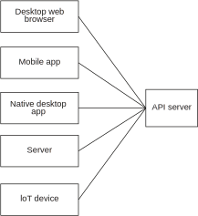
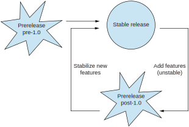

## 12.3 网络API的版本管理

在我们开始讨论网络API的版本管理之前，也许我们应该首先定义一下什么叫网络API。这个名词有很多变种，我们对网络API的定义是`一种通过网络访问，接收请求并提供响应的服务`。有的变种比如webhook API，它会向客户代码发送请求而不是用户向服务发请求。为了简化起见，我们只讨论用户向服务发请求，并由服务返回响应的场景。我个人对于使用JSON数据的HTTP服务以及使用protobuf的gRPC服务很有经验，但是这里讨论的问题可以被运用到各种服务上。（Protobuf是谷歌的二进制序列化格式，一开始只是在谷歌内部使用，公开于2008年。我们会在12.4节看到它的更多细节。）当然，我们讨论的问题对于不同的服务有不同的答案，所以你需要意识到在不同环境下复用答案可能导致的偏差。


### 12.3.1 网络API调用的环境

我们在发布一个库时，通常对于这个库会如何被用户使用是一无所知的，除非用户提bug报告，提新功能需求或者在Stack Overflow上提问等。我们通常会期望这个库只在一个单一的生态圈里使用——比如我从来不会去考虑NodaTime库和Perl之间要如何互动。这个生态圈本身可以很大很复杂，包含多种语言，但我们应该不需要处理太多意料之外的问题。

对于网络API（或者至少是由我们提供的那些），我们会更加了解它会如何被用户使用，因为我们可以看到服务端接收到的请求。但即便如此，我们通常也不可能知道用户调用这些API的环境。这种灵活性是网络API的强大功能之一，但同时也让我们难以推断改动API可能带来的影响。

图12.8展示了各种应用程序或设备发送网络请求的复杂环境，且其内部的实现会更复杂。你接收到的请求可能来自用不同编程语言写的各种应用程序——有些是自己写裸代码发请求，有些则使用某个专门的客户端库。在同一个平台上甚至有可能存在多个不同的客户端库。



**图12.8 API会被很多不同的设备调用**

```
对客户端库的假设
客户端库可以给你的用户提供方便，但要写好客户端库却不容易，特别是当你需要扩展支持多种语言和多个API的时候。代码量上升到一定程度以后，你可能就需要通过某种工具或API描述格式来自动生成你库里的大部分代码，比如用OpenAPI，或自己写一个代码生成器。这会在兼容性方面带来更多的复杂性：你在API上进行的改动也许兼容老的请求和响应，但是会生成不兼容的新库。这样的情况只能由你来决定是否可以接受（通过升级库的主版本）。

即使你提供了客户端库，你也不能假定所有的请求都是由客户端库生成的，除非你通过某种方式强制这一点（比如让库提供数字加密的签名）。大多数API都不会这样做，因为跟那些能够用Postman（https://www.postman.com/）等工具进行测试的API相比，强制使用客户端库会让用户感觉很不友好。
```

在讨论库和依赖图时，我们遇到了应用程序及其依赖库会各自依赖另一个库的不同版本的情况。在网络API里不存在这种菱形依赖的情况，但是会遇到类似的老版本和新版本的代码同时提供服务的情况：

* 在部署服务时，服务的老版本和新版本可能会同时运行。现代的服务通常都会被设计成在版本更新时无需下线维护。
* 同样的数据可能被两种客户端访问——一种客户端只认老版本的数据，另一种能识别新版本的数据。

我们需要意识到网络API所处的环境，那就是访问我们服务的客户端具有多样性，而我们的服务的版本又只能保证最终的一致性。我们会在后面看到这样的环境给我们的API设计带来的详细影响，不过在此之前，让我们先从客户的角度看看他们想要完成的目标。


### 12.3.2 用户喜欢公开透明的版本策略

当你开始思考API的版本管理时，有时会忍不住深入技术方案和策略。但是如果不先显式确认需求，你的方案就可能太过简单无法满足任何需求，或者太过复杂以至于难以理解。（或更糟，那个太过复杂难以理解的方案依然无法满足客户的需求，你还很难修改。）

你应该问自己这样一些问题：

* 你的API是用于某个特殊环境吗？（通常来说，API会被用于多种环境，一个99%的客户都是其他网络服务的API设计和一个99%的客户都是物联网设备的API设计可是完全不同的，物联网设备很少更新版本，而且会对响应的数据量有要求。）这是我们在第五章描述的流量模式中提到的内容，以及对帕累托法则的运用。
* 你跟你的用户之间是否有一个清晰的沟通渠道，可以通知他们关注接下来的任何改动？
* 你的API层是否打算跟用户合作开发？这会导致API的某些版本对稳定性的要求不是那么高。
* 你预计API的进化速度有多快？你估计用户需要多久才会升级到最新的版本？
* 你打算支持老版本多长时间？能满足用户的预期吗？
* 你能否记录API各方面的使用情况，比如版本，客户端库以及RPC这样的独立组件？

这些问题中有一些甚至对简单的库也有意义，但是网络API会需要更多的互动。比如，用户可以想要继续使用一个供应商早已放弃支持的库，他们可以这样做（当然责任自负）。但在网络API里，如果供应商关闭了某个端口，用户会立即受到影响。

**注意** 上述所有问题都会影响你的版本策略，但有一件事是肯定的：用户会欣赏一份清晰完善的版本文档。这能让他们的业务放心依赖你的API，也能让他们的开发团队有信心安排好自己代码的升级。不幸的是，这方面的文档就像其他大多数文档一样经常被忽视，但是你的版本策略应该要将这种公开的文档作为你产品的一部分。

有了这些背景，现在让我们来看两个经常被用到的版本管理办法。


### 12.3.3 常见的版本策略

不同的组织对于长期的版本管理有不同的做法。最常见的做法莫过于：当它不会有问题，走一步看一步。我当然不会推荐这样的做法。

有两个比较深思熟虑的办法，虽然它们依然有可能出错，需要花很大代价去实现，但至少成功的概率比较高。我将它们称为客户端控制版本和服务端控制版本。这两个称呼比较模糊，后面会有详细的说明。

这两种办法都需要客户端在发送请求时通过某种形式指定版本。具体的指定方式不会影响之后的处理。比如，一个HTTP请求可以通过下列形式指定版本：

* 把版本放在某个HTTP头部
* 把版本放在一个查询参数里
* 把版本作为URL路径的一部分

如果是其他协议，版本还可能出现在别的什么地方。无论我们让客户端把版本放在哪里都有其优缺点，具体的细节不属于本书范畴。我们主要关注那个版本号会如何影响API。首先让我们看看由客户端精确指定API版本的情况。

**客户端控制版本**

在客户端控制版本的时候，客户端需要提供API版本，该版本精确指定了客户端代码能够理解的API层，比如：

* 客户端不应该在请求中提供不属于该版本的字段，即使该字段会出现在其他版本里。
* 服务端不应该在响应中返回不属于客户端指定版本的字段。
* 服务端不应该在修改资源时对客户端指定版本中不存在的信息做任何假设。

让我们看一些具体的例子，想象围绕`Person`资源有一个非常简单的API，其1.0版本有字段`id`和`name`。（这实在是过于简化了，目的是让我们只关注版本。如果你还想要关注各种其他方面的考虑，比如ID的特征，应该由谁来创建ID等。你可以参考由Manning出版，J.J.Geewax撰写的《API设计模式》[Manning, 2021]，那里面有一般API设计的更多细节。）到了1.1版本，我们引入了一个新的字段：`occupation`。我们的API提供了`CreatePerson`和`UpdatePerson`方法（请求里包含了`Person`资源）以及`GetPerson`方法（请求里包含了需要获取的`Person`的ID）。表12.1展示了客户端控制版本的一些示例请求及其响应。这些示例只包含`CreatePerson`和`GetPerson`方法；我们会在后面看到`UpdatePerson`。

**表12.1 客户端控制版本的示例请求及其响应**
|客户端请求|服务端响应|注释|
|--|--|--|
|版本：1.0<br>方法：CreatePerson<br>正文：id=1, name="Jane"|OK||
|版本：1.1<br>方法：CreatePerson<br>正文：id=2, name="Erik", occupation="Accountant"|OK|1.1版本可以指定occupation|
|版本：1.0<br>方法：GetPerson<br>正文：id=2|OK<br>id=2, name="Erik"|虽然该资源包含occupation字段，但不会在1.0版本的响应里返回|
|版本：1.0<br>方法：CreatePerson<br>正文：id=3, name="Kara", occupation="Engineer"|Bad request|1.0版本的请求里不能指定occupation|

版本号本身的格式很灵活。像语义版本规范那样区分主版本和次版本是需要的，但通常不需要再加上补丁号，因为语义版本规范的补丁号是用于不同实现的（或仅仅是改了注释），而不是用于API的。次版本可以是一个普通的自增整数（比如1.0，1.1，1.2等），也可以是一个8位数的日期，形成这样的版本序列：1.20200619，1.20201201，1.20210504。基于日期的版本号更长，但是能提供更多信息，不需要用户去查找完整的版本历史文档。

```
补丁号的成本和价值

对于那些需要确保绝对稳定性的商用API来说，你可以加入补丁号，确保客户端在请求指定的版本时获得一致的行为，即使该行为是一个错误的行为。比如说，一个质数API在1.2.0版本里错误地申明了1是一个质数，并在1.2.1版本里修复了这个行为（没有改API层）。当客户端指定访问1.2.0时，它依然能够得到一个错误的结果。这意味着需要维护每一个版本的实现，这可不是一项简单的任务。大多数API不需要这种程度的绝对一致性。
```

客户端控制版本的成本可能很高，因为服务端需要记住历史上曾经被发布过的所有版本，或者至少记住所有你还打算支持的版本。让一个旧版本下线会破坏所有该版本的客户端。被破坏的客户端会采取什么行动取决于服务端里处理错误的方式——包括处理那些从来不合法的版本号，以及那些曾经合法但是现在不支持的版本号。本章内容不讨论你具体该怎么处理这些错误，但你需要在一开始设计的时候就考虑好。

客户端控制版本的一个缺点是实现代码需要把所有次版本的细节都记录下来，这样服务端才能知道如何验证请求并在响应里返回什么样的字段。因为请求可能在系统里传播，客户端指定的版本号也会被传播，所以最好在系统的入口点自动完成请求的验证过程和移除响应中多余字段的过程。

从理论上说，让客户端控制版本可以允许API迅速进化而不破坏客户端。比如说，如果你在1.0版本有一个拼写错误，你可以发布2.0版本修复这个错误。新老两个版本的请求可以被转化成一个内部的请求格式，以一种跟版本无关的方式进行处理。内部的响应格式则根据指定的版本转化成不同的响应返回给客户端。1.0版本的现存用户不受影响，只有当他们打算升级到2.0时才需要改代码。

**注意** 主次版本号的作用区分只对人类有意义；对于代码来说，其实每个次版本都是独立的版本，服务端的代码或客户端的代码都不在乎1.0到1.1是一个向后兼容的改动，而1.1到2.0又是一个破坏性改动。只有人类才需要在升级应用程序去使用新版本时关心这些——他们要了解是否需要修改代码来应对破坏性改动。

客户端控制版本在读—修改—写操作上有一个好的副作用，正是本节开头的列表最后一项指出的。让我们回顾一下那个`Person`资源的API，它的1.0版本有`id`和`name`字段。然后在1.1版本，我们又引入了`occupation`字段。我们的API有一个`UpdatePerson`方法，接受一个`Person`参数，用来设置该资源所有字段。该参数内未提供的字段则会被清除掉。

如果我们不考虑客户端了解哪些字段，这种行为就会有危险的后果。让我们看看下面一段简化的代码，它更新一个`Person`的`name`。

**代码12.12 更新name的代码**
```
public void updateName(String id, String newName) {
    Person person = client.getPerson(id);
    person.setName(newName);
    client.updatePerson(person);
}
```

虽然看上去没有什么问题，但如果这个客户端只知道1.0版本，而被修改的`Person`被另外一个客户端设置了`occupation`字段怎么办？表12.2展示了当服务端没有正确地实现版本管理时，会导致信息在一系列请求后丢失的场景。

**表12.2 错误实现的读—修改—写操作会丢失数据**
|客户端请求|服务端响应|注释|
|--|--|--|
|版本：1.1<br>方法：CreatePerson<br>正文：id=2, name="Erik", occupation="Accountant"|OK||
|版本：1.0<br>方法：GetPerson<br>正文：id=2|OK<br>id=2, name="Erik"|没有返回occupation字段，因为1.0的客户端不知道这个字段。|
|版本：1.0<br>方法：UpdatePerson<br>正文：id=2, name="Eric"|OK|1.0的客户端提供了它知道的所有字段。|
|版本：1.1<br>方法：GetPerson<br>正文：id=2|OK<br>id=2, name="Eric"|occupation丢失了！|

在这个例子里，服务端处理`UpdatePerson`方法的行为是错误的。虽然我们期望该方法接受的参数是一个完整的资源，但这个完整只能是从客户端的角度看到的。客户端没有提供`occupation`并不说明客户端希望删除这个字段；只是客户端不知道`Person`资源里存在这个字段。

幸运的是，服务端可以更好地实现这个方法。它可以看到客户端指定了1.0版本，并只更新该版本里有的字段。在大多数情况下，这个实现已经足够好了。除非遇到新字段需要跟老字段进行校验的情况，那时我们还会进行一些复杂的处理。在服务端实现正确的情况下，客户端就可以进行完整更新，而无需担心会践踏那些自己都意识不到的数据。我们在这里忽略了并发校验的情况，这是会导致数据丢失的另一种场景。但这两种导致数据丢失的因素是正交的，并发性跟API版本管理无关（更多的是资源的版本管理）。要实现这样的服务端并不容易，但通常会有一些比较通用的自动化方式能帮助我们实现它。

现在让我们来看看服务端控制版本的情况。这并不意味着版本完全由服务端说了算，但确实给服务端提供了更大的自由空间。

**服务端控制版本**

服务端控制版本的时候不存在次版本号的概念。API只能在同一个主版本号内以向后兼容的方式进化，而客户端只能忽略响应里任何它们不理解的信息。

服务端控制版本的时候还是有主版本的，而且由客户端指定，可以通过URL，IP地址，或者HTTP头部指定。如果连这点协商都没有，服务端的破坏性改动就会必然破坏所有现存的客户端。

服务端控制版本感觉比客户端控制版本更加动态，更不精确。通常服务端会更容易实现，因为它们只需要维护所有主版本的实现，而不需要确保支持所有的次版本。需要适配内部格式的请求和响应的版本数量更少，你需要写的适配器数量也更少。

服务端有可能在响应里返回比期望更多的信息，这对于某些客户端来说会是一个问题。比如说，一个物联网设备请求一本书的信息，期望获得一百个字节左右的简介，结果API还返回了整个第一章的内容作为试看内容，导致设备在处理响应时内存耗尽。这不是一个不可解决的问题，API设计模式里提供了限制响应数据量的方法，只需要客户端在请求中指定它对响应的哪部分内容感兴趣。对于我们来说，只要记住这里会有一些需要考虑的地方就好了。

在服务端控制版本时，我们之前见过的读—修改—写操作的问题会更严重，因为服务端没办法知道客户端都了解哪些字段。完整接受资源并无条件复制字段的方法会丢失数据，所以需要设计基于补丁语义的方法，让API接受一个需要更新的字段列表。我们会改动示例中的API，让它提供一个`PatchPerson`方法，允许客户端在提供待修改资源的同时也提供一个待修改字段的列表。跟表12.2类似，表12.3展示了服务端控制版本时的一个请求序列。客户端无需在请求里说明自己用的是1.0版本还是1.1版本了，甚至都不会有1.1这个版本；只有API的v1版本。

**表12.3 用补丁语义实现读—修改—写操作**
|客户端请求|服务端响应|注释|
|--|--|--|
|版本：1（客户端版本是1.1）<br>方法：CreatePerson<br>正文：id=2, name="Erik", occupation="Accountant"|OK||
|版本：1<br>方法：GetPerson<br>正文：id=2|OK<br>id=2, name="Erik", occupation="Accountant"|返回了occupation字段，因为只指定了主版本，客户端可以丢弃它不理解的信息。|
|版本：1<br>方法：PatchPerson<br>正文：resource={id=2, name="Eric"} fields="name"|OK|客户端指定它想要修改的所有字段。（可以是它知道的所有字段，也可以是其中一部分。）|
|版本：1<br>方法：GetPerson<br>正文：id=2|OK<br>id=2, name="Eric", occupation="Accountant"|occupation还在，因为只更新了指定的字段。|

使用客户端控制版本的API为了效率也可以提供补丁语义；只是不需要为了避免丢失数据而为之，因为它已经在版本号里提供了额外的信息告诉服务端哪些字段是它能理解的。而在服务端控制版本的API里，除了最简单的场景之外，其他场景都需要提供补丁语义。

```
保留未知字段

有些序列化格式有能力在解析响应的时候保留未知字段，并将这些信息原封不动地插入另一个请求里。比如protobuf就支持这种能力。但这种能力是比较脆弱的：如果响应的数据被反序列化到另一种对象模型里面，那么未知的字段就有很大可能被丢失。所以如果你想要一个比较健壮的方案，还是得靠显式指定你想要修改的字段。
```

客户端控制版本和服务端控制版本这两种方法都完全合法。它们对客户端库的版本管理、文档、服务端的实现都有不同的要求，而且正如我们在更新资源的API例子中看到的那样，它们甚至在API的设计上都有所不同。你需要自行决定最适合你的方法，它甚至可能是跟这两种方法都完全不同。在决定选用任何一种方法之前，我建议你都要深思熟虑。

上述两种策略还有一些额外的考虑因素。有些考虑因素甚至会影响数据存储的选择，我们会在本章最后一节讨论。


### 12.3.4 版本管理额外的考虑因素

彻底分析网络API版本管理的方方面面超出了本书的范畴，这块内容自身就可以写一本书。不过，最后有几点还需要简要介绍一下，主要是为了提醒你在API相关的上下文里会有一些额外的思考。

**预发布版本的管理**

设计API不是件容易的事。通常也不受重视；毕竟API层自身并不包含代码逻辑。你可能觉得只有具体的代码实现才是重点。某些API是这样，但对于大多数API，其接口设计才是重点，需要工程和艺术的结合。你通常不会知道API会被如何使用（API设计的一大乐趣也在这里），这意味着你在设计的时候拥有的信息不完整。再加上你在迭代API时还需要考虑兼容性方面的限制，最后能把它做好简直就是奇迹。这就是为什么我们需要预发布API。

把API的一个早期版本——或者是在已有API上待添加功能的一个早期版本——提供给你的潜在用户，你就能在API层最后定稿之前收到一些反馈。虽然你总是可以发布一个新的主版本来修复任何问题，但这样做对于你的用户来说很不友好，因为他们将不得不修改自己的代码。图12.9显示了预发布版本可以如何在API的第一个稳定版本之前和之后进行迭代。



**图12.9 API预发布版本的迭代**

表12.4假想了一个API的发布序列。版本字符串的格式沿用了之前讨论客户端vs服务端控制版本的例子。这张表可以给你一个直观的概念，如何让用户反馈帮助你改进API的设计，还不会导致那些需要稳定性的客户被破坏。

**表12.4 假想的API发布序列**
|版本|发布日期|注释|
|--|--|--|
|1.0-alpha.1|2023-01-10|API初稿，用于获取用户反馈。某些部分还没实现，或者可能性能很糟。|
|1.0-beta.1|2023-02-15|基于alpha版本的反馈做了修改，改进了实现——但还是不保证API层的稳定性以及服务的可用性。|
|1.0-beta.2|2023-02-25|基于1.0-beta.1版本的反馈做了破坏性改动。如果我们足够自信，可以宣布这个版本为一个发布候选版本。|
|1.0|2023-04-05|第一个稳定发布，保证了API层的稳定性和服务的可用性。|
|1.1-beta.1|2023-04-08|两个新功能（X和Y）的预发布版本。|
|1.1-beta.2|2023-05-05|基于1.1-beta.1版本的反馈做了修改；X功能的API层有破坏性改动。|
|1.1|2023-05-30|包含Y功能的稳定发布，但是不包含X功能，因为用户的反馈表明它还需要返工。|
|1.2-beta.1|2023-05-30|和1.1同时发布，让试用（不稳定版的）X功能的用户可以有一个较稳定的包含Y功能的API层。另外还加入了Z功能。|
|1.3|2023-07-14|包含X和Z功能的稳定发布。不需要同时发布beta版，因为没有其他不稳定的功能。（对于那些大型API来说，这种事情可能永远不会发生。永远都会有一些不稳定的功能。）|

API的预发布版本并不只是一个提供给经过挑选的用户群体使用的普通API版本。我们在API层的稳定性和服务的性能方面对它们的预期是不一样的。我们需要确保用户了解这些预期，这样他们才不会对我们产生抱怨。

处理预发布的方式有很多，下面列出了一些需要你自己回答的问题：

* 预发布版本的内容跟稳定版本的内容边界如何区分，如何确保用户不会因为不当心而用到那些不稳定的功能？
* 客户端是否需要在每个请求里都表明它期望使用预发布功能？
* API的预发布版本和稳定版本是互相独立的服务吗？还是在一台API服务器上同时服务两类请求？
* 你是否向API的用户提供任何稳定性和可用性的保证？比如，请求里如果指定了预发布API的版本，你打算支持该版本多长时间？你会突然做出破坏性改动还是会提供一个较短的淘汰期？
* 你打算如何将预发布版本提供给用户？会同时提供相应的客户端库吗？
* 预发布版本有文档吗？
* 预发布的API是公开可见的还是仅内部可见的还是两者皆有？
* 你的预发布版本是否面向特定的客户？
* 你有什么内部工具和流程来支持回答上述问题吗？

如果你在开发的时候从没想过这些问题，事到临头要插进去一个预发布版本，你可能就要给你的用户添麻烦了。就算你一开始并没有打算实现预发布版本，也不妨你未雨绸缪。

**服务部署**

这可能是句废话：你的API会部署在多台服务器上。（说真的，任何生产环境API要是不这样我们才担心呢。）这意味着生产环境在任何时候都可能有混用的API版本。基于版本策略以及客户端在请求中指定版本的方式，你可以将公开的请求路由到指定的服务器上。但是更简单的方法通常是让所有的服务器都能处理所有当前公开支持的版本的请求，并确保你只在服务器部署完成后才公开对新版本的支持。

部署流程通常包含如下步骤：

* 部署到一组灰度服务器上。
* 监控灰度服务器上的故障。
* 在灰度服务器上测试API的新功能。
* 部署到剩余服务器上（根据服务器数量，部署时长可能需要几个小时甚至几天）。
* 在随机服务器上测试API的新功能。
* 公开发表新API的细节。

你需要准备好在任何时候将部署回滚，这意味着你需要考虑如何处理测试新API时对资源造成的改动。如果你需要在发布新API后回滚，那你可就要处理更大范围（也更敏感）的资源了，包括所有新输入的字段，还要跟客户沟通回滚的情况。

**跨版本资源处理**

我们已经讨论过如何（慎重地）使用主版本来（偶尔地）对API做破坏性改动。大多数API需要将资源持久化，通常你也会让不同主版本的客户端有能力访问同一个资源。当然例外也是有的：你可能决定从v1升级到v2时淘汰部分资源，某些资源类型仅在新的主版本里可用也是很合理的。但是v1里大多数资源到了v2应该依然可以被访问。如果没有某种边界控制，那么一旦某个资源被v2客户端访问后，v1的客户端就没法访问了。

跨版本访问资源会影响资源被使用的方式；资源的ID不应该包含API版本号。这也会限制你设计和实现新的主版本的方式。如果你想要从头写v2，支持v1客户端的需求会让你的重写变得很困难。让v1客户端的开发者迁移到v2只是需要考虑的因素之一，更重要的是服务端如何实现的问题。v1可能只有一小撮用户，且他们可能根本不打算迁移到v2（所以你不需要担心升级路径），但如果他们需要访问跟v2客户相同的资源，麻烦就来了。我们不是说彻底重新设计是不可能的；只是实现的代价会比你预期的大很多。

其中一些代价取决于你的存储系统提供的功能。让我们来到本章最后一节：以版本灵活的方式设计数据存储。