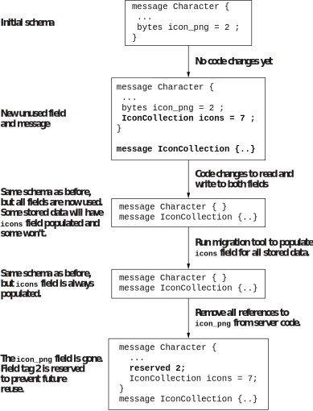

## 12.4 数据存储的版本管理

我们生活在一个大数据的时代。过去几十年来，我们一直可以安全地认为数据是存放在SQL数据库里的，有数不清的书籍文章教我们如何进化SQL表的格式。但是在本节，我们会以更通用的方式讨论数据进化。虽然我们会使用protobuf作为示例中的格式，但是我们讨论的内容是跟特定格式无关的。世上还有很多其他存储格式，比如Avro和Thrift——它们各自在版本管理上都有细微的差别。无论你选择的是什么格式，本节都不打算成为该特定格式的说明文档，只是会提醒你那些说明文档里的哪些部分比较重要，需要特别留意。其实那些讨论SQL的文章也是这么做的，只不过SQL表格式的选择跟你使用的SQL数据库类型强相关。

虽然本节讨论的是存储，涉及到的很多格式也可以被用于网络API，特定格式的破坏性改动也跟API的设计和版本策略有关。我们在上一节特意只考虑了顶层的设计，没有深入这方面的细节。然而一旦你设计好了顶层的API版本策略，本节就可以继续在细节方面帮助你。让我们从一个非常简要——但足够解释本节剩余内容的protobuf教程开始。


### 12.4.1 简要介绍Protocol Buffers

Protocol Buffers（protobuf）是谷歌发明并广泛使用的一种序列化格式，后来被更广泛的生态圈接受并使用，特别是在gRPC框架中。protobuf的主要设计目的是高效的二进制存储，但现在它也支持JSON编码的格式。

protobuf的格式文件被称为proto文件，使用.proto文件扩展名。这些文件应该跟其他源码文件一样被谨慎对待并一起托管在源码管理工具里。它们会在文件头部包含一些选项，并包含一系列定义格式的元素：

* Message（消息）——大多数proto文件的主要部分，类似在大多数编程语言中定义类型。一个消息里面可以包含字段、嵌套消息以及枚举。
* Enum（枚举）——定义了从名字到整形的映射。
* Service（服务）——用来定义远程方法调用（RPC）。虽然gRPC和protobuf通常被一起使用，但是也可以设计一个使用protobuf的非gRPC的RPC框架，或设计一个不使用protobuf的gRPC。我们不会在这里关注服务的细节。

消息中的字段有三个主要内容：

* Type——字段的类型，可以是一个原始格式（整形，浮点数，字节字符串或文本字符串）、一个枚举或一个消息。字段还可以被指定为是一个重复（repeated）类型，表示这个字段是该类型的一个列表。
* Name——字段的名字，用来在代码以及转换成JSON格式时生成对应的名字。
* Number——字段的序号，用于二进制序列化格式。

protobuf还有一些额外的概念，比如扩展，多选一，映射，可选字段等。（多选一是指提供一组字段，但在同一时间只能设置其中一个字段。）https://developers.google.com/protocol-buffers的文档里有更多信息，这些细节的讨论不属于本章范畴。本章主要关注兼容性方面的常见问题。

一般来说，protobuf的格式需要经过protobuf编译器（protoc）的转换才能变成代码用于库和应用程序中。虽然理论上可以不用格式文件，直接写代码使用二进制序列化的格式，但是实际上很少有人这样做。（某些语言的代码还支持直接在数据模型上加标注表明protobuf字段的number和type）。

为了让说明可以更具体一些，让我们用一个简单例子来看看一个角色扮演游戏的proto文件长什么样。我们想要表示一个玩家可以操控的角色，包括角色的名字，职业，血量，以及他们携带的物品（库存清单）。下列代码展示了一个存储上述数据的proto格式文件长什么样。

**代码12.13 角色扮演游戏中定义角色的proto文件示例**
```
syntax = "proto3";
message Character {
    string name = 1;
    bytes icon_png = 2;
    Profession profession = 3;
    repeated Item inventory = 4;
    // 库存最大格子数量
    int32 inventory_slots = 5;
    int32 health = 5;
    int32 max_health = 6;
}
message Item {
    string name = 1;
    // 该物品在库存里占用了几个格子
    int32 slots = 2;
}
enum Profession {
    PROFESSION_UNKNOWN = 0;
    MAGE = 1;
    THIEF = 2;
    WARRIOR = 3;
}
```

我们不会深入更多的细节，但会以这个proto文件为基础讨论后续的改动及其影响。我强调一遍，本节内容不会涵盖protobuf的方方面面；只关注那些跟你使用的存储格式相关的细节。让我们先来看看哪些改动可能会有问题。


### 12.4.2 哪些是破坏性改动

正如海拉姆定律所揭示的，任何改动都可能破坏一些用户。如果用户以一种脆弱的方式使用数据，那么用户可感知的存储格式的变化会给用户带来麻烦。然而对于内部存储格式来说，任何的改动都会破坏一部分场景——由于用户感知不到这些场景，所以你可能并不关心它们。这种情况有点像源码兼容性和二进制兼容性的区别，但是需要考虑的因素更多。

举几个例子：

* protobuf有多个类型表示32位带符号整型，它们有多个不同的序列化格式。把int32类型改成sint32会改变存储数据的含义但不会改变生成的API代码。
* 把字段名字从`health`改成`hit_points`不会改变存储数据的含义，但在生成的代码里会导致破坏性改动。
* protobuf为Java和C#生成的方法和属性使用驼峰命名法。这意味着把字段名字从`inventory_slots`改成`inventorySlots`不会改变存储数据的含义，也不会改变Java和C#生成的代码，但会影响为大多数其他语言生成的代码。
* 新增一个枚举值（比如添加新职业弓箭手）不会导致任何构建失败或存储失败，但所有试图使用角色职业的代码都需要对新值进行专门处理，或者也可以用一种通用的方式来处理（比如：我不知道这个值的含义，但是会保留它）。
* 删除一个字段会破坏所有试图使用它的代码，即使存储数据里还保留着该字段的数据。
* 新增一个字段不会破坏任何代码，即使你同时部署了新老版本的代码，且老版本的代码读取的数据里包含了新的字段也不会有问题。

最后这个例子是由protobuf处理未知字段的方式决定的，我们在之前讨论API响应时已经提过了。我们等会将看到更多的细节。

我还要提醒上面所有陈述都假设我们只用protobuf的二进制格式来存储数据。如果我们还要用JSON格式存储数据，改变字段名也会导致存储数据被破坏：JSON格式里忽略了字段的序号，但是会根据字段的名字生成对应的JSON属性的名字。如果你的数据有多种存储格式，你需要在做改动时考虑其对所有存储格式的影响。

如果你的存储只在内部使用，你就能找到并改变所有用到它的代码。此时你会发现对生成的代码做出破坏性改动是可行的，有时候甚至还很简单。它很大程度上基于你内部代码使用的版本策略。破坏存储格式的改动则是一件更困难的事，切不可掉以轻心。通常我们可以通过数据迁移来进行修复，但这需要很详细的计划。让我们来看一个例子。


### 12.4.3 在存储系统内部迁移数据

首先我们要意识到数据迁移有很多不同的类型。有时可能是从一个系统迁移到另一个系统，有时则是在系统内部从一种格式迁移到另一种格式。在我们接下来要讨论的场景里，你会发现：如果要对现有的格式进行一蹴而就的改动，那将会是一种破坏性改动。但如果换一种小步慢走的方式就不会有破坏性改动。

假设我们要改变角色显示图标的方式，需要能支持不同大小和用途的图标。比如我们想要在介绍单个角色时显示大图标并在显示角色列表时显示小图标。目前我们只有一个`icon_png`字段。虽然我们可以继续往`Character`消息里面添加新字段，但这样做会给我们的后期维护带来麻烦，且不利于我们在类似场景下（比如在展示物品或地点时）复用图标处理的代码。所以我们想要引入一个`IconCollection`消息来帮助我们进行数据格式和代码的复用。

**注意** 使用最简单的方式可以帮助我们在原型阶段迅速试错，但是这种方式到了后期就会难以改变，比如数据的存储格式。你不可能预先设想好所有的场景，且提前引入灵活性也会存在过度设计的风险。但无论如何，在你为字段选择原始格式之前，请至少先考虑一下是否值得使用一个消息类型。哪怕这个消息里面一开始就只包含一个字段。

我们的`IconCollection`消息最终会相当复杂，这里先给出一个简化的版本。

**代码12.14 图标集的proto示例**
```
message IconCollection {
    message Icon {
        bytes data_png = 1;
        int32 width = 2;
        int32 height = 3;
    }
    repeated Icon icons = 1;
}
```

我们的最终目标是将当前`Character`消息里的`bytes icon_png = 2`字段替换成新的字段：`IconCollection icons = 7`。我们不希望在改动的过程中破坏任何现有用户。注意这里字段的序号是不同的，这一点对于数据迁移来说很关键。

现在我们需要执行一系列步骤来迁移数据：
1. 写一份关于所有步骤的计划文档，确保所有利益相关者都对之满意。
2. 将新的`IconCollection`消息加入格式文件，并将`icons`字段加入`Character`。
3. 修改服务端所有读取`icon_png`字段的代码:
    * 如果`Character.icons`字段存在，且这个重复字段中至少有一个元素，使用第一个元素。
    * 否则使用老的`icon_png`字段。
4. 修改服务端所有写入字段的代码：
    * 将`Character.icons`字段设置成一个`IconCollection`消息，其重复元素中只有一个元素。
    * 将新的图标数据也设置到老的`icon_png`字段里。
5. 部署新服务代码。
6. 等待一段时间，直到我们确信不需要回滚。
7. 运行迁移工具，检查系统内的所有`Character`，如果`icon_png`字段有值而`icons`字段没有，则将数据复制到`icons`字段的`IconCollection`里。
8. 修改服务端，移除所有用到`icon_png`字段的代码。
9. 部署新服务代码。
10. 等待一段时间，直到我们确信不需要回滚。
11. 运行迁移工具，检查系统内的所有`Character`，如果`icon_png`字段有值就将其清除（确保我们没有无用的陈旧数据）。
12. 将格式文件中`icon_png`字段那行代码替换为`reserved 2`。

最后这一步确保我们今后永远不会复用序号为2的字段。这样做不会有什么坏处，还能提供额外的安全防范——万一有一些老数据没有迁移，我们也不会将老的图标数据错误地解释成别的什么东西。

图12.10展示了上述步骤。左边的文本描述了在采取每一个步骤时数据格式和存储数据的状态，右边的文本则描述了步骤之间需要进行什么操作。步骤与步骤之间必须有一段合适的等待期，以确认是否需要回滚。我们应该要有一份在绝对必须的情况下回滚的计划，但也要尽可能避免回滚。



**图12.10 存储迁移步骤的图示**

现在，所有的代码都已经使用新字段了，我们就可以开始实现新功能，而这又会导致新一轮的改动步骤，因为我们的逻辑从`Character只有一个图标`变成`Character可能有多个图标`。确认是否需要回滚的等待步骤十分关键。数据迁移只有在我们知道是什么代码在访问数据的情况下才能进行。为了确保两个不同的代码版本可以在同样的数据存储上并发访问，我们就不可避免地要执行这些细碎的步骤。（这是我们假设不允许下线维护的情况。如果你可以在迁移的时候让系统彻底下线，那么很多事情就会很简单。但在现代的系统设计里，这样的情况很罕见。）推断三个或更多代码版本同时访问相同数据的情况会变得更加复杂，通常采取小步慢走的策略总是会更好。在我们的例子中总共出现过三个不同的服务端版本：

* 最初的版本只知道`icon_png`
* 同时知道`icon_png`和`icons`的迁移版本，且确保它们是一致的
* 最终版本只知道`icons`

如果所有三个版本同时运行，那么第一个代码版本对图标做的任何改动对第三个代码版本都是不可见的，反之亦然。另外，我们还需要关注其它所有可能访问数据的代码：如果在迁移理论上完成之后还有哪个服务不认识新的字段，那就会导致严重的问题。这也是为什么我们在第一步必须让所有利益相关者同意这份计划。

上面列出的只是些一般步骤，更复杂的迁移可能会有更多更庞大的步骤，可能需要同时迁移多个字段。每一次迁移都伴随着风险和代价，而在考虑复杂迁移计划时，你需要权衡的是将其拆成多个小迁移的风险和代价（比如会有更多的步骤，且总的时间也会更长。）和在尽量少的步骤内完成迁移的风险和代价（每一个步骤的风险更高，需要更仔细地验证）。

上述迁移步骤一个关键的前提是原始代码可以安全读取包含`icons`字段的`Character`消息，毕竟原始代码在部署的时候，其格式文件里根本不存在这个字段。让我们看看这对我们写的代码来说意味着什么。


### 12.4.4 准备好面对未知

让我们老实承认：没人很擅长预测未来。我们不希望本节被错误解释成你需要过度开发代码来为今后所有的新需求做准备，或者你需要在写第一行代码之前定死今后10年的需求。这两种方式都不可行。我们建议你在设计软件和数据格式时保留一定程度的自然灵活性，能够满足现有的需求，也不用额外添加太多的实现复杂度。我们已经见过其中一种方式了，它使用开放式的数据格式来面对未来的需求，那就是将一个字段的类型，从一个原始类型替换成一个单字段的消息。

**注意** 我们的`Character`消息包含了多个原始字段。我们是否应该创建一个`Inventory`消息来替换原有的`inventory`和`inventory_slots`字段？跟角色血量相关的字段呢？一般来说，如果我们需要用到多个字段表示同一类概念的时候，这就是在提示我们应该用一个消息把它们封装起来——正如我们会在代码中做的那样。这方面目前还没有什么明确规则，而且存储格式的封装和代码里的封装也不完全等价。

不过使用这种方式的前提是我们的代码也要可以处理新加的字段才行。现代的大数据格式通常都被设计成能够满足这个条件，但你需要明确了解自己使用的格式到底支持什么样的行为。尤其是它可能会限制你将数据转换成不同存储格式的能力。在protobuf里，未知字段（解析数据时接收到的字段，但是无法被代码生成时的原始格式识别）会被保留在二进制存储格式里，但不能被转换成JSON这样的文本存储格式，因为字段的名字不属于二进制序列化格式的一部分。

存储格式提供的clone操作可以保留数据，但如果你手写了一个转换消息的代码怎么办？如果你不知道一段数据的含义，你就很难知道它应该如何参与这个转换。任何时候当你手写转换代码时，都需要记住它会影响你引入新字段的能力。任何时候当你引入新字段时，你都需要去检查那些手写的转换代码。

**添加新的枚举值**

只要现有代码能够在不理解新字段的情况下传播它，那么添加新的字段还不至于干扰现有逻辑。要推断枚举值的情况则会更难一些。

枚举可以被看作是一组特定场景下所有已知的值，但我们有时候会忘记这个`所有已知的值`其实指的是在`代码生成的时候所有已知的值`（或者是其等价物）。你的代码只知道这些值，但这些值在将来可就不一定是全部的值了。

有些枚举值毫无疑问是定死的；如果你写一个扑克牌游戏，你会把花色的枚举值定死为红桃、黑桃、方块、草花。这些都很好处理，而且在代码里一旦遇到不属于上述四种花色的枚举值就抛出异常也很有道理。

有些枚举值则在设计的时候就是可扩展的，比如我们角色扮演游戏的`Profession`枚举值。如果你的代码确实需要有能力处理`所有`的职业，那么在引入任何新职业之前，你先要确保能够处理该新职业的升级代码已经被部署完成了，且这一点要在需求收集阶段就明确下来。其他的代码可以忽略它们不理解的枚举值，但需要能将这些枚举值保留。（protobuf能够在代码的数据模型和二进制格式之间序列化和反序列化的时候保留未知枚举类型的整数值。）

最后，有些枚举值可能一开始感觉应该是定死的但是后来发现需要扩展。比如，你可能需要一个表示美国所有州的枚举值。这个枚举值可能在很长一段时间都是固定的，但是不能排除你需要在某些时候添加（或者甚至移除）部分值的可能。你可能不需要为此制定一个详细的计划，但至少需要确保自己无需在一旦遇到此类需求的时候重写整个应用程序。

枚举值可能带来的版本管理问题有时候甚至会让你考虑彻底放弃使用枚举值类型。特别是，当那些需要枚举的值已经有业界标准的字符串表达的时候，比如MIME类型或ISO-3166的国家代码，这种时候直接使用字符串值通常会更合适一些。

我们在前面几页讨论数据的存储格式时都基于一个前提，那就是你能够控制所有跟存储数据互动的代码。接下来让我们看看当该条件不成立的时候怎么处理。


### 12.4.5 分离API和存储的数据格式

一些常见的最佳实践需要一点时间才能掌握，但是掌握以后就会让你的生活变得简单，然后你就很少再去思考背后的原因。本节提供的关键建议恐怕不属于这类最佳实践。它将引入重复的模式，冗长的代码（或者复杂的基础架构），通常都会很麻烦。但是，如果你需要进化自己的系统，它会给你带来巨大的好处。

**将你的网络API和存储的数据格式分离**

创建一个系统去存储数据并使用网络API接受和返回同样的数据是十分常见的。几乎每一个提供API的系统或多或少都会这么做，除非提供的信息完全属于转瞬即逝，比如“当前时间”。

一旦你仔细设计好了存储的数据格式，且你的网络API也使用相同的数据结构，那么你会很容易地想到将它们直接公开成网络API的数据格式。把接收到的数据原样存下来，把保存的数据原样返回，生活无比简单。这样的作法在原型阶段有时候是可行的，直到你需要考虑稳定性。而且虽然这种做法在原型阶段开发速度很快，但不幸的是你要为此付出的代价是长期的灵活性。

如果你对本章关于网络API版本管理和存储版本管理的内容进行比较，你会发现它们区别很大，那是因为它们需要在不同的环境下处理问题。在考虑网络API时，你通常需要面对的环境是多种客户端使用了在不同时间点发布的多个API版本，对数据格式的破坏性改动会导致巨大的代价。虽然你可以鼓励用户改变他们的代码来适配这些改动，但是你很难在不引起敌意的情况下控制整个用户群体的升级时间表。（技术上你可以只给用户提供一个很短的时间用来迁移到一个新的主版本上，但是这会让你的用户流失，特别是当你经常这么做的时候。`技术上可行`和`实际可行`是两码事。）长期系统需要有能力进化它们的存储数据格式，我们需要在一开始设计的时候就意识到这点并将这个能力构建出来。

分离这两种数据格式的具体方式取决于你使用的存储格式以及可以与之合作的工具。其核心要点在于，分离API和存储的数据格式需要两类转换：

* 你如何将存储的数据格式转换成API的数据格式？
* 你如何在两种数据格式之间转换数据？

注意我这里特地指明从存储的数据格式开始转换：因为几乎在任何时候，存储的数据格式才是真正的信息源。存储的数据格式和API的数据格式之间最终是要能互相转换的，但要用一种机器可以理解的方式表达出来可能会比较难。在系统生命的初期特别难，因为那时你还没有多少时间去开发工具，且你对到底需要什么样的转换理解的还不够深刻。

**手动转换**

将存储的数据格式转换成网络API的数据格式最简单的方法是复制粘贴并编辑。一开始也没太多东西需要编辑，除了改改包名或名字空间等。当你需要改变存储的数据格式时，你可以直接将这些改动复制粘贴到网络API数据格式里——当然也不能完全无脑复制粘贴。

在运行时转换数据（比如将请求里的数据转换成可以被存储的数据，或将存储里取出的数据转换到一个响应里）就比较费力了。技术上最简单的方案通常是为每一种数据结构类型在每一个方向上写一个方法进行转换。这样做很繁琐，费力，且容易出错。你很容易改了存储API，也复制到了网络API，但忘了相应修改那些转换方法。不过这样的错误通常会在API集成测试中被迅速发现。（有太多的理由告诉我们一个完备的API集成测试有多重要了——远不止版本管理这一个方面。）

如果所有这些让你感到手动转换是一个很糟的主意，我完全理解。没人想干这种脏活累活。但它确实也有自身的优点。如果你能在改动原始的数据格式之后依次改动相关代码时保持批判性思维，你就可能发现问题或机会。有时一个新功能最恰当的存储数据格式并不是最恰当的API数据格式。比如我们可能会发现，需要在存储的数据格式里使用枚举值（用来保存当前支持的所有值），并在网络API里使用字符串（使将来的改动更容易）。你还可能需要在两种数据格式上使用不同的粒度和范式。这两种数据格式使用的环境不一样，你需要做出的决定也不一样。当你的数据格式越来越庞大，你对于需要做的转换也越来越清楚的时候，你就可以考虑将一些工作自动化。

**自动转换**

如果手动保持API和存储在数据格式上隔离的代价变得越来越令人难以接受，你就应该想办法用工具来做这件事。也许有时候你可能会找到一些现成的工具，但是大多数情况下，你会发现需要由自己来实现这些工具。它们能提供更高的灵活性，当然也需要你维护更多的代码。

我会建议你在经历了足够多的手动维护之后才开始做自动转换。因为那样可以帮助你发现各种边界情况以及简单情况下的偶发状况。如果你打算进行自动转换，最好记录下这些边界情况、你是如何解决它们的、以及为什么。这可以帮助指导你的自动化流程并提供一组优秀的测试用例。

以我的经验，在设计自动化工具时，最好给自己留一个安全舱：如果某个数据结构在API和存储上具有大相径庭的格式，那么手动维护这部分代码可能会更加简单一点，最好能将其从自动化工具中移除。不要给工具不断增加新功能让它变得无所不能，那只会让这个工具在处理简单任务时太难使用和维护。

最后，关于数据格式的转换，我还建议你在过程中手动检查工具的输出，至少要检查一开始的几个数据格式改动。等到这个工具已经很长时间没有给你带来意外之后，你才可以将检查步骤移出流程。

数据转换的检查会更复杂，但是测试会更简单。你的存储格式自带的工具通常是一个不错的起点。比如，protobuf库提供了一个可以动态访问消息数据的反射API，我们可以把它作为自动转换的起点。数据格式转换中需要安全舱的地方通常也会需要手动转换数据，所以你需要在设计自动化工具的时候想好如何加入手动转换的代码，即使你不需要立刻开始做手动转换。

你可能会担心数据转换对性能的影响，特别是当我在上个自然段提到反射的时候。既然涉及到性能问题，那就必须对手动转换和自动转换的各方面性能影响进行测量和比较。但是根据我的经验，数据转换在所有API调用的总时间上通常都不会有很显著的开销，而是在CPU和内存使用上会有明显的感觉。总之，仔细衡量各方面指标是运筹帷幄的关键。

选择存储格式有这么多需要考虑的因素，它显然是一个非常重要的决定。让我们回顾一下在决策过程中你需要问自己的几个问题。


### 12.4.6 评估存储格式

本书不会推荐任何一种存储格式或技术。在选择存储时有很多考虑因素，其中大多数跟版本管理无关。但是既然本章关注的是兼容性，我们还是在下面提供了一份清单，列出了你需要在评估各种存储选项时调查的项目。

* 如果它是一种无格式的存储，它还能支持定义格式吗？
* 它能对格式进化提供外部支持吗？比如Apache Avro在设计的时候就考虑了这一点，并提供了兼容性规则和工具来支持格式的进化。
* 它如何处理未知的值，比如当接收到的数据中存在格式中没定义过的字段或枚举值，客户端会如何处理？
* 你如何将格式改动加入你的构建过程？练习做几个构建计划会很有帮助，包括写一系列假想的数据迁移步骤。
* 如果你打算使用生成的代码，这会影响你内部代码的版本策略吗？如果数据格式的改动不会破坏存储但会破坏现有代码，你的策略会是怎样的呢？
* 你会对存储和API选择同样的数据格式吗？如果选是，请继续问自己下列问题：
  * 有没有进行格式转换的工具——或至少能支持你写自己的工具？
  * 有没有在不同格式间进行数据转换的工具或支持？
  * 这是否符合你的API版本策略？

上面这份问题列表可不是一张是或否的检查清单。很多存储技术都提供了足够的功能来支持你做任何你想做的事；这些问题是为了帮助你评估它们完成这些任务的难易程度。别忘了当你在评估系统的存储选项时，你并不是在决定世界上最好的存储格式：而是在选择你的环境下最适合你系统的存储格式。


## 总结

* 版本管理管的是事物随时间发生的变化。版本号以简洁的形式沟通这些变化中最重要的信息。
* 向后和向前兼容描述了新老代码和信息之间如何互动。
* 语义版本规范以`major.minor.patch`的格式提供兼容信息：
  * 破坏性改动会有新的主版本。
  * 向后兼容的改动会有新的次版本。
  * 双向兼容的改动会有新的补丁号。
  * 我们可以在`major.minor.patch`格式后面加上额外的信息，比如预发布状态或构建元数据等。
* 库代码的兼容性需要考虑不同的形式，主要分源码兼容性（比如现有代码能在新版本的库上构建吗？），二进制兼容性（比如现有的二进制程序能和新版本的库一起运行吗？），以及语义兼容性（比如用了新库后代码行为能跟之前保持一致吗？）。
* 在依赖图中可能看到菱形依赖，即应用程序的不同部分会依赖同一个库的不同版本。不同版本之间的破坏性改动可能导致我们无法找到能让应用程序成功运行的一组完整依赖。
* 主版本的改动会通过依赖图给整个生态圈带来涟漪效应；热门库应该尽量避免为了破坏性改动升级新的主版本。
* 内部代码比公开代码更能承受破坏性改动，但你还是要小心处理并做好回滚准备。
* API的版本管理通常比库的版本管理复杂，且有两种方式：
  * 客户端控制版本让客户端提供一个精确的版本，服务端返回的响应不应包含该版本之外的任何内容。
  * 服务端控制版本让客户端提供一个主版本号，服务端返回的响应可能包含客户端不理解的内容。
* 预发布版本可以让用户在正式发布之前试用还在计划中的新功能。这些新功能需要跟稳定版的API层有严格区分。
* 不同的存储格式在数据格式的进化方面有不同的特性。
* 设计能够接纳未来变化的数据格式是一件很有挑战性的工作，需要从一开始就将其纳入考虑。
* 分离你的API和存储的数据格式能给你提供更多的灵活性，但它也会带来额外的代价，比如烦琐的手动维护或复杂的自动维护。
* 虽然你无法预知所有的版本改动，但是在一开始就计划好一个版本策略可以给你带来长期的好处。