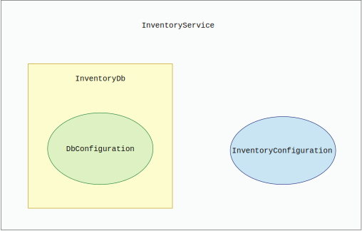

## 什么时候应该使用依赖注入框架

依赖注入（dependency injection，DI）框架的设计思路是很直白的。我们的组件，比如服务，数据访问层，或者配置类，都不应该构建它们自己的依赖。组件需要的所有依赖都应该从外界注入。至于这个外界是什么并没有定义，可以由一个外部调用者来提供实现，而且实现的注入可以发生在任何层面。

假设我们有一个方法需要依赖组件A执行一个操作。我们可以将组件A作为参数轻松注入该方法，如下列代码所示。

**代码13.1 通过参数将组件注入方法**
```
public void doProcessing(ComponentA componentA){
    // processing
}
```

调用者注入组件。`doProcessing()`方法不会知道`ComponentA`的具体细节，因为它是由外界提供的，且`doProcessing()`并没有在方法内部创建该组件的实例。这么做可以让测试这个方法变得十分简单。

我们可以向方法传入一个mock对象（或者另一种实现）来显式测试所有功能。相反，如果`ComponentA`是在`doProcessing()`方法内部创建的，要想测试这个方法就会比较难。我们无法为了测试而换一种实现。例如，`ComponentA`的默认实现可能需要连接另一个服务的线上API，如果我们能注入该组件的另一种实现，我们就能让它连接一个提供测试数据的API。

这种注入的另一个好处是`doProcessing()`方法不需要关心`ComponentA`的生命周期。创建和删除该组件的代码都在外界，可以由调用者处理。

参数注入是一个合法的技术。然而，在面向对象的编程语言中，我们倾向于构造复杂的对象，让它们使用其它对象。因此，让所有方法都通过参数注入组件并不是一个理想的解决方案。这会让我们的代码冗长且难以阅读。

替代方案是在构造函数里注入组件。使用这种技术，调用者需要在构造一个对象实例时提供该对象的所有依赖组件。然后，由构造函数将这些组件设置为对象内部的成员变量。最后，该对象的所有方法通过访问成员变量来使用之前注入的组件。


### 13.1.1 自己实现（DIY）依赖注入

让我们来看一个依赖注入的关系示例，如图13.1所示。我们假定应用程序包含4个组件：

* `DbConfiguration`是数据库的配置类
* `InventoryConfiguration`是库存的配置类
* `InventoryDb`是数据访问层，它依赖`DbConfiguration`
* `InventoryService`是应用程序的主入口点，它依赖`InventoryDb`和`InventoryConfiguration`



**图13.1 依赖注入的组件关系示例**

因为我们想要让应用程序使用依赖注入模式，我们就不能在组件里创建任何其它组件的实例。我们还想要在构造函数里进行依赖注入。这意味着我们需要有一个专门的地方来创建并注入所有需要的服务和配置类。在我们创建并设置好依赖关系后，我们还要调用`InventoryService`的`prepareInventory()`方法。

为了满足这样的场景，我们创建了一个`Application`类作为应用程序的入口点。所有需要的依赖都在那里被创建并注入。下列代码展示了创建`Application`类并注入依赖的过程。

**代码13.2 DIY的依赖注入**
```
public class Application {

    public static void main(String[] args) {
        // construct dependencies
        DbConfiguration dbConfiguration = loadDbConfig();
        InventoryConfiguration inventoryConfiguration = loadInventoryConfig();
        InventoryDb inventoryDb = new InventoryDb(dbConfiguration);
        InventoryService inventoryService = new InventoryService(inventoryDb,
        inventoryConfiguration);
        inventoryService.prepareInventory();
    }
```

注意我们只在这里创建所有的服务和配置类。没有任何组件会在其内部初始化其它组件，这样我们就能在组件隔离的情况下迅速测试任何类。举例来说，如果我们希望隔离测试`InventoryService`，那么可以在测试代码构造`InventoryService`时注入`InventoryDb`和`InventoryConfiguration`的任意实现。另外，所有组件的生命周期都在一个地方管理。这样，我们就可以在应用程序调用完`prepareInventory()`后轻松关闭或停止任何服务。

如果我们需要注入`InventoryDb`的一个特殊实现，下列代码展示了其做法。

**代码13.3 创建一个特殊服务**
```
public class SpecializedInventoryDb extends InventoryDb {
    public SpecializedInventoryDb(DbConfiguration dbConfiguration) {
        super(dbConfiguration);
    }
}
```

然后我们就可以在主方法初始化所有组件的地方轻松创建这个特殊服务的对象，如下列代码所示。

**代码13.4 依赖注入初始化地方的改动**
```
public class Application {

    public static void main(String[] args) {
        // construct dependencies
        DbConfiguration dbConfiguration = loadDbConfig();
        InventoryConfiguration inventoryConfiguration = loadInventoryConfig();
        InventoryDb inventoryDb =
➥ new SpecializedInventoryDb(dbConfiguration);			1
        InventoryService inventoryService =
➥ new InventoryService(inventoryDb, inventoryConfiguration);	2
        inventoryService.prepareInventory();
    }
1 创建SpecializedInventoryDb的实例
2 将InventoryDb的特殊实现注入InventoryService
```

DIY的依赖注入解决方案很直接；但也有遗漏的功能。举例来说，如果`InventoryService`不是线程安全的，且我们的应用程序使用了多线程。那么我们就应该要为每个线程（如果做不到那就为每个请求）都创建一个`InventoryService`的实例。DIY的依赖注入解决方案并没有提供这个功能。于是我们决定要使用一个依赖注入框架来取代自己实现的依赖注入。


### 13.1.2 使用依赖注入框架

市面上有一些经过生产环境验证过的依赖注入（DI）框架，比如Spring，Dropwizard以及Guice。下文假定我们选择了Spring作为DI框架，因为它是市面上的DI框架里最流行的，而且可以为每一个请求构造一个服务。

DI框架使用DI容器来管理所有组件的生命周期。Spring将这些组件称为`bean`。DI容器允许我们在`bean`的生产者端注册新的`bean`。它还允许我们的消费者端从容器里获得一个`bean`。`bean`的生产和消费里面有很多细节。

我们可以为每一个`bean`选择不同的作用域（http://mng.bz/0w86）。它可以是跟随整个应用程序的生命周期（单例模式），也可以是跟随网络请求或者网络会话的生命周期。DI框架还可以在调用`bean`的方法时添加额外的逻辑。比如它可以（使用代理服务器）劫持网络调用并记录请求的参数。在这方面，它支持的功能数量很庞大。

让我们重新设计应用程序来使用Spring DI框架。首先，两个配置类需要用`@Configuration`标注（http://mng.bz/KBJ0），如下列代码所示。

**代码13.5 用@Configuration标注Spring DI的配置类**
```
@Configuration
public class DbConfiguration {}

@Configuration
public class InventoryConfiguration {}
```

接下来，`InventoryDb`需要用`@Service`标注（http://mng.bz/9Kx1），如下列代码所示。

**代码13.6 用@Service标注Spring DI的服务**
```
@Service
public class InventoryDb {
    private final DbConfiguration dbConfiguration;

    @Autowired
    public InventoryDb(DbConfiguration dbConfiguration) {
        this.dbConfiguration = dbConfiguration;
    }
}
```

在代码13.6里，注意`InventoryDb`同时提供了生产者和消费者。我们还需要在构造`InventoryDb`组件时注入`DbConfiguration`。`@Autowired`标注告诉Spring在创建组件之前要先注入该组件的依赖组件。DI框架会处理所有组件之间的初始化次序。

最后，`InventoryService`也要被注册成`@Service`。我们还指定它的作用域是跟随网络请求的。每当一个新的请求抵达，一个新的`InventoryService`实例就会被创建并注入。这个功能也是由DI框架处理的，如下列代码所示。

**代码13.7 使用自定义作用域的服务**
```
@Service
@Scope("request")
public class InventoryService {

    private final InventoryDb inventoryDb;
    private final InventoryConfiguration inventoryConfiguration;

    @Autowired
    public InventoryService(InventoryDb inventoryDb, InventoryConfiguration
          inventoryConfiguration) {
        this.inventoryDb = inventoryDb;
        this.inventoryConfiguration = inventoryConfiguration;
    }

    public void prepareInventory() {
        System.out.println("Preparing inventory");
    }
}
```

现在让我们看看`Application`类（之前初始化所有组件的入口）要如何改动。首先，我们移除所有创建新组件的逻辑。虽然我们依旧可以手动创建这些类，但如果这样做了，Spring DI框架是不会管理它们的。这意味着我们会有两种创建组件的机制。我们希望完全依靠Spring DI框架，手动创建组件容易导致错误，所以并不理想。下列代码展示了`Application`的改动。

**代码13.8 使用Spring DI框架的application类**
```
@SpringBootApplication
public class Application {
    @Autowired private InventoryService inventoryService;	1

    public static void main(String[] args) {
        SpringApplication.run(Application.class, args);
    }

    @PostConstruct					2
    public void useService() {
        inventoryService.prepareInventory();
    }
}
1 InventoryService由Spring DI自动注入
2 仅当所有组件构造完成后才调用prepareInventory()
```

跟之前的代码相比，`main()`方法变了。另外我们还要用`@SpringBootApplication`标注我们的`Application`类。它会扫描所有的bean标注并注入所有需要的组件。仅当所有组件都构造完成后，最后的`prepareInventory()`方法才会被调用。

这里要注意几个方面。首先，实际的创建代码、组件的生命周期以及初始化的顺序对我们来说都是不可见的。这些都在Spring DI框架内部进行处理。只要一切都如我们预想的那样工作那就没什么问题，但是在继续开发应用程序的过程中，我们遇到了一些生命周期方面的问题。由于这些逻辑是隐藏的，debug十分困难。在之前的方案里，我们使用自己的代码控制所有的逻辑，debug属于自己的代码会容易很多。

第二个方面要注意的是跟Spring框架的紧耦合。由于依赖注入需要依靠标注，我们自己所有的类和组件都会被Spring框架的类（或标注）污染。除此之外，我们的应用程序也不再是一个简单的`main()`函数了。我们现在需要将启动逻辑代理给Spring框架。这也是不可见的，而且要使用依赖注入就不得不依靠这种机制。

最后，所有的组件初始化逻辑本来集中在一个地方，现在被分散到我们的代码里。如果不分析大量的代码就不容易看清所有组件的生命周期。

现在让我们回到最初的问题，为什么我们决定要把DIY的解决方案改成使用Spring DI框架呢？这是因为我们想要在`InventoryService`上使用`@Scope("request")`，使得每个请求都可以创建一个服务实例。然而这里有一个很大的警告。每一个请求确实都会初始化一个新的`InventoryService`实例，但是这要求我们必须使用兼容Spring DI的网络服务框架。也就是说，我们必须使用Spring REST。这又是一个依赖框架，而我们必须调整自己的应用程序去跟它合作。一旦我们开始使用Spring DI，我们就被迫采取后续的步骤将我们的网络服务迁移到兼容Spring的框架上。这样的步骤越多，我们跟框架耦合的就越紧，应用程序引入的复杂度也就越高。

需要指出的是Spring网络服务框架和Spring DI框架都是经过严格验证的高质量框架。但如果你的业务场景比较简单或者你希望尽量限制外部依赖的数量（有很多理由这么做，见第9章），那么用某个DI框架带替简单的DIY方案可能并不是一个好决策。

除了试图用某个第三方框架来解决我们最初的问题以外，我们也可以自己想办法改进DIY方案的某些部分。比如，我们可以构造一个`InventoryServiceFactory`，每次调用它来创建实际的服务实例。我们可以在新请求抵达网络服务时调用它。不要因为别人都在用某种框架，就决定我们也要追逐潮流，而不考虑其复杂度或者别的什么因素。另一方面，如果我们确实需要某个框架提供的功能，那么也应该去权衡是否使用这个第三方的解决方案，只是要意识到它会有自己的缺点。

我们对于使用依赖注入技术改变应用程序架构的分析就总结到这里。在下一节，我们会去看一下响应式编程。