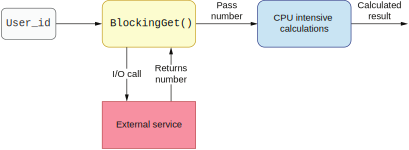

## 什么时候应该使用响应式编程

响应式编程的目的是为了更容易也更有效地处理输入的数据。通常来说，响应式流会对输入数据进行转换并输出结果。这些结果会被保存在某个地方（sink）或者由其他对结果感兴趣的代码消费。响应式编程具有非阻塞的处理模型，意味着它会异步处理数据，并在未来某个时候输出结果。另外，响应式处理可以工作在无限数据流上，并在数据抵达时（或者消费者请求数据时）处理它。

响应式编程给我们提供了函数式，数据驱动的非阻塞处理模型，让我们可以高并发地处理数据。我们可以将处理的工作交给多个线程来实现并发。而且线程模型和处理模型是解耦的。我们不能对线程模型做任何假设，也不知道哪个线程会处理哪部分数据。

响应式编程的一个关键特征是它对反压的支持。数据流是生产者输出的，我们能够预计有些时候消费者无法立即消费掉所有输出的事件，比如存在间歇性的消费者故障。如果消费者在无法处理的时候，生产者还继续以原来的速度输出事件，那么这些事件就需要被缓存在某个地方。如果内存里能缓存下这些数据，那还好说。当消费者能够继续处理时，它就能处理缓存中的事件并回归正轨。不幸的是，如果缓存满了，或者某个节点失效，我们就有可能遇到处理故障并丢失一些事件。

在这种情况下，响应式编程提供了一种机制叫做`反压`。消费者可以发信号说需要消费更多事件。生产者收到信号后才输出对应数量的事件。这种工作模式被称为拉取模式。消费者只有当自己有能力处理时才去生产者那里拉取事件。这就是最自然的反压机制。

我们可以看到，响应式模型提供了很多方案来解决很多复杂的问题。但是它也有代价。响应式API不容易学，也不容易推断。对于简单的业务场景来说可能看上去容易，但是对于自定义的处理来说就会变得复杂。它没有一个适合所有场景的单一解决方案。为了理解这一点，让我们来实现一个数据处理管道并把它进化成响应式。


### 13.2.1 创建一个单线程阻塞式处理模型

首先，让我们来实现一个处理工作流，它的第一步会对每一个用户ID执行一个阻塞的HTTP GET。这是我们的I/O操作，它会阻塞并等待响应。处理的第二步是一个CPU密集型任务，它会在`blockingGet()`方法返回的数字上执行一些高等数学计算。最后一步是将计算结果返回给调用者。图13.2展示了这个场景。



**图13.2 I/O和CPU密集型任务**

该工作流的第一个实现很简单。我们会使用Java Stream API来链接这些处理操作。（其它平台上也会有类似API，比如.NET上的LINQ。）下列代码展示了第一版的处理逻辑。

**代码13.9 我们的第一版处理逻辑**
```
public List<Integer> calculateForUserIds(List<Integer> userIds) {
    return userIds.stream()
        .map(IOService::blockingGet)
        .map(CPUIntensiveTask::calculate)
        .collect(Collectors.toList());
}
```

所有`userId`处理完后，它将结果返回给调用者。注意这里实现的逻辑是阻塞的。这意味着调用者会直接调用这个方法（而不是将它封装在一个异步操作里），然后等待方法结束。`IOService`和`CPUIntensiveTask`都会将执行操作时的线程打印出来，如下列代码所示。

**代码13.10 打印执行操作的线程**
```
public class CPUIntensiveTask {

    public static Integer calculate(Integer v) {
        System.out.println("CPUIntensiveTask from: " +
            Thread.currentThread().getName());
// ...
}

public class IOService {

    public static Integer blockingGet(Integer userId) {
        System.out.println("IOService from: " +
            Thread.currentThread().getName());
// ...
}
```

让我们为这段逻辑写一个单元测试吧。我们用`IntStream.rangeClosed`生成器创建一个包含10个元素的列表，接下来将所有数据传入`calculateForUserIds()`方法。最后，我们断言它会返回10个元素。下列代码展示了这个单元测试。

**代码13.11 处理逻辑的单元测试**
```
@Test
public void shouldCalculateNElements() {
    // given
    CalculationService calculationService = new CalculationService();
    List<Integer> input = IntStream.rangeClosed(1,
        10).boxed().collect(Collectors.toList());

    // when
    List<Integer> result = calculationService.calculateForUserIds(input);

    // then
    assertThat(result.size()).isEqualTo(10);
}
```

更重要的是我们需要能够在运行测试时观察到执行处理的线程。下列代码显示了预期的输出。

**代码13.12 查看处理逻辑的日志**
```
IOService from: main
CPUIntensiveTask from: main
IOService from: main
CPUIntensiveTask from: main
```

所有的处理都是在调用者线程执行的。从这个测试可以确认，我们的处理是阻塞的，并且是单线程的。也就是说我们没有并发处理。


### 13.2.2 使用CompletableFuture

我们可以用Java类`CompletabltFuture`提供的异步抽象一次解决阻塞和单线程这两个问题。你选用的语言大概率也会提供类似的异步API，让你可以提交一个操作而无需阻塞等待结果。

使用这种模式，我们就可以并发提交N个任务。每个任务都可以有自己的线程，或者由线程池提供一组线程。我们使用的`CompletableFuture`API是Java SDK内建的，不需要依赖任何外部库就可以用它。

现在让我们看看上一节示例中的方法会如何改变。对于输入的每一个用户ID，我们都启动一个非阻塞任务，它会在另一个线程中执行（非调用者线程）。我们使用`CompletabltFuture`类的`supplyAsync()`方法，并在其上执行第一步I/O阻塞操作。接下来，我们需要链接后续的CPU密集型操作。注意，它应该要在第一个方法（`blockingGet()`）完成后调用。所以我们用`thenApply()`方法来做到这一点，如下列代码所示。

**代码13.13 使用CompletableFuture的异步实现**
```
public List<CompletableFuture<Integer>> calculateForUserIds(List<Integer>
        userIds) {
    return userIds.stream()
        .map(
            v ->
                CompletableFuture.supplyAsync(() -> IOService.blockingGet(v))
                    .thenApply(CPUIntensiveTask::calculate))
        .collect(Collectors.toList());
}
```

请注意CPU密集型任务会在I/O密集型任务结束后执行，这一点很重要。这意味着这两个阶段不能在同一个ID上并发执行。另外`supplyAsync()`方法有一个重载函数，可以显式接受一个参数提供执行者。这让我们可以提供自己的线程池。如果没有显式提供线程池，则它会使用通用的fork-join线程池。

`CalculationService`现在以异步并发的方式运行。它返回一个列表，里面的`CompletableFuture`包含了会在未来某个时候返回的结果，由调用者来决定是去阻塞等待结果还是继续链接后续的异步操作。比如，调用者可以对列表里所有元素调用`get()`方法并收集结果，如下列测试代码所示。

**代码13.14 异步实现的测试**
```
@Test
public void shouldCalculateNElementsAsync()
➥ throws ExecutionException, InterruptedException {
    // given
    CalculationService calculationService = new CalculationService();
    List<Integer> input = IntStream.rangeClosed(1,
        10).boxed().collect(Collectors.toList());

    // when
    List<CompletableFuture<Integer>> resultAsync =
        calculationService.calculateForUserIds(input);
    List<Integer> result = new ArrayList<>(resultAsync.size());

    for (CompletableFuture<Integer> asyncAction : resultAsync) {
        result.add(asyncAction.get());		1
    }

    // then
    assertThat(result.size()).isEqualTo(10);
}
1 阻塞等待结果
```

我们可以注意到，异步和同步API之间的转换可以十分容易。这个新的异步实现的`calculateForUserIds()`方法可能会在我们代码中很多地方被调用，而我们并不希望强制所有的调用者都使用异步的`CompletableFuture`抽象。如果调用者代码以同步的方式工作，它就可以很容易地使用这个阻塞式API从`CompletableFuture`列表中抽取结果值。我们在组件的内部实现了并发，但没有强制其调用者使用异步工作模式。如果运行代码13.14中的测试，我们可以注意到类似下面示例的输出。

**代码13.15 查看异步处理的日志**
```
IOService from: ForkJoinPool.commonPool-worker-9
IOService from: ForkJoinPool.commonPool-worker-2
.....
IOService from: ForkJoinPool.commonPool-worker-1
CPUIntensiveTask from: ForkJoinPool.commonPool-worker-2
CPUIntensiveTask from: ForkJoinPool.commonPool-worker-9
...
CPUIntensiveTask from: ForkJoinPool.commonPool-worker-1
```

注意这些操作是在多个线程内执行的。即使调用者会阻塞获取结果，实际的计算也会并发运行。如果我们想要获得线程相关性——也就是让I/O密集型和CPU密集型任务在同一个非main线程中执行，那么我们可以向`supplyAsync()`方法传入一个单线程的执行者。

当前使用的这个方法相当简单。我们使用的是所有调用者都可以访问的Java API。我们可以直接影响线程模型，并轻松定制其行为。我们还能做到不强制调用者实现异步的处理方式。封装`CompletableFuture`并将其转成阻塞工作模式几乎没什么工作量。


### 13.2.3 实现一个响应式方案

现在我们想要让自己的代码使用最新的技术，我们决定用响应式方案重写它。我们的处理代码需要在N个输入元素上执行数据转换，所以看上去很适合使用响应式方案。我们依然希望它能像上一个方案一样做到异步和并发。我们选择使用响应式API的`Flux`抽象（http://mng.bz/jyMP）。这是一个支持N个事件的响应流。其它平台上也会有别的响应式编程的库和框架。https://reactivex.io/网站上提供了很多不同平台的选项。

让我们看看新的处理代码长什么样。我们的流程被分成N个步骤。`map`里的每一个动作都会在前一个步骤结束后执行，如下列代码所示。

**代码13.16 实现响应式逻辑**
```
public Flux<Integer> calculateForUserIds(List<Integer> userIds) {
    return Flux
        .fromIterable(userIds)
        .map(IOService::blockingGet)
        .map(CPUIntensiveTask::calculate);
}
```

我们使用`fromIterable()`方法从`userIds`列表构建了一个`Flux`流。在真实世界中，响应式处理的`Flux`流都是从外部源构建出来的，并在这些外部源输出的事件抵达我们系统时消费它们。我们通常无法停止这些事件的输出（热数据源）。响应流就是一个用来对这种行为进行建模的抽象。

如你所见，我们的方法返回这个`Flux`对象。调用者需要在自己的代码里跟它的API互动。我们的方法返回`Flux`对象就是在告诉调用者，里面的数据可能会（以流的形式）无限输出。因此，所有的`Flux`消费者也需要把他们的处理流程迁移成响应式。这不容易，也没有什么安全的方法能以阻塞的方式读取`Flux`里的元素。当数据的生产者有可能无限输出数据时，我们也就有可能被永远阻塞。

这是一种相当侵入式的改动。以响应式方案重新设计我们的组件会突然导致所有的调用者也必须使用响应式处理。响应式处理必须从生产者开始一直实现到最后一个消费者。如果我们只是想要让代码中一小部分逻辑能并发执行，响应式的方案就不太适合。

我们的目标是让一个方法能够不要阻塞主线程且能够并发计算。在运行我们的响应式代码时，我们会注意到一个奇怪的行为，如下列代码所示。

**代码13.17 响应式单线程处理的日志**
```
IOService from: main
CPUIntensiveTask from: main
IOService from: main
CPUIntensiveTask from: main
```

我们会看到所有的处理都发生在调用者的`main`线程！虽然使用了响应式API，但我们的处理还是单线程的，且它会阻塞调用者，因为它占用了主线程。那么我们该如何解决这个问题呢？

我们可以使用`publishOn()`方法指定响应式处理逻辑的执行者。另外要注意的一点是，`blockingGet()`方法会阻塞调用I/O。在响应式标准里提到，响应式工作流里不应该有阻塞的操作。如果必须要用到阻塞式操作，我们可以提供一个特殊的执行者：`boundedElastic()`。它是特地为阻塞式调用设计的。不幸的是，它执行CPU密集型任务的性能很差，会占用线程大量的时间。因此，我们还应该使用`parallel()`执行者来优化执行CPU密集型任务。下列代码展示了这个实现。

**代码13.18 响应式并发**
```
public Flux<Integer> calculateForUserIds(List<Integer> userIds) {
    return Flux.fromIterable(userIds)
        .publishOn(Schedulers.boundedElastic())
        .map(IOService::blockingGet)
        .publishOn(Schedulers.parallel())
        .map(CPUIntensiveTask::calculate);
}
```

运行这段代码的输出展示在下面。注意这里I/O和CPU密集型任务使用了不同的线程。操作是互相插入的，这意味着我们已经获得了一定程度的并发。

**代码13.19 响应式并发的日志**
```
IOService from: boundedElastic-1
IOService from: boundedElastic-1
CPUIntensiveTask from: parallel-1
IOService from: boundedElastic-1
CPUIntensiveTask from: parallel-1
```

在遵循响应式线程模型指南时，很难保证线程的相关性。在处理I/O和CPU密集型任务时，应该将它们放在不同的线程池里执行。所以它们是不可能像我们使用`CompletableFuture`和单线程执行者那样在同一个线程里执行的。

虽然我们达成了目标，但是这个并发方案有几个缺陷。首先，线程的配置选项是隐藏的。我们可以将并发度传给所有的执行者，但是它很难微调和配置。我们的性能分析和测试证明了这一点。另外，Flux API的线程模型并不易用。一旦我们的组件暴露了这个API，它就会强制所有的调用者也都使用响应式API。而且在暴露`Flux`之后，我们将无法控制用户使用它的方式。调用者可以使用`Flux`的`subscribeOn()`方法改变我们代码的线程池，从而影响我们的处理功能。

另外，调用者不能在同一个线程内对`calculateForUserIds()`返回的`Flux`直接链接后续的阻塞操作。这样的操作必须在`parallel()`线程池里执行，而这会影响CPU密集型任务的执行性能。

这些问题都是在使用Flux API时才会出现的。当然，它们都可以被解决，但是我们需要确保所有的团队成员都知道响应式API。如果我们的目标只是让一部分处理流程能并发执行，把整个应用程序用响应式API重写的影响面就太广了。另一方面，如果我们确实打算使用响应式编程重写应用程序，我们应该要把整个端到端的流程都改成响应式，而不只是重写这一个子组件。我们会在下一节分析函数式编程的用法。