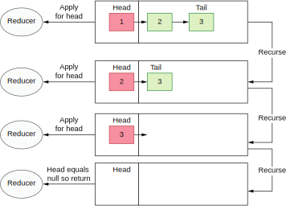
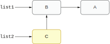

## 什么时候应该使用函数式编程

函数式编程有很多优点，比如更简单的并发模型（利用不可变对象），更简洁的代码，更容易测试（没有副作用也没有全局状态）等。然而，在面向对象的语言（比如Java）中过度使用函数式编程在某些情况下可能会导致问题。我们会试着在面向对象语言中使用100%的函数式代码解决后面一些示例问题。

Java是一种面向对象的语言。幸运的是，最近几年，它也支持一些函数式的用法，比如lambda函数和Stream API。这些概念虽然在函数式编程里广为人知，但它们只是函数式编程范畴里的一小部分。你可能会想要用这些函数式的写法来写所有的逻辑。但请记住，Java在骨子里毕竟还是一个面向对象的语言。

在用面向对象的语言写纯函数式代码时有很多陷阱。在下一节，我们会用面向对象的语言来递归实现一个`reduce()`函数。


### 13.3.1 用非函数式语言写函数式代码

我们的目标是写一个`reduce()`函数，它可以接受一个列表，对列表内的元素进行缩减，然后返回结果。这个函数应该是通用的，也就是说对于任何输入参数类型都可以工作。

另外，假设我们受到了函数式编程的鼓舞，想要以纯函数式代码实现这个逻辑。我们可以用递归和列表分解来实现。每个列表可以被认为由一个头部和一个尾部组成，如图13.3所示。头部是列表的第一个元素，而尾部则是头部后面的所有元素。



**图13.3 递归分解列表**

一旦我们取得（并移除）列表头部，我们就可以对头部的元素进行缩减。然后，我们将尾部再次传入这个函数。列表会再次分解，我们再次取得头部，进行缩减，并再次传入尾部。这个逻辑会一直重复（递归）直到列表为空。一旦列表为空，我们的递归函数就返回最终的值。下列代码展示了我们如何用Java编程语言来实现这段逻辑。

**代码13.20 创建reduce()方法**
```
public static <T> T reduce(List<T> values, BinaryOperator<T> reducer,
        T accumulator){
    return reduceInternal(values, reducer, accumulator);
}
```

这个reducer函数接受两个参数，分别是聚合值以及列表的头部。我们在第一次迭代时还没有聚合值，所以调用者需要通过`accumulator`参数提供一个初始值。reduce()方法代理给reduceInternal()方法实现，它会递归调用自身，所以我们应该从终止条件开始写起，这个终止条件告诉函数什么时候可以返回。

对于我们的场景，我们想要在列表为空时返回accumulator。没有这个条件，这个函数就会无限递归，永远不能返回。接下来，我们分解列表，抽取头部和尾部，如下列代码所示。这些分解列表的操作也分别代理给不同的方法，我们会在后面看到它们的代码。

**代码13.21 用Java实现缩减函数reduceInternal()**
```
private static <T> T reduceInternal
➥ (List<T> values, BinaryOperator<T> reducer, T accumulator) {
    if (values.isEmpty()) {
        return accumulator;
    }
    T head = getHead(values);
    List<T> tail = getTail(values);
    T result = reducer.apply(head, accumulator);
    return reduceInternal(tail, reducer, result);
}
```

抽取头部后，我们就可以调用reducer函数，传入头部和accumulator的值。最后，我们再次（递归）调用这个方法。

头部和尾部的抽取方法十分直白，如下列代码所示。

**代码13.22 抽取头部和尾部**
```
private static <T> List<T> getTail(List<T> values) {
    if (values.size() == 1) {
        return Collections.emptyList();
    }
    return values.subList(1, values.size());
}

private static <T> T getHead(List<T> values) {
    return values.get(0);
}
```

如果values里面只有一个元素（头部），那么getTail()方法就会返回一个空列表。否则，它返回头部以外的所有元素。getHead()方法返回列表的第一个元素。

让我们实现一个单元测试来验证我们的函数式reduce()的实现。这个单元测试用该函数对一个列表里的所有值求和，如下列代码所示。

**代码13.23 用Java创建reduce单元测试**
```
@Test
public void shouldReduceTenValues() {
    // given
    List<Integer> input = IntStream.range(1,
        10).boxed().collect(Collectors.toList());

    // when
    Integer result = Reduce.reduce(input, (value, accumulator) -> value +
        accumulator, 0);

    // then
    assertThat(result).isEqualTo(45);
}
```

reducer函数接收accumulator和头部的值并求和。由于我们从0开始累加，所以accumulator的初始值是0。

在目前的阶段，我们对自己的实现十分满意。我们能够使用函数式方法（递归）在非函数式语言中实现逻辑。然而，我们的方案有一个很大的问题。我们可以写一个操作大量数字的单元测试来暴露这个问题。比如说，在一个有100000个元素的列表上运行我们的逻辑，如下列代码所示，我们观察到代码会抛出StackOverflowError。

**代码13.24 抛出StackOverflowError的测试**
```
@Test
public void shouldStackOverflowForALotOfValues() {
    // given
    List<Integer> input = IntStream.range(1,
        100_000).boxed().collect(Collectors.toList());

    // when
    assertThatThrownBy(() -> Reduce.reduce(input, Integer::sum, 0))
        .isInstanceOf(StackOverflowError.class);
}
```

是什么原因让这段代码抛出了`StackOverflowError`？原来Java语言对递归的优化和支持并不理想。每次递归调用都需要在调用栈上分配一个帧。处理100000个元素就需要分配同样数量的栈帧。每个栈帧都会占用一些内存。栈的回溯上限取决于我们程序的可用内存。因此，Java限制了栈允许回溯的深度。如果我们的代码执行了太多次递归调用，Java就会抛出这个异常告知我们这个问题。

这是在非函数式语言中使用函数式编程的边缘情况之一。`reduce()`函数可以用命令式方法实现，使用标准的`for`循环，这也是我们应该在面向对象语言中使用的方法。

注意Java Stream API里就有`reduce()`方法。我们可以放心使用它，因为它就是用命令式（`for`循环）而不是递归实现的。我们自己实现的这个`reduce()`方法仅仅是为了展示在Java这样的面向对象语言中使用函数式编程的常见问题之一（递归）。


### 13.3.2 尾部递归优化

如果我们使用函数式语言，上述递归实现遇到的问题就可以被轻松解决。比如，Scala语言就提供了尾部递归优化。

这个编译器级别的优化让我们可以直接在当前栈上展开递归。这要求我们的递归调用必须是方法里的最后一个调用。这样，编译器就会把递归展开成for循环。我们在函数式语言里可以用递归的方式来写代码而无需担心栈的过度增长。下列代码展示了递归`reduce()`方法在函数式语言（Scala）里的简单实现。

**代码13.25 在Scala里实现reduce()**
```
@tailrec
def reduce[T] (values: List[T],
➥ reducer: (T, T) => T, accumulator:T ): T = values match {
    case Nil => accumulator
    case head :: tail => reduce(tail, reducer, reducer(head, accumulator))
}
```

现在我们的代码更简洁，处理大量的输入数字也不在话下。代码看上去更简洁是因为我们用到了另一个函数式编程的功能：分解模式匹配。列表通过简单的`head::tail`语句就可以被分解成头部和尾部。注意这里用`@tailrec`（http://mng.bz/W7J1）标注了`reduce()`方法。编译器看到这个标注就会去检查这个方法是否可以使用尾部递归优化。如果不能，编译器会返回一个错误。但是对于我们的代码，编译器发现是可以进行优化的，因为递归调用是方法里的最后一条语句。

在分析完这个示例并看过Scala和Java的实现后，我们可以总结如下：对于特定的编程任务来说，选择合适的语言和工具很重要。函数式编程有很多优点。但是如果盲目使用这个技术和模式，我们就会遇到很多潜在的问题。我们一方面应该从函数式编程语言中汲取精华。但是另一方面，在非函数式语言中，我们也应该谨慎使用函数式的编程结构。最佳的模式是，我们暴露一个可以跟函数式编程结合的API（比如`Stream.reduce()`），但在底层用命令式的代码实现它。


### 13.3.3 利用不可变性

不可变性是一个强大的概念，同时也有不菲的代价。不可变的对象一旦创建就不能以任何方式被修改。我们可以在Java语言中用`final`关键字标注一个对象的所有字段来创建一个不可变对象。不过，`final`如果被标注在一个引用类型的字段上，那只能保证该字段不会被重定向到另一个值，被引用的那个值本身还是有可能发生变化的。

如果一个对象提供了修改自身的方法，那它就有可能被改变。创建一个不可变对象需要你仔细设计它的类。所有能修改它的方法都必须对调用者隐藏起来。如果我们使用了允许修改的API组件（比如列表），我们就需要将这个可变组件封装到另一个不可变组件中。在封装后的组件里，我们需要禁用底层对象所有的修改方法。

只要我们的对象不可变，我们就可以在各组件中共享它而无需关注线程安全。对象只能被读取，所以所有线程都具有相同的访问能力。因此也就不需要在访问对象时加锁。这可以极大提升我们代码的效率。

写和推断这样的代码更容易，写出无bug的代码也更容易。对象的状态一定要在构造时填入——构造完成后就改不了了。

在真实世界中，即使是不可变的对象，我们有时候还是会需要改变其状态。在函数式方案里，我们的做法是，复制该对象所有的状态并改成需要的值，以此创建一个新的对象。但是一旦副本对象被创建之后，它也需要像原始对象一样遵循不可变的原则。所以我们会意识到，这样的方案可能会创建很多对象。每个对象都会分配一些内存空间。副本越多，我们需要的内存就越多。因此用函数式方案写我们的代码会导致更高的内存压力和垃圾收集的代价。副本创建的数量及其对垃圾收集的影响需要被仔细斟酌。

其实，副本的数量是可以减少的。让我们以一个不可变的`List`实现为例。列表本身是不可变的，且列表节点之间通过指针连接。假设我们的`list1`指向了一个双节点列表。接下来，我们想要基于不可变的`list1`创建一个新的`list2`，只是多了一个额外的C节点，如图13.4所示。



**图13.4 设计一个不可变列表**

我们可以从`list1`复制所有节点并添加一个额外节点，但这会额外占用3个节点的空间。替代方案是，我们可以创建一个新节点并让它指向`list1`的头部。这样操作以后，我们就有两个不可变列表：`list1`有2个节点，`list2`有3个。然而，我们总共只需要3个节点的内存空间而不是5个。我们可以利用这种模式来减少其它不可变结构和对象的内存开销。

函数式编程是一门复杂的学问，值得更加深刻的理解。本节的目的只是展示其中一个方面并分析它在面向对象语言中的用法。如果你希望学习更多有关函数式编程的内容，我推荐Pierre-Yves Saumont写的这本书：《Java中的函数式编程》（Manning， 2017）（http://mng.bz/8lVw）。我们将在下一节对比两种初始化方式：延迟初始化和急切初始化。