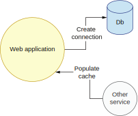
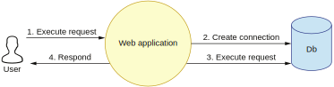
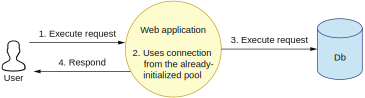

## 对比延迟和急切初始化

应用程序需要跟多个组件互动。考虑一个网页应用程序需要连接一个数据库并将最近的用户ID数据放入缓存的场景。我们的服务可能有N个实例，每个节点都有可能需要执行这些任务，如图13.5所示。

**图13.5 有两个下游组件的应用程序**

我们可以选择以延迟或急切的方式执行这些操作。目前软件业的趋势是让应用程序尽可能快地启动。这意味着我们会将初始化数据库连接这样的耗时操作尽可能移动到应用程序的后期来执行。这种模式被称为延迟初始化。这意味着当我们启动应用程序时，连接不会被初始化，而是拖延到用户的第一个请求到来时才执行初始化逻辑。然而，这也意味着第一个用户将会在第一个请求上付出初始化连接的代价。图13.6展示了延迟初始化的流程。

**图13.6 使用延迟初始化连接数据库**

如果我们使用急切模式，初始化发生在应用程序启动的时候。在这样的场景下，第一个用户请求就可以使用一个已经存在的连接而无需对其初始化。应用程序启动时就会创建连接（并保持在连接池中）。第一个请求只需要从连接池里取出这个连接就可以使用。图13.7展示了急切初始化的流程。

**图13.7 使用急切初始化连接数据库**

我们更容易在真实生活中注意到这两种模式对应用程序的影响。我们通常会有一个连接池保持着对底层系统的N个连接。这个连接池可以动态增长，但是最初的连接数量是固定的。如果我们决定对所有连接使用延迟初始化，那么就有N个请求要支付初始化的代价，N等于连接池最初的连接数量。

我们需要对较长的应用程序启动时间和较长的第一个（或更多）请求处理时间进行权衡。如果我们的SLA对于请求的处理时间有一个硬性限制不能超过多少时间，延迟初始化可能就不太适合。另一方面，如果我们需要尽快启动应用程序，那就有理由将耗时逻辑移动到后期执行。

在应用程序选择何时将数据放入缓存时，也需要考虑不同的初始化模式。我们可以使用急切模式，在应用程序启动时就将数据放入缓存，或者我们也可以使用延迟模式，在处理请求时将数据放入缓存。很明显这里需要的权衡跟前一个示例一样：时间应该耗费在启动时还是耗费在前N个请求上？

注意，外部调用是有可能出错的。如果其它服务在写入缓存的时候因为网络断线而失败，那么这些服务写入的缓存数据就可能有问题。又或者我们那些读取缓存数据的初始化代码存在bug。这些都会导致初始化出错。

然而，在使用延迟初始化的时候，初始化问题只有在应用程序运行以后才会暴露出来。那可能要等应用程序启动后很久才会出现。我们可能一开始部署了应用程序并观察到一切都工作正常，只有当应用程序开始处理流量时，我们才注意到问题，因为延迟模式将初始化逻辑推迟到了后期。如果我们的应用程序选择急切模式（在启动时）执行初始化操作，我们就能提前检测到潜在的问题。

如果是编程错误，我们可以在新代码部署到新节点上时立即检测到。一旦检测出问题，我们就可以迅速回滚。如果在新节点正常启动以前，我们就进行了回滚，那时旧版本还没有删除，我们的终端用户甚至都不会注意到这个错误。如果用了延迟初始化，部署阶段可能看不到任何故障。只有当所有节点都部署完，我们（和我们的终端用户）才可能发现问题。表13.1总结了我们的发现。

**表13.1 延迟初始化和急切初始化**
|初始化模式|启动速度|前N个请求处理时间|错误检测|
|--|--|--|--|
|延迟初始化|较快|受影响；较慢|要到后期，当服务运行时才能检测到|
|急切初始化|较慢|不受影响|部署阶段就能检测到|

如你所见，延迟初始化提供了较快的启动时间。但是这个时间并没有真的省下来，而是分摊给了服务的前N个请求。另外，潜在的错误会被推迟到服务开始运行后才能检测出来。

急切初始化把时间花在启动阶段。因此，使用急切初始化的应用程序启动更慢，但由于代价已经在启动阶段支付过了，前N个请求就不受影响。同时，潜在的错误能够在部署阶段就被检测出来。

在你决定使用急切或者延迟初始化的时候应该考虑上述因素。你也可以混合着用，对有些操作使用急切模式，对另一些使用延迟模式。

## 总结

* 使用依赖注入模式，组件需要的所有依赖都应该从外界注入，且注入可能发生在任何层面。我们在本章学到了何时应该DIY以及何时应该使用现成的框架来实现依赖注入模式。
    * 虽然参数注入是一种合法的技术，但它不适合Java这样的面向对象语言。替代方案是在构造函数里注入，在对象构造时一次性注入所有依赖的组件。
    * 市面上有一些经过生产环境验证过的依赖注入框架，比如Spring，Dropwizard以及Guice。它们提供了很多功能，但也隐含了一些前提要求，会给我们的代码引入紧耦合。
* 响应式编程提供了函数式、数据驱动的非阻塞处理模型，让我们可以并发处理数据。这种并发是通过使用多线程实现的。
    * 我们以一个单线程的处理为例，将它进化成以异步并发的方式工作。这让我们可以并行处理很高的吞吐量。
    * 根据软件业的最新趋势，我们用响应式编程重写了代码，因为它看上去很适用于转换N个输入元素的场景。
    * 学习一个解决方案的线程模型可以帮助我们更好地分析该方案的优缺点。
* 函数式编程有很多优点，比如更简单的并发模型，更简洁的代码，以及更容易测试。但是在面向对象的编程语言中盲目使用函数式编程在某些情况下可能会导致问题。
    * 我们在Java中通过递归实现了函数式方法。并将其跟Scala中的尾部递归进行了对比。
    * 不可变性是一种强大的概念，但也有代价。一旦我们创建了不可变的对象，它就不能以任何方式被修改。我们实现了一个不可变的列表作为示例。
* 由于我们的应用程序需要跟多个组件进行互动，我们学习了延迟初始化和急切初始化，并在如下方面将两者进行了对比：程序启动时间，请求处理时间，以及错误检测时机。