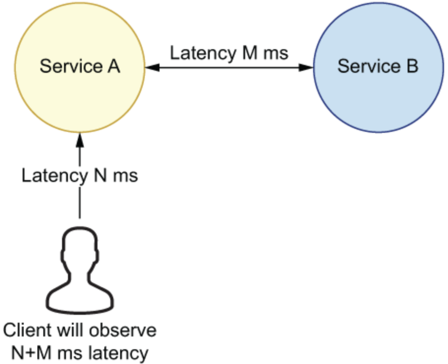
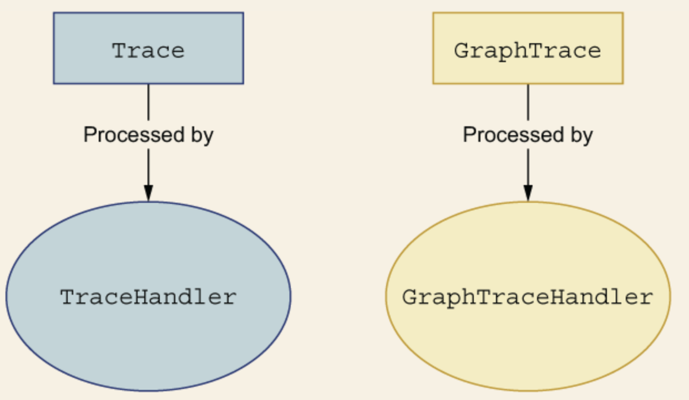
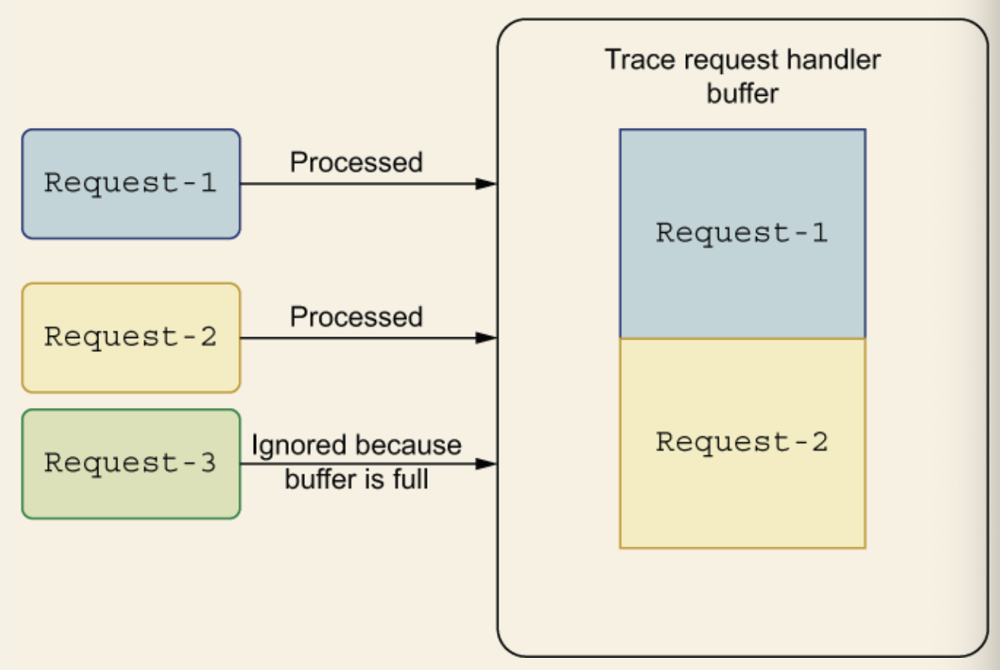
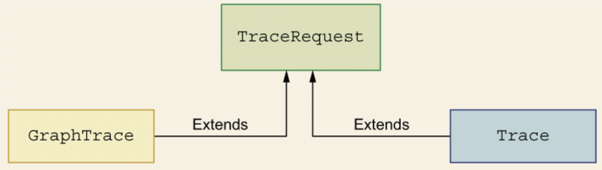
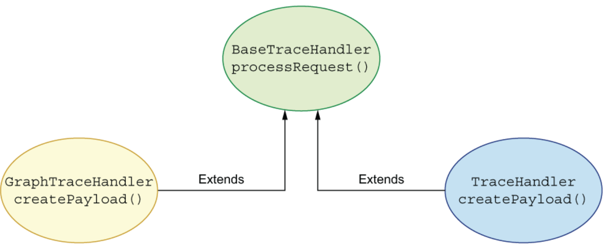
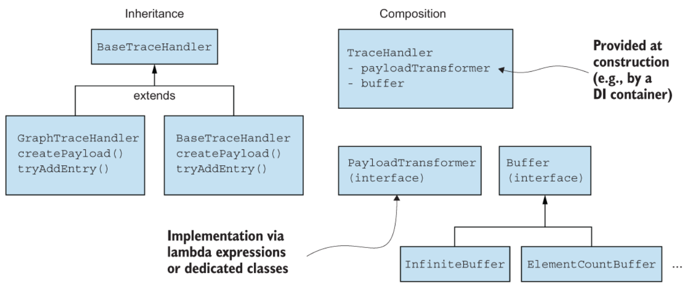

## 第二章 代码重复不一定是坏事：代码重复与灵活性的权衡

>  本章内容: 
>
> - 在相互独立的代码库间共享通用代码
> - 代码重复、灵活性与产品交付之间的取舍
> - 松耦合的情况下，代码重复是否是一个合理的选择

不要写“重复”代码（DRY）原则是软件工程领域最广为熟知的原则之一。这句话背后主要的思想就是要消除重复的代码，这将有助于减少缺陷，提升软件的可重用性。不过，如果我们构建任何系统时都要求严格遵守DRY原则，结果可能是很危险的，因为这会隐藏大量的复杂性。如果我们构建的是个单体系统，即几乎所有代码都存放在同一个代码仓库，遵守DRY原则要容易得多。


当今不断演进的系统中，我们常常需要构建分布式系统，这些分布式系统通常由多个独立部分组成。这种架构中，减少代码重复有更多的考量，譬如，是否会导致组件间的紧耦合，是否会降低团队的开发速度。如果一份代码在多个地方被使用，这部分代码的变更往往需要大量的沟通协调。如果需要在团队之间进行协调，交付业务价值的速度就会降低。本章会讨论涉及代码重复的模式与取舍。我们试图回答：什么情况代码重复是一种明智的选择，什么情况应该尽量避免。


我们从两个独立代码库存在部分重复代码的情况说起。接着，我们尝试通过共享库的方式，消除重复代码。最后，我们会采用一种新的方法解决这个问题，即使用微服务封装抽取的通用方法。这个例子之后，我们会利用继承消除代码中的重复逻辑。然而，我们会发现即便这种方法也有难以忽略的开销。

### 2.1  代码库间的通用代码及重复代码

我们会讨论微服务架构下共享代码所存在的设计问题。假设这样的场景，两个研发团队，分别是团队A和团队B。团队A工作在`payment`服务上，团队B工作在`person`服务上。如图2.1所示。

> 图2.1 两个独立的服务：payment和person

`payment`服务在`/payment`URL端点上提供了一个HTTP API。而`person`服务在`/person`端点上提供了它对应的业务逻辑。我们假设这两个代码仓库都用同样的程序设计语言编写。此时，两个团队都在紧锣密鼓地开展各项工作，能快速交付需求。

高绩效软件研发团队可以快速交付软件产品的重要原因之一是不需要在多个团队之间做信息同步。我们甚至可以借用阿姆达尔定律来估算同步对软件交付整体周期的影响。该公式表明同步的需求越少（因此，可以有更多并发进行的工作），通过增加资源来解决某个问题能达到的效果越明显。图2.2对这一原理进行了说明。

>  图2.2 阿姆达尔定律发现系统整体可达的最大处理速度取决于可并行处理工作所占的百分比

譬如，如果你的任务仅有50%的时间可以并行（另50%的时间需要进行同步），即便增加资源（即图中处理器的数目）也无法显著提升处理速度。反之，任务的并行度越高，同步的开销越小，增加资源能提升的处理速度越明显。


我们可以使用阿姆达尔公司计算并发处理的并行度，得出增加更多核可获得的效益，我们也可以将该公式应用到工作于特定任务的团队成员（更多信息请参考http://mng.bz/OG4R)。降低并行的同步包括花费在会议，合并代码分支以及需要全团队出席的活动所占用的时间。


代码重复时，各团队可独立开发，不需要进行团队之间的信息同步。因此，为团队增加新的成员能提升生产率。如果去除重复代码，情况就截然不同，这时两个团队需要在同一段代码上开展工作，随时可能因为代码变更阻塞对方。


#### 2.1.1 添加新需求导致的代码重复

完成上述两个服务的开发后，紧接着来了一个新需求：为这两个`HTTP`接口添加授权功能。两个团队的首选方案都是在自己的代码仓库中实现授权模块。图2.3展示了新的架构设计。

图2.3 新的授权模块

两个团队各自开发维护了一个类似的授权模块。然而，两个团队的工作依旧是相互独立的。

请注意，介绍这个场景时，我们使用了基于令牌的简化版认证，该方案容易遭受流量回放攻击(http://mng.bz/YgYB)，因此不建议在生产系统中使用。本章中我们使用简化版认证做介绍是为了避免复杂化我们希望介绍的主要内容。安全很难做好，这一点再怎么强调也不为过。如果每个团队都各搞一套，做好的概率是非常低的。从避免安全事故角度出发，即便开发一个共享库的周期更长，它带来的优势依旧是很明显的。

#### 2.1.2 实现新的业务需求

让我们一起回顾下`Payment`服务提供的功能。它在端点`/payment`上提供了一个基于`HTTP`协议的支付服务。只提供了一个`@GET`

资源获取某个令牌所有的支付信息，代码清单如下所示：

> 代码清单2.1 `payment`端点的实现

```java 
@Path("/payment")    (1)
@Produces(MediaType.APPLICATION_JSON)
@Consumes(MediaType.APPLICATION_JSON)
public class PaymentResource {
  private final PaymentService paymentService = new PaymentService();
  private final AuthService authService = new AuthService();    (2)
  
  @GET 
  @Path("/{token}")
  public Response getAllPayments(@PathParam("token") String token) {
    if (authService.isTockenValid(token)) {    (3)
      return Response.ok(paymentService.getAllPayments()).build();
    } else {
      return Response.status(Status.UNAUTHORIZED).build();
    }
  }
}
```

> (1) 暴露`payment`服务的接口
>
> (2) 创建`AuthService`实例 
>
> (3) 使用`AuthService`验证令牌

如你所见，代码清单2.1中，`AuthService`会对令牌做验证，通过之后，调用方会继续访问`payment`服务，返回所有的支付信息。实际项目中，`AuthService`的逻辑会更加复杂。我们先看看简化板`AuthService`的实现，代码如下所示：

> 代码清单2.2 创建认证服务

```java 
public class AuthService {
  public boolean isTokenValid(String token) {
    return token.equals("secret");
  }
}
```

> **注意** 实际项目中不太会出现两个团队使用完全一样的接口，方法名，函数签名等。这是之前讨论共享代码要早能带来的优势之一：如此一来，方法实现出现差异的机会要减少很多。

另一个团队负责`person`服务的开发，提供`/person`端点的`HTTP`服务。该服务也采用基于令牌的认证，代码清单如下：

> 代码清单2.3 `person`端点的实现

```java
@Path("/person")    (1)
@Produces(MediaType.APPLICATION_JSON)
@Consume(MediaType.APPLICATION_JSON)
public class PersonResource {
  private final PersonService personService = new PersonService();
  private final AuthService authService = new AuthService();    (2)
  
@GET
@Path("/{token}/{id}")
public Response getPersonById(@PathParam("token") String token, @PathParam("id") String id) {
  if (authService.isTokenValid(token)) {
    return Response.ok(personService.getById(id)).build();
  } else {
    return Response.status(Status.UNAUTHORIZED).build();
  }
 }
}
```

> (1) 暴露`person`服务的`HTTP`接口
>
> (2) 创建`AuthService`服务实例
>
> (3) 采用`AuthService`验证令牌

`person`服务也集成了`AuthService`服务。它会验证用户提供的令牌，接着使用`PersonService`获取`Person`的信息。

#### 2.1.3 结果评估

截至目前，由于两个团队是独立并行开发，因此存在代码及工作的冗余。

- 重复的代码可能导致更多的缺陷与错误。举个例子，`Person`团队在它的授权模块修复了一个缺陷，这并不意味着`Payment`团队不会遭遇同样的缺陷。
- 同样或相似的代码存在于各自独立的代码仓库中时，由于信息孤岛效应，工程师之间无法及时分享信息。譬如，`Person`团队发现一个令牌计算的缺陷并在自己的代码仓库中进行了修复。不幸的是，这部分修复的代码不会自动合并到`Payment`团队的代码仓库。`Payment`团队仍需要在不久的将来自行修复该缺陷，甚至不基于`Person`团队的代码变更。
- 不需要协调的工作可能进展更迅速。不过，这也导致了另一个结果，即两个团队都做了大量类似或者重复的工作。

实际生产中，我们推荐使用久经验证的认证策略，譬如`OAuth`(https://oauth.net/2/)或者`JWT`(https://jwt.io/)，而不是从头开始实现一套逻辑。这些策略在微服务架构中甚至更加重要。多个服务需要认证从而访问其它服务的资源时，这两种策略都带来了大量的优势。我们不会在这儿专注讨论某个认证或者授权策略。我们更倾向于专注在代码层面，譬如灵活性、可维护性以及架构的复杂度。接下来的一节，我们会讨论如何通过抽取通用代码，构造共享库来解决代码冗余的问题。


### 2.2 通过库在代码仓库之间共享代码 

首选，我们做一个设定，由于两个独立代码仓库之间存在着大量重复代码，两个团队决定将通用代码抽取出来作为一个单独的库。我们会将授权服务的代码抽取到一个单独的代码仓库。一个团队还需要创建新库的部署流程。最典型的场景是将库发布到一个外部的仓库管理器，譬如`JFrog`的制品仓库(https://jfrog.com/open-source/)。图2.4对这一场景进行了说明。

> 图2.4 从仓库管理器获取某个通用库

一旦通用代码存储到仓库管理器，服务就可以在构建时拉取该库文件，使用其中包含的类。这种方式，使用同一个地方存储代码，消除了代码重复的问题。

消除重复代码带来的诸多益处中显而易见的一点是代码整体质量的提升。使用一个共享库存储通用逻辑有利于团队的协作，共同改进代码仓库。基于这种机制，某个缺陷修复后，所有该共享库的消费者都能直接受益，不再有重复的工作。现在，我们一起来看看如果采用这种方式，它有哪些缺点以及需要做怎样的取舍。


#### 2.2.1 共享库的取舍与不足

一旦抽取新库，它就成为了一个新的实体，有自己的编码风格，部署流程以及编码规范。我们的语境里，“库”意味着对代码进行了打包操作（封装成了JAR, DLL，或者Linux平台上的.so文件），可以被多个项目使用。某个团队或者某个开发者需要负责新代码仓库的维护，建立部署流程，验证项目代码的质量，开发新功能，诸如此类。并且，这是一个持续不断的过程。

如果你决定采用共享库，就要定义一系列的流程，包括编码规范，部署流程，等等。不过，只要创建过一次共享库，同样的流程可以复用多次。添加第一个共享库的开销可能比较高，后续要容易得多。

这种方式最显而易见的缺点之一是新创建的库需要使用与消费端一致的程序设计语言。举个例子，如果`payment`和`person`服务使用不同的程序设计语言开发，一个使用`Python`，另一个使用`Java`，那我们就不太可能采用共享库的方式解决这个问题。不过，实际项目中，这极少成为问题，因为服务通常都采用同一种程序设计语言或者同体系的程序设计语言（譬如基于`JVM`的语言）创建。当然，我们也可以用不同的技术创建服务生态系统。然而，这会极大地增加系统的复杂度。通常这意味着我们需要雇佣熟稔各种技术栈的专家，他们得使用各式各样的工具，譬如不同技术栈的构建系统，包管理器等。你选择的程序设计语言决定了你要采用什么生态，语言与生态是紧密相关的。

> #### 开源贡献
>
> `JVM`开源生态中有很多活跃的开源社区，它们开发维护了各式各样的库。创建一个独立的库并开源之前，最好先调研一下社区中是否已经存在能解决你问题的库。当然，要适配自己的需求，你可能还是需要做一定的扩展。
>
> 如果开源社区不存在类似的库，你也可以将自己的代码贡献到社区。通过向现有的开源项目贡献代码，更多的用户可以使用你的成果。而你将获得部署流程的支持以及免费的推广。这样一来，更多的人会知道你的库，并重用其中的代码。

很多时候，我们会用别的语言（譬如C语言）编写一个库，再用你选择的原生语言封装它（譬如Java本地接口）。然而，这种方式可能会带来问题，因为如此一来我们的代码需要经过另一层的间接调用。封装在原生接口内的代码在不同的操作系统之间可能是不兼容的，或者它的方法调用甚至比封装语言（譬如Java的方法调用）更慢。基于这些考虑，接下来的讨论中，我们专注于使用同一种技术栈的语言生态。

新创建的库需要在公司内部大力推广，只有这样，别的团队才能了解它，需要的时候才会使用它。否则就会出现混杂使用的情况，即有些团队用了新的库，另一些团队依旧还在使用冗余的代码。

利用存储库管理器是共享库的好办法，不过你还是需要为库文件维护一份文档。通常情况下，拥有良好测试的项目可以降低开发者为其贡献代码的难度。如果开发者可以使用你测试套件，方便地做一些实验，他们会更愿意使用你的库并为其贡献代码。另外，项目文档由于欠维护有时会过期，这一点也值得特别注意。因此定期更新文档非常重要。

同样，测试也需要及时维护，保持与产品行为一致。这是帮助你在公司内部推广该库极好的营销手段，可以让潜在用户对你的库的品质更有信心。当然，如果你选择了冗余代码的方式，那就需要在所有的地方测试那些重复的代码。这意味着你也需要有重复的测试代码。

不能因为测试覆盖率高就放弃维护库的文档。如果你希望靠查看测试代码了解如何使用一个新的库，结果可能困难重重，除非这些测试编写时就考虑了要作为文档提供给用户。测试需要覆盖各种使用该库的方式，不仅局限在推荐的方式上。测试代码能回答某些问题，但是，和专用的帮助页面比起来还是有很大差别，帮助页面不仅提供了教学实例，还带有新手入门的内容。


#### 2.2.2 创建共享库

创建共享库时，我们应该以极简为第一原则。如果你有第三方库的依赖，这是你要考虑的重中之重。假设我们的授权组件依赖于某个流行的Java库，譬如Google的`Guava`(https://github.com/google/guava)，你显示地声明了该依赖。`payment`服务导入新的授权库时，由于依赖传递，也会依赖于Google的`Guava`库。目前为止，一切都很顺利，直到`payment`服务引入了另一个第三方库，新的库也对Google的`Guava`库有依赖，不过它依赖的是另一个版本的`Guava`库。图2.5展示了这种场景。

> 图 2.5 `payment`服务实现中的依赖传导

这种情况下, 同一个库在`payment`服务中会存在两个不同的版本。如果这两个库底层的大版本不一致，问题就更加严重。这意味这它们甚至可能不是二进制兼容的。如果这两个库都在你的类路径中存在，你又没有做额外的配置，通常情况下你的构建系统（譬如`Maven`或者`Gradle`)会自动选择新版本的库。譬如可能出现这种情况，第三方库代码对旧版`Guava`库中名为`methodA()`的方法有依赖，而该方法在新版`Guava`库中被移除了。如果你没有在配置中明确指明使用哪个版本，构建工具就可能会选择新版本的库。此时，就会发生类似`MethodNotFound`这样的异常。这是因为第三方库期待使用版本27.0的`Guava`库中的`methodA()`方法，而构建工具选择了版本为28的`Guava`库，因此第三方库必须使用它。这就导致了上述问题的发生。这种冲突很难解决，甚至可能让组织中的团队失去对你提取出来的库的信心。因此，你的库应该减少直接依赖。我们会在第9章以及第12章更深入地讨论如何选择我们系统中的库。

本节的场景里，我们假设新提取的库会同时被`payment`和`person`服务所使用。截至目前，没有固定的团队负责维护授权服务本身，因此两个团队都会参与到新的授权服务的开发工作中。这样一个库的开发工作需要在两个团队的成员间做一定的计划和协调工作。

### 提取代码为一个单独的服务

以库的方式共享代码是一个好的开端，不过，正如我们在2.2.1节中所介绍的，它也有其弊端和不足，包含了多个问题。首先，使用这个库的开发者需要考虑兼容性及其相关的问题。他们将无法自由地使用三方库。与此同时，导入库的代码意味着你的代码与库代码之间存在着依赖上的紧耦合。这并不是说微服务架构就没有紧耦合，微服务可能也存在着各种耦合，譬如`API`的定义，请求的格式，诸如此类。采用库与微服务架构，在耦合这一点上，二者的区别主要是发生的场所。

如果耦合的代码逻辑可以抽取为独立的业务领域，我们就可以创建一个新的微服务，以`HTTP API`的方式提供这些功能。譬如，我们可以将之前抽取出来，单独提供的那些功能定义为一个新的业务领域。之前讨论的授权组件是说明这一问题的好例子，它提供的令牌验证功能相对独立，有自己的业务领域。我们可以找到新服务能处理的业务实体，譬如授权服务可以处理`user`实体的用户名和密码。

>  ##### 注意:
>
> 我们的例子做了高度的简化，然而现实生产中，授权业务通常需要访问其它系统的信息（譬如，数据库中的信息）。如果权限信息存储在数据库中，将授权逻辑抽取为一个单独的服务就更合理了。处于简化说明的目的，我们设计的例子中，授权服务并没有对外部服务的访问。 

添加新的服务会带来一系列不可忽略的开销。这些开销并不只局限于开发，我们还需要考虑维护所需的人力。很明显，授权服务有自己的业务领域，有独立的业务模型。因此，授权功能与现有平台是独立的。无论`person`服务还是`payment`服务都与授权功能没什么太大的关系。基于这些考量，我们看看如何实现授权服务。图2.6展示了这三个服务之间的关系。

> 图2.6 授权服务与`person`和`payment`服务之间的关系

如你所见，图2.6中，我们新的架构由三个独立的服务组成，服务之间使用`HTTP API`通信连接。这意味着无论是`person`服务还是`payment`服务，都需要多执行一次请求对它们的令牌进行验证。如果你的应用对高性能没有要求，多做一次`HTTP`调用应该不会是什么大问题（我们假设该请求发生于集群内部，或者说在一个封闭网络内，请求的服务器并非随机选择的地球另一端的某个服务器。

新方案下，之前重复的或者以库方式提取出的授权逻辑会抽象为授权服务，以`HTTP API`的方式，经由`/auth`端点提供访问。我们的客户端会向授权服务发送验证令牌的请求，如果验证失败，授权服务会返回值为401的 `HTTP`返回码。如果令牌验证通过，`HTTP API`会返回200 OK的状态码。下面的代码清单展示了我们如何构建新的认证服务。

> 代码清单2.4 使用`HTTP`端点提供的授权服务

```java
@Path("/auth")
@Produces(MediaType.APPLICATION_JSON)
@Consumes(MediaType.APPLICATION_JSON)
public class AuthResource {
  private final AuthService authService = new AuthService();
  
  @GET
  @Path("/validate/{token}")
  public Response getAllPayments(@PathParam("token") String token) {
    if (authService.isTokenValid(token)) {
      return Response.ok().build();
    } else {
      return Response.status(Status.UNAUTHORIZED).build();
    }
  }
}
```

由于`AuthService`已经封装了令牌验证的逻辑，授权的执行将通过`HTTP`请求的方式执行，不再走库函数调用的方式。授权的代码将存放在单独的授权微服务仓库中。`payment`和`person`服务也不再需要以直接导入授权库，或者在自己的代码仓库中实现授权逻辑的方式来执行授权相关的操作。它们现在只需要一个`HTTP`客户端向`/auth`端点发送`HTTP`请求即可完成验证令牌的工作。下面的代码清单展示了发送请求的逻辑。

> 代码清单2.5 向授权服务发送`HTTP`请求

```java
// send request to a separate service
public boolean isTokenValid(String token) throws IOException {
    CloseableHttpClient client = HttpClients.createDefault(); 
    HttpGet httpGet = new HttpGet("http:/ /auth-service/auth/validate/" + token);
    CloseableHttpResponse response = client.execute(httpGet);             ❶
    return response.getStatusLine().getStatusCode() == HttpStatus.SC_OK;
}
```

❶ 向独立的授权服务发送`HTTP`请求

代码清单2.5中，我们创建了一个`HTTP`客户端执行`HTTP`请求。实际生产系统中，客户端会在调用组件之间共享以减少打开的连接数，节约资源的开销。

`HttpClient`(https://hc.apache.org/)发起一次`HTTP GET`请求，验证令牌的合法性。如果返回的状态码是`OK`就意味着令牌是合法的。否则，令牌就为非法。

**注意** 授权服务即可以使用`auth-service`的域名系统(`DNS`)向外提供，也可以使用别的服务发现机制，譬如`Eureka`(https://github.com/Netflix/eureka)，`Consul`(https://www.consul.io/)等等。`auth-service`也可以使用静态`IP`地址的方式直接暴露给外部服务。


#### 2.3.1. 采用独立服务方式的取舍与弊端 

独立微服务的方案解决了采用抽取通用代码到单独的库时所遭遇的部分问题。使用这部分代码的团队在采用单独库的方案时，他们的心态是不一样的。在你的代码库中导入一个库，这部分代码就成为了你代码库的一部分，你要对它们负责。对比起来，采用库的方式所引起的紧耦合要比采用独立微服务方式高得多。

与其它微服务集成时，我们就不需要考虑这么多，直接将它们当成黑盒即可。这种方式下唯一的集成点就是`API`，这些`API`既可以基于`HTTP`，也可以基于其它的协议。理论上，库的集成方式完全可以用类似的方法处理。然而，正如我们在2.2节所介绍的，实际生产中，由于它在代码层面引入的依赖，我们不能将其作为黑盒同等对待。

要调用微服务通常意味着你需要客户端库的支持，这些库会执行具体的调用逻辑，而这又增加了新的依赖。理论上，你可能再次落入前文介绍的依赖传导陷阱中。不过，实际项目中，大多数微服务为了调用其他服务应该都已经使用了某个客户端库。这些库可能是基于`HTTP`协议的客户端或者是基于其他协议的客户端。因此，当你需要在你的服务中执行微服务调用时，使用同样的`HTTP`客户端可能就可以了。如此一来，由每个被调用服务引入的额外依赖问题就迎刃而解了。

假设我们的授权服务是个独立的微服务，向外提供对应的`API`。我们已经知道这个方案能解决库集成方式的一些问题。然而，事物都有两面性，维护一个独立的微服务的开销也是巨大的。采用这种方式，我们要做的就不仅局限在编写授权服务的代码这么简单了，还需要做很多其他的事情。

单独的微服务意味着你需要创建将你的代码部署到云端或者私有数据中心基础架构上的部署流程。采用库的集成方案也需要部署流程，不过它的部署流程要简单直观得多。你只需要将代码打包创建成一个`JAR`文件，将其部署到某个存储库管理器即可。而使用微服务，你还需要有人或者某种机制监控服务的健康状态，一旦发生故障或者出现错误还需要做相应的处理。注意，创建部署、维护、监控的流程等等是重要的前置开销。一旦这些流程就位，后续微服务的开发要简单容易的多（库集成方式也有类似的前置开销）。我们接一下更深入地聊聊选择独立服务方式都有哪些重要的因素要考虑。

##### 部署流程 

微服务会作为一个独立的进程部署和运行。这意味着这样的进程需要进行监控，出现了问题或者发生失效，团队需要有人跟进和处理。因此，创建、监控、告警都是你创建独立的微服务时需要考虑的内容。如果你的公司有一整套的微服务生态，很可能告警和监控方案已经是现成的了。如果你是公司里希望采用这种架构的第一批人，很可能你需要从头搭建整套解决方案。这意味着大量的集成开销，会带来大量的额外工作。

##### 版本 

微服务的版本管理在某些方面比库的版本管理要容易得多。你的库应该遵守版本语意，大版本内应该尽量保持`API`的兼容性。微服务的`API`版本也应遵守同样的准则，保持后向的兼容性。同样，实际项目中，监控端点的使用情况要容易得多，如果发现某些端点不再被使用，即可快速地决定对这些端点进行弃用。如果你正在开发一个库，需要注意尽量保持其后向的兼容性，否则会导致旧版本的库无法平滑升级到新版本。破坏后向兼容性意味着升级库为新版本后，客户端无法成功编译。这样的变更是不可接受的。

如果你使用的是`HTTP API`的集成方式，可以通过一个简单的计数器，使用`Dropwizard`（http://metrics.dropwizard.io/4.1.2/）这样的指标库统计各个端点的使用情况。如果某个端点对应的计数器很长时间都保持不变，并且该服务仅为公司内部服务，你就能比较安全地考虑下线这一端点了。如果端点提供的服务是开放给所有人的，并且提供了相关的文档，下线这样的端点需要更加慎重一些，你可能需要尽可能长久地支持它们。即便是收集的指标数据表明这些端点的使用比较少了，甚至很长时间都没有人调用，也不能作为删除这些端点的理由。只要有公开的文档，就有可能某些用户准备使用它。

至此，相信你已经了解了采用微服务方式的利弊，它能为`API`演进带来更大的灵活性。我们会在第12章更深入的介绍兼容性相关的内容。

##### 资源消耗 

采用库的方式时，客户端代码会消耗更多的计算资源。你的`payment`服务处理的每一个请求，都需要由你的代码进行令牌验证。根据具体的情况，如果这部分代码的资源消耗比较大，你需要增加`CPU`或者内存资源。

如果验证逻辑由单独的服务提供的`API`进行处理，客户端就完全不用考虑扩展性以及这部分的资源消耗了。处理会在某个微服务实例上执行。如果处理的请求过多，负责该服务的团队有义务做对应的调整，适当扩展该服务实例的数量。

需要注意的是，采用微服务方案客户端代码会有额外的`HTTP`请求，因为每次验证都需要与微服务做一次应答。如果要封装在微服务`API`内的逻辑很简单，可能最后花费在`HTTP`调用上的开销就已经远超直接在客户端执行该逻辑的开销。如果这部分逻辑比较复杂，那么`HTTP`通信的开销与微服务计算的开销比起来就可以忽略不计。决定是否要抽取某部分逻辑时，这部分的利弊也是你应该考虑的。

#### 性能

最后，你需要衡量执行额外的`HTTP`请求对性能的影响。用于授权的令牌通常都有对应的过期时间。因此，你可以对它们进行缓存，减少服务需要处理的请求数量。为了实现缓存功能，你需要在客户端代码中引入缓存库。

实际项目中，这两种方式（库和外部微服务）都是常见的提供业务功能的途径。将某部分业务逻辑提取到单独的微服务中，每个用户请求都需要执行额外的`HTTP`请求，这可能是要着重斟酌不足。你需要衡量采用这样的设计会对你服务的响应延迟以及服务等级协议（`SLA`）产生什么样的影响。图2.7展示了一个这样的场景。



> 图2.7 增加额外的延迟会影响你的服务

举个例子，如果根据你的`SLA`要求，99%的请求延迟需要小于`n`微秒，增加对其他服务的调用后，之前的定义`SLA`很可能无法满足。如果微服务99%的请求延迟小于`n`微秒，而你希望通过并发，重试或者是推测执行（speculative execution）提升服务的处理能力。这可能会让情况恶化，因为微服务处理后续99%的请求时延迟可能超过`n`毫秒。发生这种情况时，你就无法满足你的`SLA`标准了。这时，你可能需要与相关干系人协调，增大`SLA`要求中延迟时间的范围。如果这不可行，你就需要花更多的时间研究如何降低后%99请求的延迟时间，或者切换到提取库的方式。

即便你没有严苛的延迟需求，也要特别留意下你的微服务是否存在**连锁故障**(http://mng.bz/GGrv)，并为服务依赖的微服务发生临时无法访问的情况做足预案。连锁故障问题并不是微服务引入的新问题，它在任何有外部系统依赖的场景都可能发生（譬如数据库，认证`API`等等）。

如果业务流程需要新增一个外部请求，你需要考虑该外部服务无法访问时应该如何处理。你可以按**指数退避（exponential backoff）**的策略进行重试，给下游服务一定的恢复时间，避免用大量请求压垮服务。采用这一策略时，你可以每隔`x`毫秒探测一下下游服务的状态，如果下游服务已恢复，则可以逐步增加流量。使用指数退避时，你的重试策略应该以递减的频率进行。譬如，1秒之后执行第一次重试，10秒之后执行第二次重试，30秒之后执行第三次重试，如此类推。如果执行指数退避一段时间（重试一定次数）后，服务依旧没有恢复，你需要使用**熔断模式（circuit breaker）**(https://martinfowler.com/bliki/CircuitBreaker.html)规避失效无限向后扩展。

你需要提供下游系统失效时的应急机制。举个例子，你有一个支付系统，如果支付服务的提供方失效了，此时系统确认支付，将借款计入账户的操作需要等待下游系统恢复一段时间之后再进行，你可能需要做出的决定。这种解决方案的实施需要万分慎重，它必须是一个经过缜密考量之后的业务决定。

#### 可维护性

如你所见，决定创建单独的微服务时，我们要考虑大量的取舍。实际项目中，采用这种方式需要更多的计划，更大的维护开销。使用之前，最好与共享库的方式做充分的比较，列出各自的优缺点，通常而言共享库的方式要更简单直接。如果需要共享的逻辑比较简单，没有大量的依赖，采用共享库的方式是比较推荐的做法。另一方面，如果该部分代码逻辑比较复杂，并且可以单独抽取出来作为一个独立的业务组件，你可以考虑创建一个新的微服务。后一种方式的工作量是比较大的，很可能要一个专门团队的支持。

### 2.3.2 关于独立服务的总结

回顾采用微服务方案的各种取舍，我们可以看到，它有很多的缺点。你需要实现大量新的部件。即便你完美的地实现了所有部分，通过不可靠的网络执行外部调用时遭遇请求失败依然是无法避免的。选择到底采用共享库还是微服务方式进行集成时，你应该充分考虑所有这些优缺点。

**注意** 如果某个功能可以被抽取为单独的服务或者共享库，将其外包出去也变得更加容易。譬如，我们可以将认证逻辑的实现外包给外部供应商。不过，采用这种方式也有诸多的不足，包括高昂的开发价格，内外部团队的协调问题，变更将变得愈加困难等等。

接下来一节，我们会从更底层分析代码重复。我们会看到松耦合带来的价值。

### 2.4 通过代码重复改善松耦合 

本节我们会从代码层面分析代码重复的问题。更具体而言，我们会拿两类跟踪请求做例子，分析它们对应的请求处理器该如何设计。

首先，我们做一个设定，我们的系统需要处理两种类型的请求。第一种请求是标准的跟踪请求，第二种是图跟踪请求。这两种请求都可能来自于不同的`API`、使用不同的协议，甚至还有一些其他特征。基于以上原因，我们定义了两条代码路径，分别处理各自类型的请求。

我们从最直接的方案开始讨论，即使用两个独立的处理组件，`GraphTraceHandler`处理图跟踪请求，而`TraceHandler`处理普通的跟踪请求。图2.8展示了对应的功能。



> 图2.8 处理跟踪请求的两个独立跟踪处理器 

这两个处理器的处理逻辑是相互隔离的，二者之间也不存在耦合。`Trace`对象和`GraphTrace`对象是类似的，如果开启跟踪，它们都可以携带信息，并且它们都装载真实的数据。`GraphTrace`类携带的是`int`类型的信息，而`Trace`类携带的是`String`类型的信息，代码清单如下所示。

> 代码清单2.6 不存在耦合的`Trace`和`GraphTrace`类

```Java 
public class Trace {
  private final boolean isTraceEnabled;
  private final String data;               ❶
  public Trace(boolean isTraceEnabled, String data) {
    this.isTraceEnabled = isTraceEnabled;
    this.data = data;
  }
  public boolean isTraceEnabled() {
    return isTraceEnabled;
  }
 
  public String getData() {
    return data;
  }
}
 
public class GraphTrace {
  private final boolean isTraceEnabled;
  private final int data;                  ❷
 
  public GraphTrace(boolean isTraceEnabled, int data) {
    this.isTraceEnabled = isTraceEnabled;
    this.data = data;
  }
  public boolean isTraceEnabled() {
    return isTraceEnabled;
  }
 
  public int getData() {
    return data;
  }
}
```

❶ 设置Trace的数据类型

❷ 注意GraphTrace和Trace的数据类型是不同的

咋一看，这两个类看起来很像，不过二者之间并没有任何共享的结构。它们是完全不耦合的。

现在，我们来看看处理跟踪请求的处理器。我们分析的第一个处理器是`TraceRequestHandler`。该处理器的功能是缓存传入的请求。图2.9展示了`TraceReqeustHandler`的工作流程。



> 图2.9 `TraceRequestHandler`缓存接收的请求

如你所见，只要缓存中还有空间`TraceRequestHandler`就会持续地缓存传入的请求。缓存满时，新的请求会被忽略丢弃（如图2.9中的Request-3）。

传递给该处理器构造函数的参数`bufferSize`限制了缓存的大小，决定了`TraceRequestHandler`可以处理的元素个数。请求被缓存在列表数据结构中。缓存被填满时，`processed`标志位会被置为`true`。下面的代码清单展示了该处理器的是如何解耦的。

> 代码清单2.7 解耦的`TraceRequestHandler`处理器

```Java 
public class TraceRequestHandler {
  private final int bufferSize;
  private boolean processed = false;
  List<String> buffer = new ArrayList<>();
 
  public TraceRequestHandler(int bufferSize) { 
    this.bufferSize = bufferSize;
  }
  public void processRequest(Trace trace) {
    if (!processed && !trace.isTraceEnabled()) {
      return;
    }
    if (buffer.size() < bufferSize) {    ❶
      buffer.add(createPayload(trace));
    }
 
    if (buffer.size() == bufferSize) {   ❷
      processed = true;
    }
  }
 
  private String createPayload(Trace trace) {
    return trace.getData() + "-content";
  }
 
  public boolean isProcessed() {
    return processed;
  }
}
```

❶ 如果底层缓存的大小小于设定的`bufferSize`，就继续向缓存中添加新的元素

❷ 如果缓存容量已满，则将`processed`标记设置为`true`

请留意代码清单中的`createPayload()`方法。它是唯一与**`Trace`**类有关的代码，负责接收`trace`请求，提取其中的数据，构造最后附加到缓冲区的字符串。

为了更好地理解该组件，我们可以看看对应的单元测试。该组件的单元测试会处理五个请求。不过，由于缓冲区的大小设置是4，第5个请求无法成功添加到缓冲区。下面的代码清单中，我们创建了一个**`TraceRequestHandler`**，使用容量为4的缓冲区来实现该策略。由于最后一个请求（值为`e`）超出了缓冲区大小，会被丢弃处理。

> 代码清单2.8 创建`TraceRequestHandler`的单元测试

```java 
@Test
public void shouldBufferTraceRequest() {
    // given
    TraceRequestHandler traceRequestHandler = new TraceRequestHandler(4); 
 
    // when
    traceRequestHandler.processRequest(new Trace(true, "a"));
    traceRequestHandler.processRequest(new Trace(true, "b"));
    traceRequestHandler.processRequest(new Trace(true, "c"));
    traceRequestHandler.processRequest(new Trace(true, "d"));
    traceRequestHandler.processRequest(new Trace(true, "e")); 
 
    // then
    assertThat(traceRequestHandler.buffer)
        .containsOnly("a-content", "b-content",
➥ "c-content", "d-content");                                 ❶
    assertThat(traceRequestHandler.isProcessed()).isTrue();   ❷
} 
```

❶ 最终在缓冲区里没有标识为`e-content`的元素

❷ 处理完成后，`isProcessed`函数应该返回`true`

如你所见，缓冲区内只有4条记录。为了理解为什么要创建两个有重复功能的处理器，我们需要对`GraphTraceRequestHandler`的代码做一些分析。实际上，图处理器与普通处理器之间仅有的差异是`createPlayload()`方法，具体的代码清单如下。`graphTrace`提取数据并在数据末尾添加了名为`nodeId`的后缀。

> 代码清单2.9 构造待`GraphTraceRequestHandler`处理的载荷

```java
private String createPayload(GraphTrace graphTrace) {
    return graphTrace.getData() + "-nodeId";
}
```

接下来处理部分的代码逻辑两个组件几乎是一样的。至此，我们对跟踪的请求和处理都有了一个比较全面的了解，两个组件的实现非常类似。它们耦合度很低，二者相互独立，不过`TraceRequestHandler`的`processRequest()`方法比较复杂，如果我们的代码试图在两个地方分别实现这段逻辑比较容易出错，也较难维护。

对这段代码我们已经知道了足够多的细节，从目前的情况看，比较理想的一个优化方案是将这部分通用的逻辑抽取出来，作为一个公共父类，两个组件的处理器都通过继承实现这部分最复杂的逻辑。接下来的一节，我们会围绕这部分重构做分析。

#### 2.5 利用继承减少API设计中重复

这一节里我们会介绍如何使用继承减少代码冗余。我们分享的请求处理器中代码逻辑最复杂的方法是**`processRequest()`**。如果你回顾代码清单2.7中该方法的定义，会注意到该方法使用了**`isTraceEnable()`**函数来检查跟踪请求是否需要缓存。由于**`Trace`**和**`GraphTrace`**结构很类似，我们可以提取其中通用的部分到一个新的**`TraceRequest`**类中，如下所示。

> 代码清单2.10 创建父类`TraceRequest`

```java 
public abstract class TraceRequest {
  private final boolean isTraceEnabled;     ❶
 
  public TraceRequest(boolean isTraceEnabled) {
    this.isTraceEnabled = isTraceEnabled;
  }
 
  public boolean isTraceEnabled() {
    return isTraceEnabled;
  }
}
```

❶ GraphTrace和Trace类共享isTraceEnabled方法

使用新的结构后，两类请求都可以通过继承新的抽象方法`TraceRequest`，提供符合各自需求的数据。下面的代码清单展示了如何通过继承`TraceRequest`类实现`GraphTrace`和`Trace`的功能。

> 代码清单2.11 继承`TraceRequest`

```java
public class GraphTrace extends TraceRequest {         ❶
  private final int data;
 
  public GraphTrace(boolean isTraceEnabled, int data) {
    super(isTraceEnabled);                             ❷
    this.data = data;
  }
 
  public int getData() {                               ❸
    return data;
  }
}
public class Trace extends TraceRequest {              ❹
  private final String data;
 
  public Trace(boolean isTraceEnabled, String data) {
    super(isTraceEnabled);
    this.data = data;
  }
 
  public String getData() {                            ❺
    return data;
  }
}
```

❶ `GraphTrace`继承了`TraceRequest`类

❷ `isTraceEnabled` 被作为参数传递给父类的构造函数

❸ `GraphTrace`中的get`Data()`方法的返回值为`int`类型

❹ `Trace`类也继承了`TraceRequest`类

❺ `Trace`类中的`getData()`的返回类型为`String类型`，与`GraphTrace`中的`getData()`返回值类型不同

图2.10中展示了提取出通用部分后，`Trace`和`GraphTrace`类各自的层次结构是怎样的。



> 图2.10 通过继承`GraphTrace`和`Trace`类，新的`TraceRequest`减少了代码重复

由于重构，我们可以在新的处理器基类中使用`GraphTrace`以及该类的衍生出来的类。接下来的一节我们展开介绍这部分内容。


#### 2.5.1 抽取出一个请求处理器作为基类

我们重构的目标是在处理器中消除代码重复。基于此，我们想提取出一个能操作`TraceRequest`类的新类`BaseTraceRequestHandler`。而与具体请求类型密切相关的`createPayload()`方法将保留在子类中，负责具体行为的实现。图2.11展示了新的设计。



图2.11 提取出父类`BaseTraceHandler`

我们需要对新类`BaseTraceRequstHandler`进行参数化，以便其能操作任何继承了`TraceRequest`的类。我们看看下文代码清单中修改版的`BaseTraceRequestHandler`。它能处理调用了或者继承了`TraceRequest`的所有类。`<T extends TraceRequest>`是使用Java语言达成这种不变性的一种技巧。

代码清单2.12 创建父类`BaseTraceRequestHandler`

```java 
public abstract class BaseTraceRequestHandler<T extends TraceRequest> { 
  private final int bufferSize;
  private boolean processed = false;
  List<String> buffer = new ArrayList<>();
 
  public BaseTraceRequestHandler(int bufferSize) {
    this.bufferSize = bufferSize;
  }
 
  public void processRequest(T trace) {               ❶
    if (!processed && !trace.isTraceEnabled()) {      ❷
      return;
    }
                                       
    if (buffer.size() < bufferSize) {
      buffer.add(createPayload(trace));               ❸
    }
 
    if (buffer.size() == bufferSize) {
      processed = true;
    }
  }
  protected abstract String createPayload(T trace);   ❹
  public boolean isProcessed() {
    return processed;
  }
}
```

❶ `processRequest`接受任何` TraceRequest`类型的参数 

❷ 由于这是个`TraceRequest`类的实例，它也提供了`isTraceEnabled()`方法

❸ 主流程的处理逻辑与重复代码的实现保持一致

❹ 在子类中创建有效负载

`processRequest`方法现在能处理任意`TraceRequest`类了。由于`TraceRequest`类定义了该方法，`isTraceEnable()`可以在`processRequest`中访问。注意`createPayload()`是一个抽象方法。它的具体实现由处理`Trace`或者`GraphTrace`请求的子类提供。

重构之后，这两个处理器都能继承基类，各自只需实现自己的代码逻辑。`TraceRequestHandler`和`GraphTraceRequestHandler`类只要提供`createPayload()`方法的实现。父类中定义了`bufferSize`，该变量会作为参数在主处理流程中使用，用来指定缓冲区的大小。子类的构造函数需要使用该参数调用父类的构造函数。新的`TraceRequestHandler`类继承了我们提取出来的基类。通过`<Trace>`类我们对该类进行了参数化，代码清单如下。

代码清单2.13 采用了继承的`GraphTraceRequestHandler`和`TraceRequestHandler`类

```java 
public class TraceRequestHandler extends BaseTraceRequestHandler<Trace> { 
 
  public TraceRequestHandler(int bufferSize) {
    super(bufferSize); 
  }
 
  @Override
  public String createPayload(Trace trace) { 
    return trace.getData() + "-content"; 
  }
}

public class GraphTraceRequestHandler extends BaseTraceRequestHandler<GraphTrace> { 
 
  public GraphTraceRequestHandler(int bufferSize) {
    super(bufferSize);
  }
 
  @Override
  public String createPayload(GraphTrace graphTrace) {     ❶
    return graphTrace.getData() + "-nodeId";
  }
}
```

❶ 提供处理`GraphTrace`的算法

通过继承，我们能极大地简化处理器的逻辑。利用`DRY`原则，我们消除了重复的代码。新的代码可维护性更好，不过也带来了更强的耦合。一番辛苦的工作之后，我们好像并没有做任何设计的取舍。不过，如果有新的业务需求到来，我们的观点可能会有一定程度的变化。这部分内容我们会在下一节中介绍。

#### 2.5.2 继承与紧耦合的取舍

现在，我们的代码已经使用了继承，处理器只负责提供`createPayload()`方法。假设来了一个新的需求：我们要对`GraphTraceRequestHandler`做变更，让它可以不受`bufferSize`的限制（注意，生产系统中不建议使用没有限制的缓冲区，出于简化问题的原因，我们使用了这样的例子）。这意味着处理器不在需要使用参数设置`bufferSize`。

如你所见，`processRequest()`的逻辑现在成为了父类的部分，由所有的子类所共享。新的业务需求意味着处理请求的方法可以简化，如下所示

代码清单2.14 简化的`processRequest`方法

```java
public void processRequest(T trace) {
    if (!processed && !trace.isTraceEnabled()) {
      return;
    }
 
    buffer.add(createPayload(trace));     ❶
}
```

❶ 不再对缓冲区内可跟踪的请求数量做限制。

这儿我们看到一个问题，`processRequest()`方法由于只用于图追踪处理器，它可以进行简化。而标准处理器依旧需要对缓冲区进行控制。因此，减少代码重复引入了设计上的紧耦合问题。也因此，我们很难保证修改`processRequest()`方法满足某个子类需求的同时，不影响其它的子类。缺乏灵活性就是我们做这一选择所付出的代价，它极大地限制了我们的设计。

解决这一问题的一种方案是利用`instanceof`创建一个处理请求的特殊场景，如果跟踪类是`GraphTrace`就不进行缓冲。下面的代码清单展示了这一方案。

代码清单2.15 采用`instanceof`的替代方案

```java 
if(trace instanceof GraphTrace){
  buffer.add(createPayload(trace));
}
```

这样的解决方案是脆弱的，并且违背了引入继承的初衷。它导致了父类与子类间的紧耦合。突然之间，父类需要知道它需要处理的所有请求的类型。它不再是只操作通用的`TraceRequest`类。现在，它要了解`GraphTrace`类的具体实现。图形处理程序的具体逻辑蔓延到了通用处理程序里。因此，对`GraphTrace`请求的处理也不再封装在这部分专门负责处理请求的代码里了。

为了缓解这个问题，我们再次转而使用重复代码的解决方案。然而，实际项目中，这样的决策是有问题的，因为实际项目中的组件重构要复杂得多，涉及的工作量也很大。

睿智的读者可能会说，解决我们这个简单的例子所面临的挑战，在`GraphTraceRequestHandler`的构造函数中传入`Integer.MAX_INT`作为`bufferSize`就能解决问题。理论上，这一方案以修改少量代码的代价，实现了无限缓冲区的业务目标。然而，现实世界中，你可能遭遇的业务需求变化会更加复杂。不消除继承，减少耦合，你可能就无法解决这些问题。

我选择继承作为这里的解决方案，是因为最初的代码工作于这样的上下文。如果你希望由调用方实现具体的处理程序，让调用方提供部分实现（譬如`BaseTraceRequestHandler`)。这就是著名的**策略模式**。这种情况下，选择使用继承可能会更容易，此时，父类中提供了主要的逻辑和处理框架，客户端负责实现缺失的部分。

你也可以尝试其它的解决方案来减少代码重复，譬如**组合模式**这样的设计模式，只要它符合你的业务需要。然而，任何解决方案都有其优缺点，你需要充分评估各种取舍，你需要决定是否为了代码的灵活性值得维护重复的代码，并且这些重复的代码还在朝各个方向演进。另一个你可以考虑的方法是利用独立构件块进行组合，而不是用继承将行为的多个方面绑定在一起。

#### 2.5.3 继承与组合的取舍 

如果每个子类都有定义完整，具体且相互独立的需求，策略模式是一种很合适的方案，譬如我们的例子。但是，如果需求集增加了，你可能会考虑使用组合策略，而不再是继承。这时，你需要将需求划分到不同的职责中。我们现存的系统中，已经将数据转换为最终的载荷形式并进行了缓冲。

目前，我们使用的缓冲相对而言还比较简单，只基于添加到缓冲区内的元素个数进行。如果我们希望增加新的缓冲策略，譬如无限缓冲，无缓冲，根据缓冲区中的元素数量定义缓冲区，或者结合每个元素的大小计算缓冲区大小。如果使用继承方式，我们可以创建一个`tryAddEntry()`方法，该方法可以是一个抽象方法，或者在`BaseTraceHandler`中提供一个缺省实现。这种方式还是推荐的最佳实践么？

将转换与缓冲的职责划分到不同的抽象中（也可能复用现有的函数接口）使得处理程序的代码可以更加简洁，它仅仅只需以恰当的方式将各种抽象连接组合到一起。这带来了更高的灵活性，譬如，可以按照任意方式对缓冲区和数据转换进行搭配和组合。但这也伴随着额外的开销，抽象的数量增加让阅读代码的人理解代码的难度增大了。图2.12同时展示了这两种方式。



图2.12 分别利用组合和继承方式实现`TraceHandler`

在构造函数中实现（譬如，通过一个DI容器）

通过`lambda`表达式或者专门的类实现

如果处理方法自身的抽象足够好，与其它的代码之间没有耦合，譬如在依赖注入阶段进行配置，之后简单使用的方法，你可以无缝地从基于继承的方式切换到基于组合的方式（或者反之亦然），并且这种转换对代码库其它部分不会造成任何影响。以上关于如何避免重复的讨论都是以存在真正的重复为前提。但事实并非总是如此，即便很多时候第一眼看起来似乎是这样。


#### 2.5.4 一贯性的重复与偶然性的重复

现实世界里，软件工程师很容易过度使用模式匹配。一个典型的例子是创建一个共享的抽象，接着在多个地方调整代码来适配这个抽象。实际上，即便两件事情看起来一样也不一定意味着它们试图解决同样的业务目标。它们演进的方向可能是不同的。这就是偶然的重复，它不是你正在处理的代码中固有的东西。


通常情况下，如果两个概念相同，将它们合并为一更容易；如果二者是不同的，将它们分开更容易。一旦你引入了抽象并在多个地方使用，组件间的耦合可能就比较高。这意味着将共享的代码拆分到单独的类的挑战很大。


有时候，看起来重复的东西其实是两件不同的事情，只是在当前的需求中被以相同的方式进行处理，但未来可能发生变化，不应该被视为等同。然而，在系统设计之初，我们可能很难区分这两种情况。


有时，试图从一个抽象开始，适配所有可能的使用场景，这可能并不是最佳方案。与之相反，我们可以创建独立的组件来实现我们的系统，让它们独立运行一段时间（即便这会导致一些代码重复）。之后，我们可能会观察到这些组件间的一些共有的模式，这时再开始抽象。这时通过创建抽象去除重复可能是更恰当的时机，而不是一开始就创建抽象。


本章中，我们分析了减少代码重复的解决方案。我们从两个代码库共享的代码入手，将其提取到一个单独的库中，分析了库的生命周期中需要面对的各种权衡和问题。接着，我们讨论了共享通用代码的一种新思路，即将这些通用代码提取出来，通过专门的服务以黑盒的方式提供API访问。独立的微服务解决了采用库方式的一些问题，但又引入了其他的权衡和问题。本章的第二部分浓墨重彩于讨论如何对两个没有任何耦合的处理程序组件进行抽象。我们使用继承创建了一个解决方案，可以用更少的代码解决问题。继承解决了一些问题，然而，当我们需要灵活性时，它又有其局限性，限制了我们设计的可能性。


下一章我们将学习如何处理代码中的异常和错误。我们会讨论如何处理源自第三方代码的异常，以及多线程环境中异常处理的最佳实践。


#### 小结 

- 可以通过提取一个单独的库实现代码库之间的公共代码共享。其弊端是，通过库重用代码会带来紧耦合、灵活性差等问题。
- 对更复杂的问题，将通用业务逻辑提取到单独的服务中可能是正确的选择，然而，它伴随的维护成本也很高。
- 继承可以帮助我们消除代码重复，并在父类与子类间共享公共代码。不幸的是，它也有很多权衡，对代码的灵活性限制比较大。
- 有些时候，保留重复的代码是有价值的，它能提供更高的灵活性，还能减少团队之间的协调工作。
