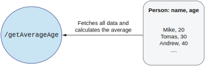
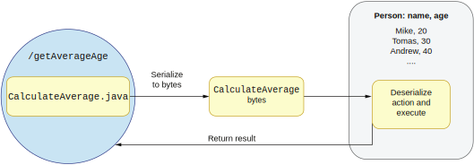
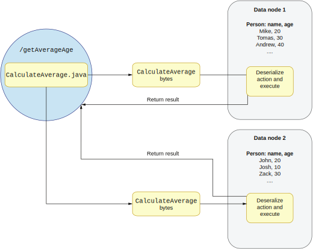

## 8.1 数据本地性是什么

数据本地性在大数据处理中扮演了至关重要的角色。为了理解为什么这个概念解决了如此多的问题，让我们来看一个不使用数据本地性的简单系统。假设我们有一个HTTP服务提供了`/getAverageAge`的端口，用于返回该服务管理的所有用户的平均年龄。图8.1展示了我们会如何将数据移动至计算处。

**图8.1 计算`/getAverateAge`端口时的数据移动**

当客户端执行这个HTTP调用时，服务端会从底层数据源获取所有数据。这个数据源可以是数据库，文件或者任何持久化存储。一旦所有数据被传输到服务端，它就开始执行计算均值的逻辑：用所有人的年龄之和除以人数，然后将这个均值返回给用户。注意这里的返回值只有一个数字。

我们可以将上述过程描述成将数据移动至计算处。在数据移动的过程中我们观察到几个重要的事实。第一个事实是我们需要获取所有数据，而这可能意味着上百G的数据。要是这么大量的数据都能放入机器的内存，那当然没问题。但是一旦我们要在TB或PB级别的大数据集上进行操作，问题就出现了。在这样的情况下，将所有数据移动到计算的机器上可能变的很复杂甚至根本不可能实现。当然，我们还可以用某种切割技术来分批处理数据。第二个重要事实是我们需要在网络上发送和接收大量数据。在数据处理中，数据的输入输出是最慢的操作，没有之一。因为我们需要传输天量的数据，它意味着读取文件系统并阻塞。发生网络丢包的概率变的不可忽视，然后我们将不得不重传这部分数据。最后我们可以看到最终用户其实一点不关心这些数据，他们只需要最终结果：那个均值。

假设这么大量的数据能被放进机器的内存，上述解决方案的优点是编码比较简单。而我们观察到的那些事实导致了在此类场景下的实际解决方案是反过来的，我们需要将计算移动至数据处。

### 8.1.1 将计算移动到数据处
现在我们知道将数据发送到计算处有很多缺点，在大数据集的场景下甚至可能根本无法实现。让我们使用数据本地性技巧来解决同样的问题。

在这个场景下，最终用户看到的`/getAverageAge`HTTP端口不变，但底层的处理逻辑变了很多。计算均值是很简单的逻辑，但它依然包含了一些编码工作。我们需要从每个人那里获取年龄，累加并除以总人数。大数据处理框架暴露了一个API让工程师们可以轻松进行此类计算。

假设我们想要用Java语言来编码这段逻辑（当然也可以是任何其它语言）。负责均值计算的逻辑被放在服务端，但我们需要一种方法将其传输到数据所在的机器。图8.2描述了如何移动计算逻辑。

**图8.2 移动计算至数据处并返回结果**

第一步是将`CalculateAverage.java`文件序列化成一段字节。我们需要用字节的形式在网络上传输数据。数据节点（存储数据的机器）需要运行一个进程用来接收序列化后的代码逻辑。

接下来，我们将这段字节转化（反序列化）成数据节点可以执行的代码。大多数大数据框架，比如Apache Spark或Hadoop，都提供了这种序列化和反序列化的机制。一旦代码逻辑被反序列化之后，数据节点就会去执行它。对于计算均值的函数来说，它操作的数据是存储在本地文件系统上的，没有必要发送任何人的数据到提供HTTP端口的服务端。当均值计算完成后，只需要将结果数字传输回服务端，然后由服务端返回给最终用户。

在这一场景下，我们再次观察到一些重要的事实。首先，需要通过网络传输的数据量很小。我们仅需要传输序列化后的函数和执行结果。因为网络和输入输出是数据处理的瓶颈，这一解决方案的性能会大大优于前者：我们将输入输出密集型计算转化成了CPU密集型计算。比如说，如果我们需要加快计算均值的速度，我们可以增加数据节点上的CPU核心来做到这一点。而之前的解决方案很难加快计算速度，因为我们并不总是能做到提升网络的带宽。

使用数据本地性的解决方案更复杂，因为我们需要序列化处理的逻辑。在复杂的场景下，这些逻辑也会变的更复杂。另外，我们还需要在数据节点上运行专门的进程。这个进程需要能够反序列化数据并执行其中的逻辑。幸运的是，很多大数据框架都实现并提供了序列化和反序列化步骤，比如Apache Spark。

有些读者可能注意到了很多数据库也提供了同样的数据本地性模式。如果你需要计算均值，你就（通过SQL）发送一条查询语句到数据库。接下来，数据库会反序列化你的语句并在本地数据上执行其中的逻辑。这些解决方案都是类似的，但是大数据框架给了你更多的灵活性。你可以在各种类型的数据节点上执行逻辑：Avro，JSON，Parquet，以及任何其它格式。你不会被某个数据库引擎绑定。

### 8.1.2 用数据本地性扩展数据处理
数据本地性在大数据处理中扮演了一个关键的角色，因为它让我们可以轻松扩展和平行化数据的处理。想象一下这样一个场景，我们的数据节点上存储的数据需要扩展为原来的两倍。此时数据的总量大到无法被放入一个数据节点。既然无法将所有数据保存在一个物理机器上，我们决定将它切割存储在两台机器上（我们将在下一节介绍如何将数据切割存储）。

如果我们使用移动数据至计算处的技术，那么通过网络传输的数据量也会变为原来的两倍。这会大大降低处理的速度，且随着我们数据节点数量的增加，情况还会越来越糟。图8.3展示了我们的数据被切割存储在两台机器上的场景。

使用数据本地性可以让我们轻松做到扩展和平行处理。我们只需要将序列化的处理逻辑传送到两个数据节点而不是一个。每个数据节点都会有一个进程负责反序列化并执行处理逻辑。一旦处理完成，结果数据会被发送回服务端合并，并返回给最终用户。

现在我们知道数据本地性的好处了。接下来，我们需要理解如何将大数据切割存储到N个数据节点上。这一过程的理解对于通过大数据操作获取商业价值十分重要。我们将在下一节讨论。

**图8.3 用数据本地性将处理扩展至两个数据节点**
