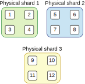

## 8.2 数据的分区和切割

我们已经在上一节看过数据本地性这一技术是如何让我们可以更轻松地扩展大数据的处理。在真实世界的大数据处理程序中，我们需要存储和处理的数据量往往达到上千TB或PB。我们不可能在一台物理机器上存储这样大量的数据。我们需要一种方法将数据切割存储到N个数据节点上。数据切割的技术有很多，本节将要给大家展示的数据切割技术叫做数据分区。

对于线上处理的数据源（比如数据库），你可以选择某种ID（比如用户ID）作为分区的关键字，并在一台指定节点上存储一段范围内的所有用户。比如说，假设你有1000个用户ID和5个数据节点，第一个节点可以存储0到200的ID，第二个节点存储201到400，以此类推。

在选择分区策略时，你要当心不要引入数据倾斜。数据倾斜指的是大多数的数据都集中在某一个ID上，或者都集中在属于同一节点的一组ID上。比如说，假设我们ID为10的用户贡献了80%的流量并产生了80%的数据。这意味着我们80%的数据都存储在第一个节点，我们的分区策略就不是最优的。在最差情况下，这个用户的数据量可能大到无法存储在一个数据节点上。这里的关键点在于，当我们在线处理数据时，数据分区需要根据读取或写入的模式来进行优化。

### 8.2.1 线下大数据分区

现在让我们关注处理线下大数据时的分区策略。一个大数据系统通常需要在一个不固定的期限内存储各种历史数据（冷数据）。我们希望存储的时间越长越好，因为当数据刚刚产生的时候，我们可能还没有意识到它所具备的商业价值。

比如说，我们可能保存了用户所有的请求数据，包括HTTP头部，但是当这些数据被保存下来的时候，可能还没有什么地方用到这些HTTP头部。但是在将来，我们可能决定要创建一个工具来根据用户所使用的设备（比如安卓，iOS）对用户群体进行分析。这类信息就保存在HTTP头部。由于我们保存了这些原始数据，我们就可以基于历史数据来执行我们新的分析逻辑。值得注意的是这些数据在很长一段时间里都没有被用到。

既然我们的系统需要存储大量暂时还用不到的信息，我们就要考虑将这部分数据存放在冷存储里。在大数据处理应用中，这通常意味着数据会被保存在Hadoop分布式文件系统（HDFS）中。这也意味着我们应该用一种通用的方式来进行数据分区。因为我们无法预知数据如何被读取，也就无法根据数据的读取模式来优化我们的分区策略。

基于上述理由，线下大数据处理最常见的分区策略是基于日期分区。假设我们有一个大数据系统在文件系统的`/users`目录存放了用户数据，并在`/clicks`目录存放了点击流数据。首先让我们只关注用户数据的分析。假设我们存储了100亿条用户数据，数据搜集开始于2017年并一直搜集至今。

我们选择的分区策略基于日期。这意味着我们的分区关键字从年开始，也就是说，我们会分2017，2018，2019和2020这四个区。如果我们的数据需求比较小，那么以年份分区可能就足够了。这样，我们的用户数据会以`/users/2017`，`/users/2018`这样的目录保存在文件系统上（如图8.4），同理点击数据则保存在`/clicks/2017`，`/clicks/2018`。

**图8.4 按日期分了4个区**

使用这样的分区方法，用户数据现在一共有4个区。这意味着我们可以把数据切割到4个物理数据节点上。第一个节点存储2017年的数据，第二个节点存储2018年，以此类推。当然，只要硬盘空间足够，我们也可以将所有的分区数据都保存在同一个物理节点上。当硬盘空间快要用完时，我们可以创建新的物理节点并将一些分区移动到新节点上。

在实际生活中，这样的分区策略的粒度太粗了。把一整年的数据放在同一个分区会导致读写都很困难。从读取的角度看，当你只想要读取某一天的数据时，你需要检索一整年的数据！这样既耗费了更多的时间，效率也很低。从写入的角度看，当你硬盘空间快用完时，想要再次切割数据会变的很困难。你将无法成功写入。

因此，线下大数据系统会使用一种更细粒度的分区策略。数据会以年、月、日的粒度分区。举例来说，如果你需要写入2020年1月2日的数据，你可以将数据写入`/users/2020/01/02`分区。在读取的时候，这样的分区策略也带来了大量的灵活性。如果你想要分析某一天的数据，你可以直接从那一天的分区中读取。如果你想要进行更广范围的分析（比如分析一整月的数据），你只需要读取那个月的所有分区。一整年的数据也是用同样的模式处理。使用这样的分区策略，我们的100亿条用户数据的分区如图8.5所示。

**图8.5 按年、月、日分区的数据**

你可以看到最初的100亿条数据基于其年份、月份被分入年度区和月度区，并最终被分入某个月的日期分区。最后，日期分区会包含10万条左右的数据。这样的数据量可以轻松放进一台物理机的硬盘。一整年的数据被分为365或366个分区，那么我们数据节点的数量上限就取决于一年的天数乘以我们需要存储的数据的年数。如果你一天的数据量都大到都放不进一台物理机，你还可以进一步将你的数据按照时、分、秒的粒度进行分区。

### 8.2.2 分区和分片的区别

现在既然我们已经用日期来分区数据，那么我们就能将数据切割到多个节点上。这种情况下，我们需要考虑如何将所有分区键的一个子集放进一台物理节点上。

假设我们要将用户数据进行分区（逻辑分片）。如果我们分区的粒度是按月分区（译注：分区键是月份）。那么2020年的数据就有12个分区要被分入N个物理节点（物理分片）。注意这里N必须小于等于12。换句话说，物理分片的数量不能超过分区键的数量。这种架构模式被称为分片。

现在，假设我们有3个物理节点。那么我们2020年的用户数据就会被分为12个分区并分配到3个分片（节点）上。每个节点存储了2020年的4个分区（12个分区除以3个节点等于每节点4个分区），如图8.6所示。

**图8.6 对3个物理节点和12个分区进行分片**

图中可以看到，物理分片和物理节点数量一致。分区键（逻辑分片）被平均分布到物理分片上。当一个新的节点被加入集群，每个物理分片需要将其上存放的逻辑分片重新分配到新的物理节点上。

分配分片的算法有很多。当新增或删除节点（节点失效或缩容）时，这些算法也需要处理分片的重分布。大多数大数据技术和数据存储都使用了这种技术，比如HDFS，Cassandra，Kafka，Elastic等，处理分片的细节在各自的实现中都有所不同。

### 8.2.3 分区算法

上一节介绍的技术被称为范围分区：数据根据产生的日期被分成不同的范围。而不同的读取模式可能会让我们决定使用不同的分区算法。

如果我们需要获取某个用户ID的所有数据，这在范围分区的模式下很难实现。为了获取某个用户ID的所有数据，我们需要到所有物理节点上检索所有分区。我们将无法利用数据本地性。我们无法预知该ID的数据会在什么时候产生，它有可能出现在任意的日期分区上，于是必须检索所有的分区。

假设我们需要将数据以user_id为分区键进行分区。我们想要将N个分区键平均分布在M个物理节点上。能够做到这一点的技术叫做哈希分区算法。首先，我们需要用某种哈希算法（比如MurmurHash）计算user_id的哈希值。接下来，我们对这个哈希值求模数M的余数，得到的就是这个user_id将被存放的物理节点的节点ID。这样就可以确保我们将N个分区键平均分配到M个节点上。理想情况下，每个节点都应该包含N/M个分区。如果用户ID本身就是一个数字，我们可以跳过哈希操作并在用户ID上直接进行除模求余的运算。但是为了让算法可以在任意类型（比如字符串类型）的分区键上都能工作，我们需要使用哈希来将非数字的值转化成一个数字。图8.7展示了这一用法。

**图8.7 在我们的数据上使用基于user_id的哈希分区算法**

如图所示，我们有2个节点，设它们的节点ID分别是0和1。当user_id为1的第一条数据抵达时，我们在这个ID上调用哈希函数并求模数2的余数，得到的结果是1。于是该条数据被发往节点ID为1的数据节点保存。当user_id为2的数据抵达时，我们的分区算法将其分配到ID为0的数据节点上保存。接下来，另一条user_id为1的数据抵达。我们的分区算法将其再次发送到节点1上。

这样的行为能确保每一条user_id为1的数据都被存储在同一个节点上。于是我们就可以使用数据本地性轻松处理相同user_id的数据。使用这个算法，总共N个user_id会被平均分配到2个节点上。

这里展示的解决方案用来理解分区算法是一个很好的例子，但是它也有一些缺点。这个方案主要的问题出现当我们决定要向集群中新增一个节点时。同样的问题也会出现在当一个节点被移除时（集群缩容或节点失效）。

让我们考虑如图8.8所示的情况，当我们新增了一个节点，我们的分区算法就立即改变了，因为现在我们需要求模数3（节点数量）的余数了。

**图8.8 新增一个节点**

假设前3条数据是在我们仅有两个数据节点时发送过来的（分区的分配和之前的例子保持一致）。将此刻的时间点定义为T0。接下来，在T1时间点，一个新的节点被加入集群。这会导致分区的配置发生变化，因为从T1开始，我们需要求模数3的余数。当user_id为2的新数据抵达，新的分区算法计算得到的节点ID为2。这会导致该数据被发送到这个新节点上。很显然我们失去了数据本地性。此时用户ID为2的数据将同时存在于两个物理节点上。我们期望的分区效果被破坏了。

那么我们应该如何来解决这个问题呢？我们可以将所有的user_id = 2的数据都转移到新算法指定的节点上。然而，由于我们的分区算法基于节点数量，这样的操作将是十分庞大的。它会导致大量耗时的数据移动操作。让我们计算一下当我们有10个这样的用户ID时的情况。一开始，ID为1，3，5，7，9的用户将被分配至节点1，用户ID 2，4，6，8，10则落到节点0上。

当我们新增一个节点时会发生怎样的变化？ID 3，6，9将落到节点0。ID 1，4，7，10将落到节点 1，剩下的ID（2，5，8）将落到节点2。只有ID 3，6，9（译注：应该是1，6，7）继续留在原来的物理节点上，剩下的ID（70%的数据）需要重新分布。

在一个现实世界的集群上，这样的效果还要乘上节点的数量。我们的节点数量越多，我们需要移动的数据也就越多。当我们的节点存储了大量的数据，这样的重新分布的过程可能无法在合理时间内完成。更糟的是，线上服务将数据下发到正在重新分布的数据存储时也会跟着受到影响。

为了降低这种效果，我们可以考虑使用一致性哈希算法。一致性哈希通过给M个节点分配虚拟插槽解决了我们的问题。当新增一个节点，只有一小部分虚拟插槽需要重新分布。很多生产系统中都使用了一致性哈希算法的各种变种。

现在我们了解了数据本地性原理，也知道了如何对数据进行分区，让我们来试着解决不同物理节点上多个分区的数据集的连接问题。下一节会介绍这个问题的一个解决方案。
