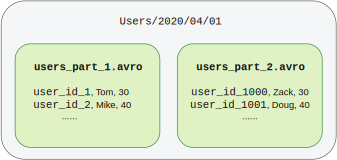
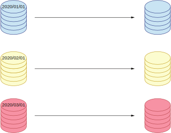
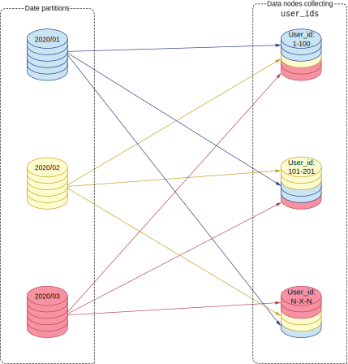
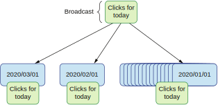

## 8.3 连接多个分区上的大数据集

我们会深入探讨三个业务场景，每一个都需要使用不同的连接策略，并用到了某种程度的数据本地性。我们会从概念上分析这些用例，但不会深入实现细节。实现细节是下一节需要关注的问题。

让我们从理解存储的数据结构开始。你应该还记得，我们将数据按照日期进行了分区，且我们的数据源有两个。第一个数据源存储了用户数据。每个分区（比如`users/2020/04/01`）包含了多个文件，每个文件包含了多行用户数据。数据可以是任意格式的：文本或二进制。

假设我们选择使用二进制格式AVRO，那就会有一批记录被序列化成这种格式并被存入HDFS上的某个文件中。一个分区可以包含多个文件，每个文件都包含了属于该分区的一部分数据。通常来说，文件的最大容量由文件系统的最大逻辑块大小所决定。对于HDFS来说，这个值是128MB。

如图8.9所示，假设我们在`user/2020/04/01`上有200MB的数据，我们就会得到两个文件：`users_part1.avro`和`users_part2.avro`，每个文件都包含了一部分用户数据。每个用户会具有多列数据（比如年龄和姓名）。更重要的是，用户有一个`user_id`列作为该用户的唯一标识。我们会使用这个标识来跟其他数据集进行连接操作。

**图8.9 用户的分区数据**

点击数据也是一样，在某个日期分区中会有多个文件。比如，`clicks/2020/01/20`包含了该日期下的多个文件，每个文件会有多行。为了让我们的数据可以连接，每一条点击数据也要包含`user_id`列。它让我们可以将一条点击数据和某个用户数据联系起来。我们会使用这层关系来连接两个大数据集。

### 8.3.1 在同一台物理机上连接数据

第一个业务场景需要解决的是连接同一天的点击和用户数据。也就是说，我们需要获取某个用户某天访问的所有点击数据。

这是一个很常见的业务场景：对多个系统产生的同一个用户的数据进行连接。我们可以想象用户数据会包含付款、交易以及其他用户行为。交易系统会收集这样的用户数据。另一方面，点击数据包含了比较少的敏感信息；点击系统会收集网站的所有点击数据，用来追踪某个用户的使用模式和活动轨迹。我们的目标是将用户的点击和行为联系起来。某次点击是否导致了某笔交易？用户是否点击了很多次但最终放弃了购买某样产品？通过连接这些数据，我们就可以从中得到更多信息，并为公司提供商业价值。

假设我们需要连接2020一整年的用户和点击数据。我们最多可以366路并行处理。这是因为这一年的数据有366个（按天数）分区。我们的进程需要访问用户数据的每一行搜索某个指定用户，并通过`user_id`标识连接点击数据。

让我们假设同一天的用户和点击数据被保存在同一台物理机上。那么当我们连接`2020/01/01`的数据时，进程就可以利用数据本地性来同时处理用户和点击数据，而无需从远程地址获取数据。连接操作所需要的全部数据都已经存在于数据节点上了。

**图8.10 窄转换，不涉及数据移动地连接两个数据集**

假设某个月的所有分区都保存在同一台物理数据节点上。当我们连接2020年1月的数据时，该月第一天的点击数据在本地，用户数据也在本地。大数据生态圈将连接数据的行为称为数据转换。我们将两个数据集转换成一个最终数据集。如果这样的数据转换不需要任何数据移动，我们称之为窄转换。也就是说，我们可以完全利用数据本地性来转换我们的数据。接下来，我们会去看一个连接操作涉及数据移动的业务场景。

### 8.3.2 需要数据移动的连接

我们接下来需要解决的业务场景依然需要在多个分区中连接数据（图8.11）。假设我们需要查找2020年所有的用户。这意味着我们需要用`user_id`连接所有月份的分区。一旦我们连接了数据，我们只需要对每一个用户保留一个ID，并丢弃所有的重复值。最终返回该用户ID。

**图8.11 宽转换，在分区间进行数据移动**

需要注意的是我们需要处理每个分区中的所有用户事件。譬如，我们要对`user_id`为1的数据进行连接操作。我们首先要在每个数据节点上过滤出该用户。利用数据本地性对2020/01的所有日期分区执行过滤逻辑。这个操作需要在每一个日期分区上执行。一旦我们过滤出数据，我们需要将数据发送到一个数据节点上对`user_id` 1进行处理。我们依旧假定每个月的数据都存放在同一台数据节点上。这意味着2020年所有12个月的数据都需要被传送到一个数据节点上对该用户ID进行连接操作。在现实情况中，所有的数据节点都会处理一批ID。

在第二阶段，我们的连接逻辑需要大量的数据移动。虽然我们在第一阶段使用了数据本地性，第二阶段还是会需要使用网络。这种需要移动数据的数据转换被称为宽转换。在数据节点间交换数据的过程被称为数据洗牌。数据洗牌次数越多，大数据处理的速度就越慢。你可能还记得在数据本地性章节，需要大量使用网络的操作远远谈不上最佳。

有些优化技术可以在连接数据时降低数据洗牌的开销。然而，他们强烈依赖具体的业务场景和数据特征。当你连接数据时，经常是一个数据集比较小，而另一个非常大。这时，你就可以实现一种混合方案：大数据集的一方尽可能地利用数据本地性；较小的一方依然需要数据洗牌，但开销被降至最低。

### 8.3.3 利用广播优化连接

现在让我们考虑一个需要优化连接的业务场景。该场景要求我们只需要获取一个月的点击数据。

这是因为我们想要找到用户数据最近发生的变化和一个用户的客户之间的关系。我们说的`最近`指的是数据处理的当天发生的变化。

这样的进程每天都要跑一次，用来匹配当日所有用户的点击事件。我们会为今年所有用户跑这个进程。为了展示优化过程，我们还将增加一个改动：点击和用户数据占用了太多磁盘空间，我们需要将两个数据源分到不同的物理机器上。这意味着用户和点击数据之间不再有数据本地性了。所有的连接操作都需要移动数据。

我们应该注意到一个重要的现象：需要连接的点击数据只有一天的数据，这意味着这个数据集的数据量相对较小。而需要连接的用户数据则相对较大。我们需要一整个月的用户数据来满足我们的业务场景。这给我们提供了这样一种场景：连接其中一方数据集的数据量跟另一个数据集有数量级上的差距。

在进行连接时，我们的主要目的是减少数据洗牌，尽量利用数据本地性。通过将小数据集（点击）发送到大数据集（用户）所在的数据节点，我们就可以同时达成这两个目的。因此在这个场景下，我们会获取这些点击数据并将其传播到所有保存了2020年用户数据的数据节点上（图8.12）。记住，我们每个月的数据都保存在一台单独的物理机上。这意味着我们需要将点击数据传播到12台机器上。

**图8.12 用广播进行连接**

今天的点击数据集被广播到所有包含用户数据的节点上。这被称为数据集广播。我们只需要为了将较小的数据集发送给大数据集所在的节点而使用网络（数据洗牌）。连接进程运行在用户数据所在的机器上，它需要检查2020年1月每一天的用户数据并连接今天的点击数据。其他月份也会重复同样的操作。

使用这种技术，我们可以利用用户数据集的数据本地性。只有一小部分的点击数据需要在网络上传输。不过我们需要注意这里有一个特殊的限制：这个优化技术仅当小数据集可以被装入数据节点的内存中时才可以正确工作。我们访问内存中的数据比访问磁盘或网络上的数据要快几个数量级。下一节描述了大数据处理中利用内存（Apache Spark）和较老的利用磁盘（Hadoop）的技术之间的权衡。

注意，虽然我们在书里使用的都是Spark的例子，但是这里描述的技术在大多数大数据处理框架中都很常见。无论那些大数据框架提供了什么样的API，它们都期望实现映射缩减（MapReduce）的语义。因此，我们接下来要讨论的优化技巧可以被运用到所有这些框架中。让我们看看它将如何影响我们的连接操作的性能。
