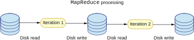
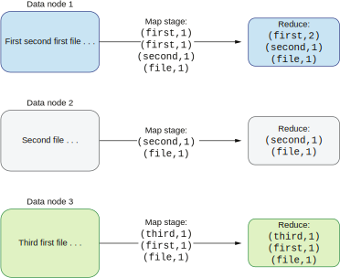
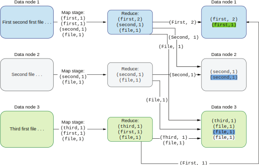
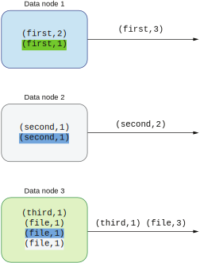
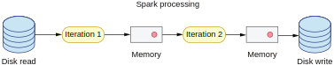

## 8.4 在内存还是磁盘中进行数据处理的权衡

目前为止，我们已经学会了如何在拼接数据的过程中利用数据本地性了。它让我们降低了在网络上传输的数据量，从而减少处理时间。然而，即使我们在处理过程中具有数据本地性，我们依然需要将这些数据调入大数据框架来进行拼接。

让我们用上一节的例子来详细解释这一点。正如你还记得的那样，我们将一个较小的数据集（点击数据）和一个较大的数据集（用户数据）进行了拼接。点击数据集通过网络传输到包含用户数据的节点上进行处理。接下来，它就被保持在数据节点的内存中。

### 8.4.1 基于磁盘的处理

现在让我们考虑用户数据会发生什么。我们假定用户数据太大而无法被放入内存中，那么处理进程就需要去磁盘上访问这些数据。我们有两种方法解决这个问题。

第一种方法是懒式读取文件。让我们假定用户数据有100GB，分成1000个part文件，每个part文件的大小是100MB。当拼接过程处理完第一个part文件，它将中间结果写入一个文件。然后继续读入数据的下一个part、进行处理、并再次保存中间结果。这一过程不断重复直到所有数据都处理完毕，如图8.13所示。

**图8.13 基于磁盘的大数据处理**

这其实就是标准的Hadoop大数据处理的映射缩减流程。Hadoop的处理建立在对磁盘以及文件系统的访问上。流程中每个阶段之间的主要集成点就是文件。处理阶段将产生的结果保存在一个HDFS文件中，给下一个Hadoop任务继续进行处理。

这种方法有几个好处。它允许工程师独立实现他们的处理阶段，每个处理阶段产生的结果都可以长期保存，不会被轻易改变。每个阶段从文件系统某个路径的文件中获取输入数据，并将输出数据以文件形式写入另一个路径。不幸的是，基于磁盘的大数据处理有一个巨大的坏处——它超级慢。

### 8.4.2 我们为什么需要映射缩减？

映射缩减背后的主要思想在于数据本地性。为了理解为什么我们需要映射和缩减这两个阶段以及它是如何利用数据本地性的，让我们来解释一下司空见惯的单词计数问题是如何被解决的。我们会使用映射缩减的语义来解决这个问题，并解释为什么它是大数据集最好的解决方案。

假设我们有N个文本文件被切割到我们集群的M个数据节点上。每个文本文件都是一个N GB的大数据集。我们的任务是计算每个文本文件中每个单词出现的次数。注意这里所有的数据集（M个数据点上的每一个N GB的大文件）都无法被放入一台机器的内存中。因此，我们需要通过某种方式将我们的处理过程分布到多台机器上。

首先关注我们处理过程的第一个阶段：具有数据本地性的本地阶段。所有的操作都在数据所在节点执行，如图8.14所示。

在这个场景中，我们有三个数据节点。我们可以看到，在图8.14的左边，每个节点都有一个大数据文件，里面包含了一些文本。这些文件都太大了，所以无法将它们全部发送到同一个节点进行计算。于是我们首先将文本文件切割成N个单词。对于每个单词，映射阶段会创建一个键值对：键是单词本身，值是该单词出现的次数。在这一阶段，这个值始终等于1。

第一眼看去，这个阶段很无用。然而这样做的主要目的是给每一条记录创建一个分区键。这个分区键就是需要计数的单词本身。所有具有相同分区键的键值对最终会被发送到同一个数据节点上。我们后面马上就会看到。

**图8.14 单词计数的第一阶段：在本地执行，利用数据本地性**

一旦我们的数据被分了区，我们就可以执行一个本地的缩减阶段。这意味着所有具有相同分区键（单词）的键值对会被聚集到一起并缩减成一个新的键值对，其中的键还是跟之前一样，而值则会发生改变。数据节点1上的缩减操作将键值对（first，1）的两条记录缩减成了一条记录（first，2）。这是我们单词计数的第一阶段，在每个节点本地执行。一旦我们在本地缩减了所有的键值对，我们就准备好去执行第二阶段了。

第二阶段（图8.15）包括在网络上移动数据（数据洗牌）。根据分区算法，数据被分发到N个节点，并确保具有相同分区键（单词）的数据总是落到同一个数据节点上。

我们可以看到第一个数据节点处理了所有分区键为first的键值对：所有具有该分区键的键值对都被发送到这个节点。键值对（first，2）原本就在这个节点上，所以不需要数据洗牌。不过第三个数据节点上有一条（first，1）键值对被发送到了第一个数据节点上。一旦数据移动完毕，最后的缩减步骤就可以被执行了。

这个阶段最重要的是确保所有具有相同分区键的数据都落到同一个数据节点上。这样我们才能利用数据本地性执行另一次缩减操作。每个分区键可以并行执行缩减操作，加速我们的计算过程。

最后，如图8.16所示，我们的处理进程为每一个单词产生了一个键值对，该结果可以被保存进一个文件系统，数据库，队列等，用于进一步处理。

**图8.15 单词计数第二阶段：数据洗牌**

**图8.16 单词计数最终阶段：最后的缩减**

注意这个方案会有数据倾斜的问题。假设我们有一个分区键包含了大多数需要处理的数据。在这样的情况下，我们就会将这大多数的数据发送到同一个数据节点上。如果这些数据无法被放入该节点磁盘/内存，我们就无法对这个键的数据进行缩减操作。显然，数据的分区算法和分布特征是十分重要的。

映射缩减方案跟单节点方案相比有很多复杂性。不过当我们在大数据环境下（意思是我们的数据太大了无法全部放在一个节点上）进行数据处理，我们不得不接受这样的复杂性才能解决我们的问题。

现在让我们来看看基于磁盘的映射缩减比基于内存的有多慢。我们也会比较需要通过网络获取数据的方法，来看看为什么数据本地性是如此必要。

### 8.4.3 计算访问时间

假设我们需要处理100GB的数据，这些数据被切割成1000个文件。我们想要计算通过网络发送100GB数据的时间（数据洗牌）。接下来我们想要计算从磁盘（HDD和SSD）读取同样这些数据的时间。最后，我们想要比较从内存中访问这些数据的时间。

我们预计内存访问的时间是最快的。（SSD会慢一点，而HDD则是有数量级的慢。）如果你不想深入挖掘这背后的数学，可跳过本节。

我们的计算会使用经过证明的数字（[http://mng.bz/GGov]）。这些数字可能有点过时了，但这些数字之间的数量级差距依然是存在的。一旦数据在主存里，它就可以被迅速访问：从内存中顺序读取1MB数据的时间是250000纳秒，也就是250微秒。

我们需要记住，使用内存时，我们需要将所有数据预先读入内存——但只需要做一次。和使用磁盘相比（SSD和HDD），两者所花费的时间差距很大：SSD顺序读1MB需要1000000纳秒，也就是1000微秒（1毫秒读1MB，相当于每秒1GB，SSD花费的时间是内存的4倍）。而HDD顺序读1MB则需要20000000纳秒，20微秒（20毫秒，内存的80倍，SSD的20倍）。

最后，网络读取的时间，包括网络请求和网络响应：从加拿大发送网络报文到荷兰，再从荷兰返回响应报文到加拿大的时间是：150000000纳秒，150000微秒，150毫秒。

当然，我们的数据中心不应该处理大数据时进行洲际数据传输。不过就算是在本地数据中心，通过网络发送数据依然比从磁盘上访问本地数据要慢好几倍。来自网络的数据在处理时间上的差距变得十分显著。

让我们计算一下我们的大数据处理程序用于读取数据的全部时间。根据数据的不同来源：处理内存中的100GB数据需要250000 ns x 1000 (MB) x 100 (GB) = 25000000000纳秒 = 25秒。

处理SSD磁盘：1000000 ns x 1000 (MB) x 100 (GB) = 100000000000纳秒 = 100秒。最后，HDD磁盘：20000000 ns x 1000 (MB) x 100 (GB) = 2000000000000纳秒 = 2000秒，约33分钟。

我们可以看到，就算我们为所有数据使用SSD磁盘，数据的读取依然比操作内存慢4倍。现实生活中，当我们需要存储TB级数据，我们会将它保存在标准HDD磁盘上，因为它最便宜。而处理速度就要慢80倍！当我们在写本书时，HDD的价格是5美分每GB，而SSD的价格则是它的两倍：10美分每GB。因此，我们可以得出结论，使用SSD存储数据的价格是HDD的两倍。表8.1总结了我们的发现。

**表8.1 比较磁盘和内存的读取速度**
|资源类型|大小（GB）|时间（秒）|时间（分钟）|
|内存|100|25|~0.42|
|SSD磁盘|100|100|~1.66|
|HDD磁盘|100|2000|~33|

我们知道Hadoop大数据处理是基于磁盘的。因为速度较慢，且现在内存也变得越来越便宜了，新的基于内存访问的大数据处理就变得更加受欢迎了。接下来我们就来看看这个新的处理方式。

### 8.4.4 基于内存的处理

由于现在内存变便宜了，新的大数据处理工具开始改变它们的架构，完全使用内存来处理数据。现在一个处理节点集群具有TB级别的内存已经屡见不鲜了。这让工程师可以创建数据管道将尽可能多的数据读入内存。一旦数据进了内存，大数据处理进程就可以比基于磁盘的方法快很多地处理它们。一个最有名的生产级别的大数据处理框架是Apache Spark，它在处理阶段之间使用内存作为主要集成点（图8.17）。

**图8.17 Apache Spark基于内存处理大数据**

大数据的入口点需要从一些文件系统中读取数据。我们假定有数据本地性，这意味着从本地磁盘读取数据。基于内存的处理方式将这些数据读入机器的内存。当前的处理阶段结束时，结果不会被写回磁盘（不同于Hadoop的大数据处理），而是留在处理节点的内存里。当下一个处理阶段（变形，拼接）开始时，它不再需要从磁盘读取数据。彻底免去了后续阶段读取磁盘的开销。只有第一个阶段需要读取这些数据。当最终处理阶段产生了结果，它们可以被保存入磁盘进行持久化。

在计算磁盘和内存时间时，我们看到Hadoop即使用了最快的磁盘（SSD）也比内存慢4倍。当使用Spark时，我们只需要在两个地方支付这个代价——第一阶段的数据读取和最终阶段的结果持久化。一个对数据迭代（变形）两次的Hadoop处理流程，需要读取磁盘两次并写入磁盘两次。就算所有地方都使用SSD，最理想的情况下也比Spark慢8倍：100秒 x 2次读 + 100秒 x 2次写 = 400秒；而Spark：25秒 x 1次读 + 25秒 x 1次写 = 50秒。400 ➗ 50 = 8。

实际场景下，写入磁盘通常比从磁盘读取更慢。因此Spark和Hadoop之间的差异会变得更大。另外，现实生活中的大数据管道的阶段都会比两次迭代（变形）更多。有些管道可能包含了10个以上的阶段。对于这样的大数据管道，我们的计算结果还要再乘上阶段的数量。

我们可以很轻松地注意到，阶段越多，内存和磁盘之间的处理速度差就越大。最后，正如我之前提到的，由于价格优势，大数据处理依然在使用HDD磁盘。让我们计算基于HDD的处理时间吧：Hadoop HDD：33分钟 x 2次读 + 33分钟 x 2次写 = 132分钟 = 2小时12分钟。你可以看到基于内存和基于HDD的处理时间上的巨大差异。那是50秒和2小时的差别！

我希望这些数字可以说服你在创建现代大数据处理管道时去考虑基于内存的工具，比如Apache Spark。下一节，我们就会用Apache Spark来实现我们的拼接处理程序。
