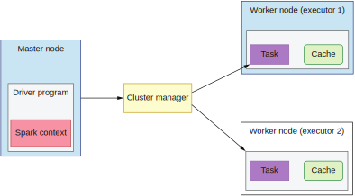

## 8.5 用Apache Spark实现连接

在我们开始实现我们的逻辑之前，让我们先看一下Apache Spark的基础特性。它是一个基于Scala的大数据库，让我们可以存储内存中的中间结果。我之前提过，在某些情况下我们不可能在内存中保存所有的数据。Spark允许我们在这种情况下进行一些处理。

Spark提供了`存储级别`的设置选项，让我们可以指定数据必须在内存中保存还是允许数据在内存用满的时候外溢到磁盘上。如果我们选择了前者，大数据处理进程会在内存用满时立即报错，通知用户内存不足。我们可以考虑切割我们的数据使它能够被放在一台机器的内存中。如果我们选择后者，内存用满时，数据会被保存到磁盘上，处理进程不会报错。我们的进程最终能够成功结束，但它会浪费很多的时间。这里我们可以看到，Spark允许我们创建基于内存的处理程序。数据本地性又如何呢？

为了了解如何通过Spark获得数据本地性，我们需要看一下它的架构，如图8.18。



**图8.18 Spark的架构**

Spark是一个主从架构。Spark的每一个进程都工作在一个包含待处理数据的节点上。假设我们有三个数据节点，其中两个将会是Spark的执行节点，而另一个则是主节点。Spark主节点上运行着一个特殊进程，用来协调我们的处理程序并将计算移动到数据处。

在这一节，我们用Spark写的程序会被提交给主节点。主节点将程序序列化（类似我们在第一节学到的）并将程序发送给执行节点。执行进程运行在数据节点上，其中包含了我们想要处理的数据。这就让我们可以构建利用数据本地性的处理程序。在这种情况下，执行进程会访问节点上的本地数据。第二执行进程则访问第二节点上的本地数据。

我们以用户数据和点击数据的连接为例，执行进程会处理一部分用户数据。第二执行进程处理剩下的那部分用户数据。Spark执行节点的缓存组件是我们的内存。我们从磁盘或网络上读取待处理数据并保存在内存中。

较小的点击数据在连接时会被发送到所有的执行节点上。主节点上的驱动组件从包含点击数据的数据节点上读取这些数据。注意这里驱动进程必须拥有足够的内存来保存全部的点击数据。接下来，驱动进程将点击数据发送给所有的执行进程。这些也需要保存在内存中。因此，这些执行节点上的可用内存也必须大的足以存下这些数据。


### 8.5.1 不使用广播的连接

现在让我们再次从连接用户数据和点击数据的业务场景出发，但这一次我们不对两个数据集的大小做任何假设。我们会使用简单的连接操作而不使用任何优化手段。接下来，我们会分析执行计划，让它给我们展示Spark引擎是如何解释和执行连接的。

本节的代码示例是用Scala写的，因为它让我们可以创建流利可读的大数据处理程序。另外，Scala是Spark的原生语言。下面的代码展示了我们简单的数据模型。

**代码8.1 数据模型**
```
case class UserData(userId: String, data: String)
case class Click(userId: String, url: String)
```

用户和点击数据集都包含用户ID。我们会用这个ID来连接数据。用户数据有一个data字段。而点击操作有一个指定的url作为上下文。因此，这个字段也出现在数据模型中。

接下来，我们会使用Spark数据集API（http://mng.bz/zQKB），它让我们可以使用类似SQL的语法。这是一个高级API，底层封装了RDD（http://mng
.bz/0wpN）。

为了测试数据，我们需要模拟一些点击和用户数据。在真实世界的应用程序中，你会使用reader从文件系统中读入数据。下列代码展示了如何从HDFS路径读取AVRO数据（http://mng.bz/KBQj）。

**代码8.2 读取AVRO数据**
```
val usersDF = spark.read.format("avro").load("users/2020/10/10/users.avro")
```

为了简化示例，让我们模拟两个数据集。如下列代码所示。

**代码8.3 模拟用户和点击数据集**
```
import spark.sqlContext.implicits._
val userData =
  spark.sparkContext.makeRDD(List(
    UserData("a", "1"),
    UserData("b", "2"),
    UserData("d", "200")
  )).toDS()

val clicks =
  spark.sparkContext.makeRDD(List(
    Click("a", "www.page1"),
    Click("b", "www.page2"),
    Click("c", "www.page3")
  )).toDS()
```

这里，我们将用户ID a，b和d填入了userData数据集。最后，我们用toDS()函数将RDD转换成一个数据集，如代码8.3所示。我们想要在数据集上进行操作，因为它提供了比RDD更好的API接口和优化。

实际的连接逻辑很简单，不过隐藏了很多信息。在下列的代码，我们用点击数据连接用户数据。

**代码8.4 不带假设的连接**
```
val res: Dataset[(UserData, Click)]
  = userData.joinWith(clicks, userData("userId") === clicks("userId"), "inner")
```

我们在用户数据和点击数据都拥有的userId字段上使用内连操作连接`userData`和`clicks`。所以在执行语句时我们会得到两条结果，如下列代码所示。

**代码8.5 內连操作的两条结果**
```
res.show()
assert(res.count() == 2)

+-----+-------------+
|      _1|                  _2|
+-----+-------------+
|[b,2]|[b,www.page2]|
|[a,1]|[a,www.page1]|
+-----+-------------+
```

注意结果以表的形式返回。左边包含了用户数据，右边包含了点击数据。由于不存在相关的点击数据，userId为d的用户数据没有返回。类似原因，userId为c的点击数据也没有返回。

连接操作隐藏了很多底层的复杂性。我们可以通过抽取实际的物理计划来查看。它可以告诉我们实际使用了哪种连接策略。为了抽取物理计划，我们需要执行explain()方法，如下列代码所示。该方法返回了具体的物理计划。

**代码8.6 获取语句的物理计划**
```
res.explain()
== Physical Plan ==
*SortMergeJoin [_1#10.userId], [_2#11.userId], Inner
:- *Sort [_1#10.userId ASC], false, 0
:  +- Exchange hashpartitioning(_1#10.userId, 200)
:       +- *Project [struct(userId#2, data#3) AS _1#10]
:            +- Scan ExistingRDD[userId#2,data#3]
+- *Sort [_2#11.userId ASC], false, 0
     +- Exchange hashpartitioning(_2#11.userId, 200)
          +- *Project [struct(userId#7, url#8) AS _2#11]
               +- Scan ExistingRDD[userId#7,url#8]
```

我们可以看到两个数据集使用了相同的处理方式。首先，两者都进行了正向排序。排序后使用哈希分区算法。因为我们没有对数据进行假设，所以这个物理计划符合那些需要数据洗牌的场景。其中一个数据集需要被传输到包含另一部分数据的执行节点上。

因为数据经过了排序，Spark查询引擎可以进行一些优化，比如说之移动一部分数据。这样的优化是十分智能的，有时，它们甚至好于我们强加给查询引擎的优化。不过测量你的方案并和另外的方案进行比较仍然是必要的。结果可能是你的手动优化方案比标准Spark查询优化逻辑要差。现在让我们看一下使用了我们在8.3.3节讨论的广播技术后的连接计划。


### 8.5.2 使用广播的连接

下面，让我们用向所有节点广播（点击）数据集的方式来实现连接。为了做到这一点，我们需要修改我们的连接逻辑，将需要广播的数据集包裹进broadcast()函数。我们会包裹点击数据集。让我们看一下下列代码所示的完整测试用例。

**代码8.7 使用广播的连接**
```
test("Should inner join two DS whereas one of them is broadcast") {
  import spark.sqlContext.implicits._
  val userData =
    spark.sparkContext.makeRDD(List(
      UserData("a", "1"),
      UserData("b", "2"),
      UserData("d", "200")
    )).toDS()

  val clicks =
    spark.sparkContext.makeRDD(List(
      Click("a", "www.page1"),
      Click("b", "www.page2"),
      Click("c", "www.page3")
    )).toDS()

  //when
  val res: Dataset[(UserData, Click)]
  = userData.joinWith(broadcast(clicks), userData("userId") ===
    clicks("userId"), "inner")

  //then
  res.explain()
  res.show()
  assert(res.count() == 2)
```

这个查询返回的数据和上一个例子一样，因为我们没有改变任何逻辑。有趣的地方在于物理查询计划。让我们看一下下面的代码。

**代码8.8 查看广播的物理查询计划**
```
* == Physical Plan ==
  * *BroadcastHashJoin [_1#234.userId], [_2#235.userId], Inner, BuildRight
  * :- *Project [struct(userId#225, data#226) AS _1#234]
  * : +- Scan ExistingRDD[userId#225,data#226]
  * +- BroadcastExchange HashedRelationBroadcastMode(List(input[0,
  struct<userId:string,url:string>, false].userId))
  * +- *Project [struct(userId#230, url#231) AS _2#235]
  * +- Scan ExistingRDD[userId#230,url#231]
```

你有没有注意到物理计划发生了巨大的改变？首先，我们不再对数据进行排序了。Spark执行引擎移除了这个步骤，因为我们不需要分部发送数据集。因此也就不需要切割数据。`BroadcastExchange`步骤将点击数据发送给所有数据节点。当这个数据被发送到所有数据节点上之后，Spark执行`Scan`步骤，通过哈希找到匹配的数据。

获取这些结果只是故事的一部分。在现实生活中，你还需要测量两个方案。我之前提过，标准的Spark查询引擎的性能可能会更好。

当你的数据集被广播到数据节点上时，你需要确保这些数据可以放入你机器的内存。如果这些数据以不受控制的方式增长，强烈建议你重新考虑是否使用广播策略。我们会在下一章看看在我们的代码中选用第三方库的策略。


## 总结
* 移动数据到计算处很简单但很耗时间。对于大数据集来说，由于我们需要在网络上移动的数据太多，以至于根本做不到。
* 数据本地性可以通过移动计算到数据处来达成。这样更复杂，但对于大数据集来说是值得的，因为我们不需要移动那么多数据。因此我们的处理速度会显著提升。
* 使用数据本地性的处理程序可以并行，且比不使用数据本地性的处理程序更轻松地扩缩容。
* 大数据生态下，我们需要通过分区将数据切割到多台机器中。
* 线下和线上数据的分区具有不同的特性。线上分区可以针对查询模式进行优化，而线下分区需要更加通用，因为我们一般无法预先知道线下数据的访问模式。
* 线下分区通常基于日期，这样可以给我们更多的灵活性。
* 如果我们在同一台物理机上执行连接，有些连接类型可以完整利用数据本地性。另一些需要更宽数据范围的连接类型则需要进行数据洗牌。
* 我们可以通过减少连接操作的分区来减少数据洗牌。
* 如果我们可以对数据进行假设，我们就可以使用广播连接策略。
* 基于磁盘的大数据处理程序更成熟，但是性能比基于内存的处理程序差。Hadoop实现了前一种策略；Spark使用了后者。
* 我们可以使用Apache Spark API来实现数据的连接。
* 分析物理计划让我们可以看到查询语句的内部逻辑。比如，我们可以使用广播技术并看到查询执行引擎是如何使用它的。
* 我们应该通过了解我们的数据来分析不同连接策略的权衡与取舍。