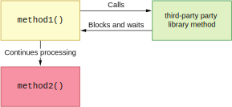
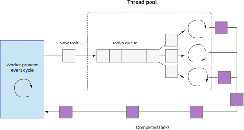
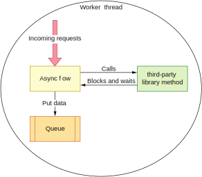
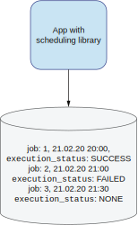
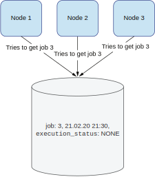

## 9.2 并发模型和可扩展性

我们将第三方库加入我们的代码是因为我们想要让它们干活。这意味着我们要调用它们的API，等待执行，然后获取结果（如果有的话）。这个简单的流程实际上隐藏了一些执行处理模型上的复杂性。

我们将要考虑的第一个场景十分简单。这是一个顺序阻塞执行第三方库函数的程序，如图9.1所示。



**图9.1 阻塞调用的程序**

在这个程序里，`method1()`执行了第三方库提供的方法。而后者会阻塞，意味着调用`method1()`的线程会被阻塞，直到第三方库的方法返回。在它返回后，调用者才能继续执行，并调用后面的`method2()`。

如果我们有一个异步的非阻塞式处理的流程，这个场景会变得更复杂。某些网页应用框架（比如Node.js，Netty，Vert.x等等）的处理模式基于事件循环模型（图9.2）。




**图9.2 事件循环处理模型**

在这样的模型下，每一个请求或者每一个需要处理的工作都会被放入一个队列中。比如，当网页服务器需要处理一个HTTP请求时，接收请求的工作线程并不会去处理请求。它会将需要处理的数据放入队列。接下来，线程池中负责处理的线程会从队列中取出数据并进行实际的处理工作。如果你不希望调用的方法可能被阻塞，那么你就需要仔细检查那些不属于你的代码（图9.3）。

在上述场景下，接收请求的工作线程只有一个。它接收数据然后做一些预处理，比如将字节反序列化。然后将数据结构放入队列。这个操作必须很快且不能阻塞后续的请求。如果我们在这个工作线程里调用了不属于我们的代码，主流程就可能被阻塞。那我们应用程序的整体性能就会下降。

由于上述原因，我们必须了解我们调用的代码。它会不会阻塞？它是同步还是异步？接下来，让我们看看如何使用那些同时提供两种模式的第三方库。



**图9.3 不应阻塞的地方调用了阻塞代码**


### 9.2.1 使用异步和同步API

让我们看这样一个场景，我们需要集成一个第三方库用来存取一个实体。我们使用的API是阻塞式的，意味着我们不应该在异步代码中调用它。下列代码展示了这个场景。

**代码9.6 阻塞式API**
```
public interface EntityService {
  Entity load();
  void save(Entity entity);
}
```

无论是读取还是保存，调用这些方法的线程都会被阻塞，而这会给我们带来问题并限制了我们使用这个API的方式。比如说，你很难将这样一个阻塞式处理的API插入你已有的异步代码中。甚至，你应用程序的线程模型可能根本不支持任何阻塞（比如Vert.x）。

如果我们已知它会阻塞但还是想要使用这个第三方库，我们该怎么办？最简单和明显的方法莫过于在阻塞代码上封装一个包裹函数，如代码9.7所示。包裹函数将实际的处理委托给第三方库，自己则提供了异步调用的方法。存取的方法都会返回`CompletableFuture`实体，确保它在未来会被满足。不允许阻塞的异步代码可以使用这些非阻塞版本的方法。

**代码9.7 将阻塞调用包裹成异步**
```
public CompletableFuture<Entity> load() {
  return CompletableFuture.supplyAsync(entityService::load, executor);
}

public CompletableFuture<Void> save(Entity entity) {
  return CompletableFuture.runAsync(() -> entityService.save(entity), executor);
}
```

注意`load()`方法返回的是对`Entity`的保证，而这个保证可能在任何时候被满足。调用者可以随意执行异步操作而不会让自己的线程被阻塞。

第一眼看上去，这个解决方案很简单。然而，将阻塞式代码包裹成异步代码并不总是简单的。我们需要在一个独立线程中执行异步动作。因此，我们需要创建一个专门的线程池给这些代码使用。这个线程池需要被监控和微调。我们需要选择合适的线程数量以及一个队列用来接受操作任务，如下列代码所示。

**代码9.8 创建一个执行者**
```
public WrapIntoAsync(EntityService entityService) {
  this.entityService = entityService;
  executor = new ThreadPoolExecutor(1, 10, 100, TimeUnit.SECONDS, new
     LinkedBlockingDeque<>(100));		1
}
1 参数包括线程池核心容量，线程池最高容量，探活超时和任务队列
```

为不属于我们的代码寻找最优配置可能不是一桩容易的任务。我们需要了解它的期望流量并进行性能测试。另外，一个阻塞式的第三方库的性能可能不如异步代码的性能。包裹阻塞式代码可能只是推迟了可扩展性问题而没有真正解决它。

如果性能问题很关键，且不存在异步的第三方库，你可以考虑自己实现这部分代码。现在，让我们看看选择异步库会是什么情况。下列代码展示了我们的`Entity`服务API看上去长什么样子。

**代码9.9 创建一个异步API**
```
public interface EntityServiceAsync {
  CompletableFuture<Entity> load();

  CompletableFuture<Void> save(Entity entity);
}
```

这个组件所有的方法都返回一个保证，表明这个处理会是异步的。它意味着我们集成的库内部已经是用异步方式写的了。我们不需要再去实现从同步世界到异步世界的翻译层。这通常表明我们用来处理异步任务的线程池也已经被封装到库里面了。它可能已经为我们大多数的业务场景进行过了微调。不过，你可能还记得我们在本章第一节说过的，你需要注意那些默认设置。

虽然线程池已经被封装进了库里，它还是会创建新线程的。调用它代码的是我们的应用程序。库内部为了进行处理而创建的线程还是会占用我们应用程序的资源。从同步阻塞式的应用程序调用异步代码比从异步的应用程序调用阻塞式代码更简单。

你唯一需要做的是从返回的`CompletableFuture`中获取内部的值。需要注意这个操作是阻塞式的，所以你需要给它传入一个合理的超时设置。不过，如果你的应用程序已经是阻塞式的，那就不会有任何问题。下列代码展示了这种方式。

**代码9.10 阻塞式应用调用非阻塞代码**
```
public class AsyncToSync {
  private final EntityServiceAsync entityServiceAsync;

  public AsyncToSync(EntityServiceAsync entityServiceAsync) {
     this.entityServiceAsync = entityServiceAsync;
  }

  Entity load() throws InterruptedException, ExecutionException,
       TimeoutException {						1
    return entityServiceAsync.load().get(100, TimeUnit.MILLISECONDS);		2
  }
}
1 代理方法load()直接返回实体
2 阻塞式调用异步API获取值
```

如果你可以选择异步或同步的库，通常选择异步版本会更合理一些。就算你的应用程序自身是同步的，你也可能在将来考虑将它转换成异步处理来提高它的可扩展性和性能。

如果你已经使用了一个提供异步API的库，将它迁移到同步模式也会更容易。然而，如果你正在使用一个用同步方式写的库，迁移就不会那么简单了。你会需要提供翻译层并管理线程池。而且，那些一开始就没用异步方式写的库通常都是以不同的方式实现的。用一个返回保证的包裹函数来进行调用可以提供一个快速的替代方案。

一开始就用异步方式写的库，其性能通常比阻塞式的库要好。你可能已经观察到这点了，特别是当你的整个处理流程都是异步的时候。让我们看看你的应用程序的可扩展性是如何被那些不可扩展的库所限制的。


### 9.2.2 分布式系统的可扩展性

当你的应用程序运行在一个分布式环境中时，理解你打算使用的第三方库的可扩展性就很关键。让我们考虑一个为你的应用程序提供调度能力的库（类似cron job）。它的主要职责是检查任务是否应该执行，并在指定的时间范围内运行它。

这个第三方库需要一个持久化层用来保存它的任务。每个任务都有一个执行的日期和时间。一旦任务被执行，调度库就会更新它的状态。这个状态可能是`Success`，`Failed`或`None`，表示任务还没有被执行。图9.4展示了这个调度库。



**图9.4 应用程序使用了一个调度库**

需要被执行的任务被保存在一个数据库，由应用程序定期获取。在开发这样一个功能时，我们可能会被诱惑去考虑和设计单一节点的业务场景。我们的集成测试可能会去验证使用内嵌数据库的调度库的行为。然而，在这种场景下，当数据被查询时，我们可能不会观察到任何问题。

当我们在分布式环境中操作时，情况就可能发生彻底的变化。需要调度能力的应用程序会被部署在多个节点上，而同一个调度任务不能被重复执行。这意味着当我们的应用程序被部署在多个节点上时，节点之间需要明确哪个节点执行哪些任务。因为同一个任务不能被一个以上的节点处理。

这样的需求意味着任务的状态需要在节点之间同步或分区处理。如果我们选择的调度库没有实现一个合适的可扩展性逻辑，我们就会面临严重的性能甚至正确性问题。

假设我们想要在3个节点上部署我们的应用程序。每个节点都有一个调度库，如图9.5所示。



**图9.5 多节点上调度库的可扩展性**

如果我们使用的调度库不可扩展，所有这些节点都会去数据库争抢任务记录，如图9.5所示。我们可以使用数据库的事务或在某条记录上使用全局锁来保证这些改动的正确性。但这两种方法都会严重影响我们库的性能。

使用支持分区的调度库就能解决这个问题。比如说，第一个节点负责某个分钟段的任务，另一个节点则负责另一个不同的分钟段，依此类推。重要的是我们的库必须被设计成可扩展。通常这不是一个简单的任务，需要仔细地规划和开发。不是所有的库都被设计成可以在这样的环境下工作。因此，当我们知道要为（多节点下的）分布式环境选库时，我们应该要去仔细分析它是否可以运行在分布式环境下。

主从架构是我们可以用来解决调度库问题的另一种方法。在这样的架构中，所有的调度请求都由主节点执行。从节点在后台同步主节点的数据库。但不会执行任何实际的逻辑。如果主节点奔溃，其中一个从节点会成为新主并开始执行cron job。不过，要使用这样的架构，调度库一开始就需要被设计成可以在多节点环境下工作。

理解可扩展性模型并了解它是否需要维护一个全局状态可以让我们在扩展应用程序时不至于遇到什么棘手的问题。如果库没有被设计成能在分布式环境下工作，我们就在冒可扩展性和正确性问题的风险。这样的问题通常会出现在我们将应用程序部署到N个节点上时，N是一个高于平常的节点数量。这种情况通常发生在应用程序处理的流量暴涨时。更糟的是，你的产品通常会在流量暴涨时遇到很好的商业机会。比如，它可能发生在节假日。在这样的日子发现我们依赖的库不可扩展可不是什么好事。

再说一次，我们使用的代码会成为我们自己的代码，这对于受我们系统奔溃影响的客户来说是显而易见的。在下一节，我们会看一看第三方库的可测试性来减轻我们的担忧。