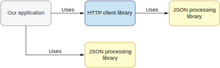
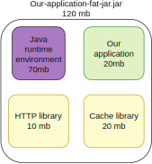

## 9.4 第三方库的依赖

我们引入并使用的每个库都是由工程师们开发的，这些工程师们在写库时都会做类似的决定：我们应该自己实现这一小部分逻辑还是用另一个库给我们提供这些功能？比如说，当我们在引入提供HTTP客户端功能的库时，它显然不应该依赖另一个提供同样功能的库。但是当工程师要处理库的非核心功能时，情况就不一样了。比如HTTP客户端库可能会提供JSON序列化和反序列化的功能，如图9.6所示。


**图9.6 带JSON处理能力的HTTP客户端**

处理JSON可不是件容易的事，而HTTP客户端库的设计者可能并不是这方面的专家。所以，他们也许就会选择另一个第三方库来提供这个功能。这是个合理的决定，但会给我们的应用程序带来一些问题。

如果我们的应用程序需要在跟HTTP客户端库无关的逻辑中处理JSON，情况就变得复杂起来。我们要记住HTTP客户端提供的每一个类（包括它们的依赖）在我们的应用程序代码中都是可见的。所以我们可以通过间接依赖使用HTTP客户端库所使用的JSON处理库。但基于如下原因，这其实不是个好主意。

主要是，我们会把自己应用程序的代码跟第三方库的依赖库紧耦合。HTTP客户端库可能会在将来决定换一个JSON处理库。那时，我们的代码就会有问题了，因为这个库不在提供原始的JSON库和类了。


### 9.4.1 避免版本冲突

另一个（更好的）解决方案是跟我们的应用程序想要用的JSON处理库创建直接的依赖（见图9.7）。不幸的是这同样会有问题，因为我们可能会在两个JSON库之间发生版本冲突。比如当HTTP客户端库和我们的应用程序使用了不同版本的JSON库。



**图9.7 我们的应用程序直接使用HTTP和JSON库**

特别需要注意真实世界的应用程序通常会有很多第三方依赖。每个依赖又可能带来它们自己的依赖。这可能很快就管理不过来了。我们的应用可能依赖了多个库的多个版本。

所有JSON库提供的类都位于`com.fasterxml.jackson`包内。如果我们需要，我们就可以用`com.fasterxml.jackson.databind.ObjectMapper`这样的形式来使用这些类。这意味着这个库的两个版本，分别由HTTP客户端库和我们的应用程序所依赖，都可以通过这个包访问。因此构建工具需要从中选择一个版本。这会导致一系列问题，比如找不到方法、方法签名改变等等，我们会在第12章讨论这些。

```
语义化版本控制规范和兼容性

大多数库都使用了语义化版本控制规范，其版本字符串包含3各部分：主版本号，次版本号，修正版本号。任何破坏兼容性的改动都应该升主版本号。我们会在第12章更详尽地看这方面内容。在这里我们只需要记住，如果依赖的多个JSON库都是同一个主版本号，那我们只需要使用最新的那个版本就可以了。如果有多个主版本号，那我们就需要让他们成为互相独立的依赖了。
```

幸运的是这个问题可以通过我们引入的第三方库解决。这个技术叫做依赖遮蔽。我们会用HTTP客户端库的例子来解释。它使用的JSON库是FasterXml Jackson（[https://github.com/FasterXML/jackson]）。

如果HTTP客户端对它依赖的JSON库使用了遮蔽技术，它会重写所有的包名并将它们放在一个不同的前缀下。比如，HTTP客户端可能将它所有的类都放在`com.http.client`下。这样，经过遮蔽后，来自HTTP客户端库的JSON库的所有类可以通过`com.http.client.com.fasterxml.jackson`包名访问。

这个技术让HTTP客户端可以对我们的应用程序隐藏JSON处理库的类。它们依然可以被访问，但我们也可以在自己的应用程序里使用独立的Jackson版本。我们不再需要担心第三方HTTP客户端库带来的依赖关系了。

这个遮蔽技术很强大，但这需要第三方库的工程师大量的维护成本。需要被隐藏的每一个第三方库都要进行遮蔽和重命名。这个步骤是在库的构建阶段完成的。它会让构建过程变得复杂，因为它可能需要为多个库定义遮蔽行为。如果有一个想要遮蔽的第三方库改变了它的包结构，我们就需要配置遮蔽插件。

在评估我们想要使用的库时，我们应该检查它所有的依赖。如果它使用了遮蔽技术，这意味着它对我们的应用程序隐藏了第三方依赖。这样它就不会污染我们的应用程序。这相比于那些提供同样功能但没有（使用遮蔽技术）隐藏第三方依赖的库就是个很高的加分项。它也表明这个第三方库是经过仔细思考和完善设计的。


### 9.4.2 太多的依赖

我们需要注意几乎所有的库都需要使用其他库来提供非核心功能。所以我们应该检查它引入的库的数量。引入那些很难写的复杂功能的库是一回事，引入那些可以轻松实现的功能的库是另一回事。

我们需要记住，我们引入的每一个库都会影响我们的应用程序。库的作者一般不太可能对所有的依赖都进行遮蔽，因为那需要太多的时间和精力了。

引入的每一个依赖都影响了我们的目标应用。部署应用最常见的方法就是构建一个包含一切依赖的包（fat jar，又称uber-jar），如图9.8所示。



**图9.8 构建一个fat jar**

假设我们的应用程序代码占了20MB，我们还需要将Java运行时环境和用到的所有第三方库打包进来。最终的目标文件是一个包含一切的可运行应用。在我们的例子中，它有120MB。

当一个应用程序以fat jar部署，我们就可以在任何地方直接运行它，不需要任何外部依赖。在容器环境下这会更受欢迎（比如Kubernetes和Docker）。

如果我们的应用程序构建的文件包含了所有第三方依赖以及依赖的依赖，那么每一个依赖都会增加这个文件的大小。所以我们要仔细考虑应用程序依赖的数量。依赖越少，文件越小。文件越小，启动越快，部署和管理也越容易。

文件小，运行时开销也会更低，因为构建出来的程序需要被读入机器的内存才能运行。现在无服务器计算架构变得越来越流行，文件的大小问题也获得了越来越多的关注。因为在无服务器环境中，应用只能得到有限的资源（比如CPU，内存）。而且，无服务器环境的启动时间是非常重要的。

在Java生态中，Maven遮蔽插件（[https://maven.apache.org/plugins/maven-shade-plugin/]）简化了fat jar的构建过程。它还提供了使用重命名技术的遮蔽处理。在下一节，我们会看看你该如何选择第三方库以及你该如何使用它们。